# 51单片机

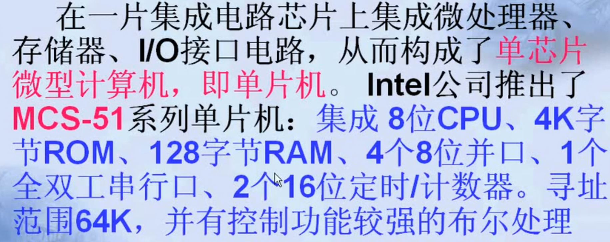

## LED

### 硬件原理

- 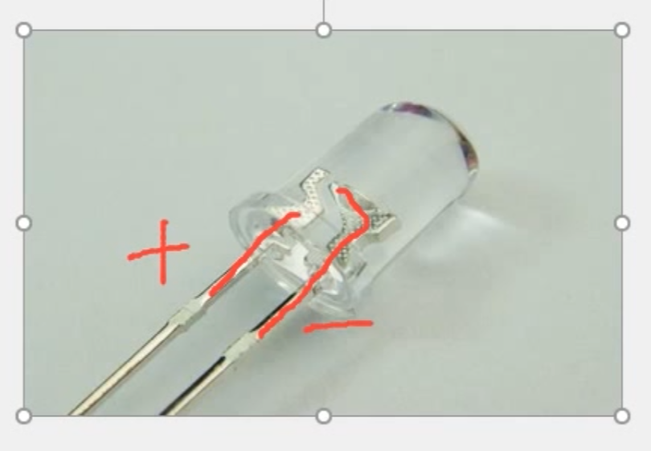

- 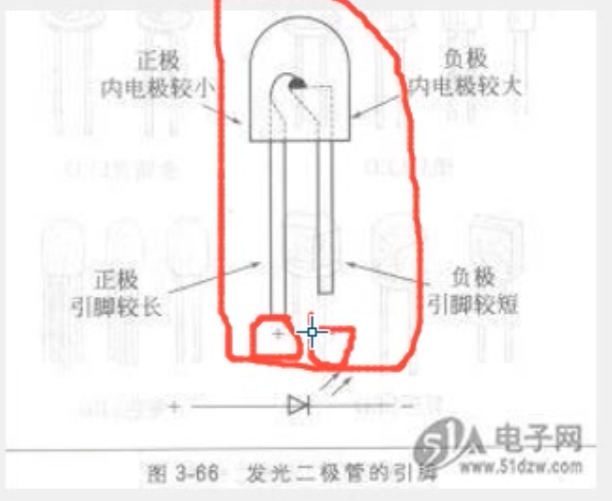
- LED在上电时，负极默认接高电平，只有当使用者改变LED负极引脚对于的io口输出电平才能使其亮

## 电阻

102 = 1K（后边的2其实是10的2次方）

10 00 = 1K

同理，473

47*10^3

47 000 = 47K

### TTL电平

单片机使用的一种电平规范，规定了高电平是5V，低电平是0V

### RS232电平

单片机使用的一种电平规范，规定了高电平是15V，低电平是-15V

#### 引脚地址

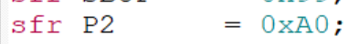

这里的P2首地址应该是指P2.0的地址

然后直接操作寄存器8位点灯

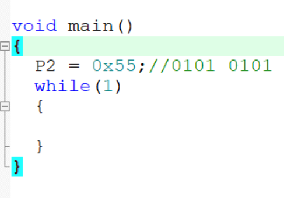

置零才能点亮灯，因为led的负极接的是引脚。其实不加下边那个循环好像灯也不会灭

### 延时函数

```c
void Delay500ms()		//@12.000MHz
{
	unsigned char i, j, k;

	_nop_();
	i = 4;
	j = 205;
	k = 187;
	do
	{
		do
		{
			while (--k);
		} while (--j);
	} while (--i);
}
```

- 时钟周期=1/晶振频率
- 机器周期：完成一个基本操作所需要的时间
- 基本操作：取指令，存储器读，存储器写
- nop是汇编指令集里的空操作，运行一个机器周期，一个机器周期等于十二个晶振周期（这是人工规定的准则吗？），可用于验证延时功能

## 数据类型

int 16位（单片机） 32位（PC）

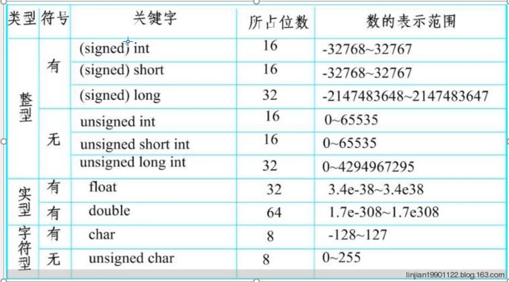

## 数据运算

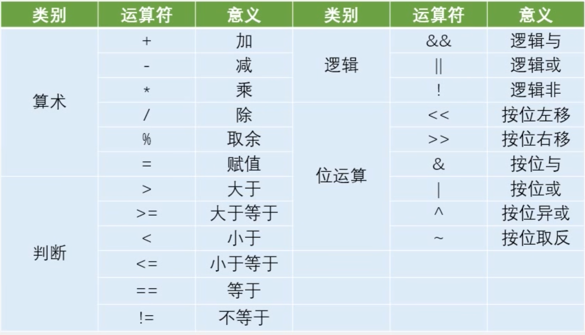

## 按键开关

- 相当于是一种电子开关，按下时开关接通，松开时开关断开，实现原理是通过轻触按键内部的金属弹片受力弹动来实现接通和断开

- 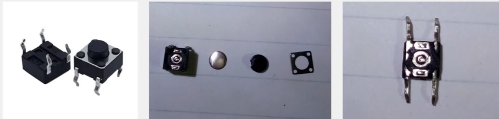

#### 原理图

- 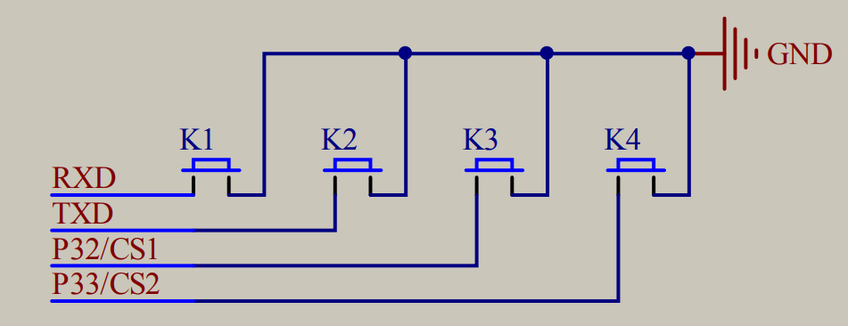
- 引脚是读取实时电平值的，当开关按下时，引脚与GND接通，读到低电平
- 当开关松开，读到高电平

#### 按键的抖动

- 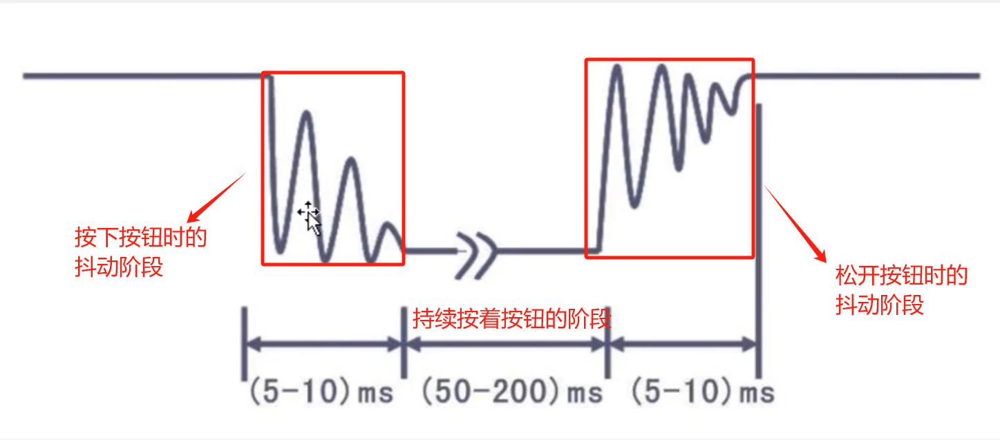
- 对于机械开关，当机械触点断开、闭合时，由于机械触点的弹性作用，一个开关在闭合时不会马上稳定地接通，在断开时也不会一下子断开，所以在开关闭合及断开的瞬间会伴随一连串的抖动
- 此时需要消抖来减少对程序的影响，一般常用软件消抖，即延时一定时间。通常在完成开关断开的消抖后才继续执行剩下的程序,即当你松开开关的那一刻程序开始往下执行

#### 寄存器操作

- 由于八个LED灯可由八位寄存器直接操作亮灭，因此可以定义一个无符号八位的变量，从而直接将变量内存储的值赋给寄存器，达到操作寄存器的结果。
  - 此次无符号八位变量可以通过定义无符号char类型变量实现，无需担心字符型变量会怎么样，它现在只作为一个八位存储器使用
  - 变量名称只能用字母、数字、下划线组成
- 在编译器中，输入十进制、十六进制的的数据在编译完以后都会变成二进制的数据，因此无论是将相同值的二进制、十进制、十六进制数据直接赋给寄存器，都能达到相同的结果。
  - 注意：C51的编译规则无法直接将二进制数据赋给寄存器，C99可以

### LED数码管

- LED数码管是一种简单、廉价的显示器，是由多个发光二级管封装在一起组成8字型的器件
- 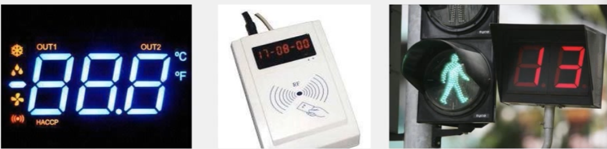

#### 数码管引脚定义

- 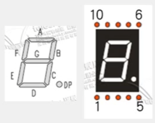
- 共阴极连接（51上所采用的连接方式）
  - 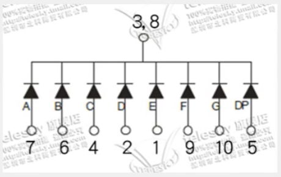
- 共阳极连接
  - 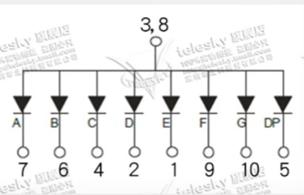

#### 多数码管引脚定义

- 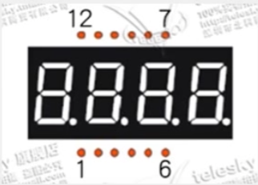
- 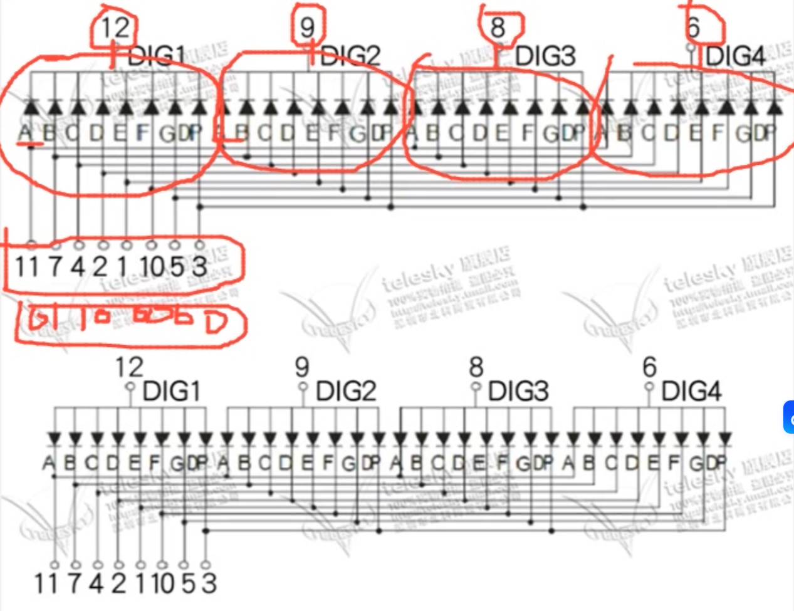
- 上边的12、9、8、6号引脚是分别控制不同位置的数码管亮灭的总开关
- 同时可得出的结论是，一个多数码管无法同时表现出不同的数字，即使有多个数码管同时亮，上面所显示的数字都是一样的。

#### 多数码管显示

- 多数码管显示要注意**消影**的问题，即单数码管的的显示一般的过程是：选位、段选，如果是多数码管的过程：选位-段选-选位-段选-选位-段选，第一段程序的段选和第二段程序的选位会杂糅在一起，从而第二、三、四个数码管的显示会有前一数字的重影
- 重影
- 消影
- 消影的步骤：段选后延迟1ms，然后将数码管段选置零

#### 数码管驱动方式

- 单片机直接扫描：硬件设备简单，但会耗费大量单片机CPU时间
- 专用驱动芯片：内部自带显存、扫描电路，单片机只需告诉他显示什么即可

### 双向数据缓冲器

- 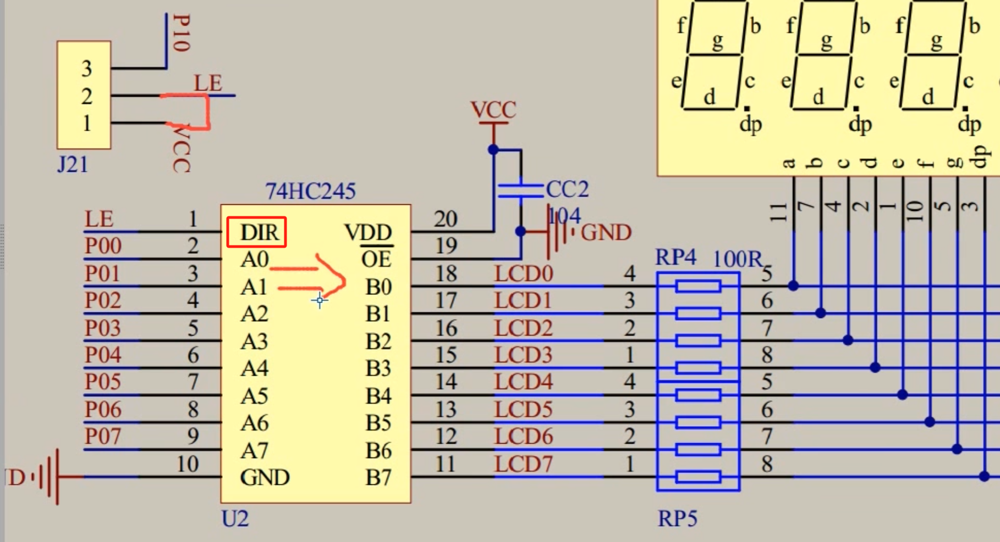

- DIR如果接高电平，数据从左边传输到右边；如果接低电平，就把右边数据读回到左边
- 通过LE位接高低电平，LE位其实是跳线帽，可以直接将LE与另一位短接
- OE为芯片使能位，接地使能，接VCC则失能
- 接数据缓冲器的原因是，MCU的信号直接接到数码管上，灯的亮度会很暗，因为MCU输出的电流小。因此将MCU的输出当作控制信号，再由数据缓冲器增大电流后输出，可以使得数码管亮度更亮
- RP4为限流电阻，防止输送的电流过大

### 数据传输

- 十六进制数据如果有已经固定一一对应的值，如下图，则可以定义无符号字符型数组存储对应的十六进制数据，以后像是直接操作寄存器值的行为可以参考使用数组存储对应的值
- 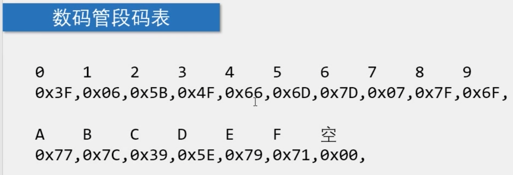
- 然后有些情况下只能操作三位二进制的引脚，这时候可以使用switch语句来赋予对应引脚值，case值可宏定义以便读者观看对应的引脚
- 
- 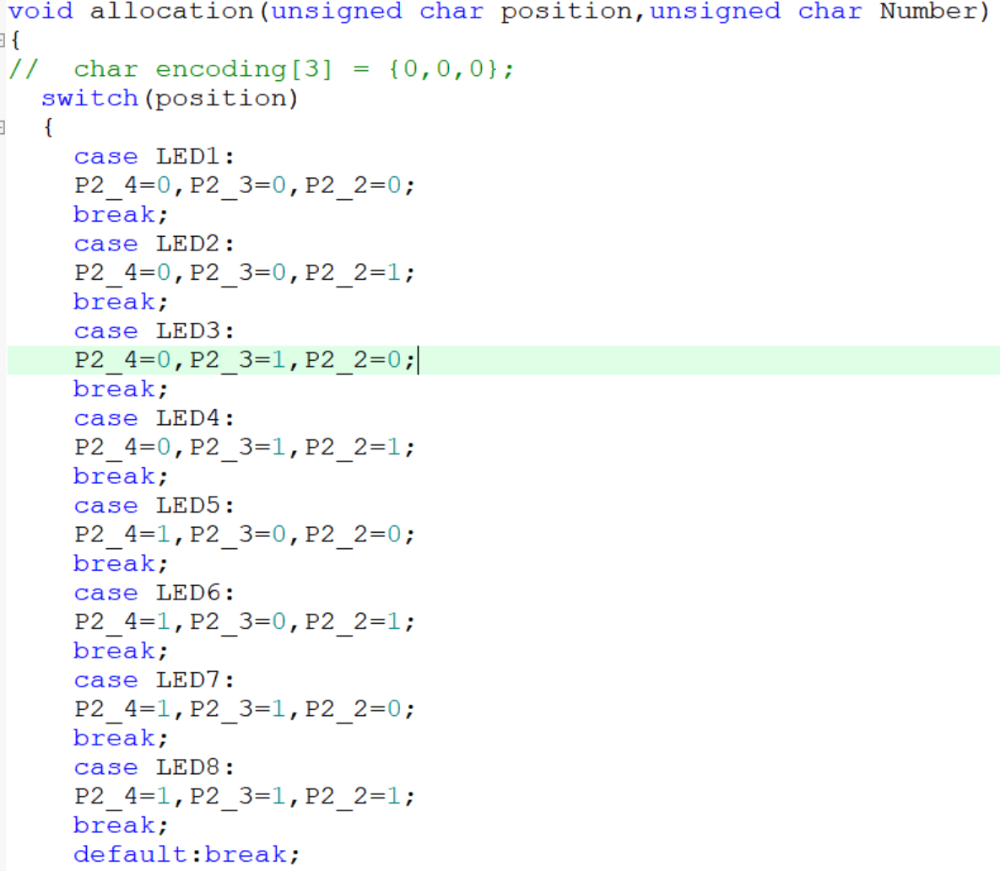

### 模块化编程

- 传统方式编程：所有的函数均放在main.c里，若使用的模块比较多，则一个文件内会有很多的代码，不利于代码的组织和管理，而且很影响编程者的思路
- 模块化编程：把各个模块的代码放在不同的.c文件里，在.h文件里提供外部可调用函数的声明，其他.c文件想使用其中的代码时，只需要#include"XXX.H"包含头文件即可。使用模块化编程可极大的提高代码的可阅读性、可维护性、可移植性等
- 具体实例：
- 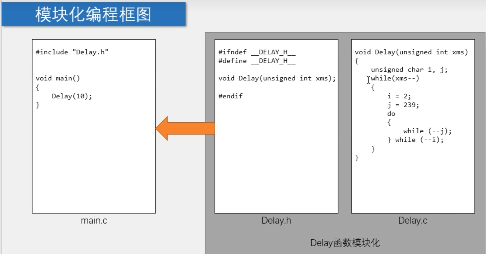

#### 模块化编程注意事项

- .c文件：函数、变量的定义
- .h文件：可被外部调用的函数、变量的声明
- 任何自定义的变量、函数在调用前必须有定义或声明（同一个.c），例如在main函数里使用Delay()函数必须先包含"Delay.h"
- 使用到的自定义函数的.c文件必须添加到工程参与编译，也就是必须把c文件放到Project里，
- 使用的.h文件必须要放在编译器可寻找到的地方（工程文件夹根目录、安装目录、自定义）

#### C预编译

- C语言的预编译以#开头，作用是在真正的编译开始之前，对代码做一些处理（预编译）
- 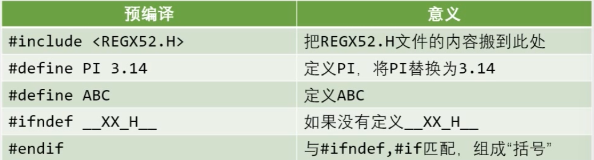
- 此外还有#ifdef（如果定义了）,#if,#else,#elif,#undef等

#### 头文件包含范围的区别

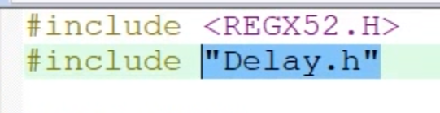

- <>与""的区别是<>在软件安装目录里寻找头文件，""在当前程序文件目录里寻找文件


### STC89C52单片机的I/O口结构

#### I/O口配置

- 有三种工作类型：准双向口/弱上拉(标准8051输出模式)、仅为输入(高阻)或开漏输出功能。
- 弱上拉模式，io口输出的1的驱动能力比较弱，输出的0的驱动能力比较强（准双向口输出类型可用作输出和输入功能而不需重新配置口线输出状态。这是因为当口线输出为1时驱动能力很弱，允许外部装置将其拉低。当引脚输出为低时，它的驱动能力很强，可吸收相当大的电流。）

### 程序下载

[一文彻底搞懂单片机程序烧录](https://blog.csdn.net/ZHOU_YONG915/article/details/122842967)

[STM32启动配置和自动串口下载](https://blog.csdn.net/ZHOU_YONG915/article/details/136841873)

[51单片机烧录那点事儿](https://blog.csdn.net/ZHOU_YONG915/article/details/125822094?ops_request_misc=&request_id=&biz_id=102&utm_term=51%E5%8D%95%E7%89%87%E6%9C%BA%E7%A8%8B%E5%BA%8F%E7%83%A7%E5%BD%95%E5%8E%9F%E7%90%86&utm_medium=distribute.pc_search_result.none-task-blog-2~all~sobaiduweb~default-1-125822094.142^v101^pc_search_result_base5&spm=1018.2226.3001.4187)

#### 编程器编程

单片机程序下载的本质就是将由0和1组成的二进制文件（hex格式或bin格式）写入到掉电数据不会消失的EEPROM（Electrically Erasable Programmable Read Only Memory，电可擦除可编程只读存储器）中。

#### ISP（In System Programming, 系统在线编程）

**ISP基本是目前单片机烧录程序的主要方式**。它的实现方式就是通过电脑端的上位机软件，通过某种数据传输协议（**串口、SPI、SWD、JTAG**），将**程序编译产生的二进制文件**烧录到单片机的EEPROM中。如STC的51单片机基于串口协议，即程序通过串口写入到FLASH（EEPROM中的一种）；Atmel的AT89S52系列单片机基于SPI协议；STM32系列芯片采用**ST-Link、J-Link**等设备来下载程序，其基于的协议是**SWD和JATG**，当然STM32**也可以基于串口协议**下载程序（那个fly什么的上位机）。

虽然以上各种协议都算ISP，但是最特殊的一种莫过于串口协议，因为其他各种协议都是借助外部设备（如ST-Link、USBasp）来**直接操作单片机的FLASH**，而通过串口下载程序时，虽然也需要借助外部设备（一般是一个USB转TTL模块），**但是其本质还是靠芯片内部已固化的一段程序来更新FLASH**。

用来写入FLASH的这部分程序是芯片出厂就已经固化到芯片当中的，称为**引导程序**，英文名叫**BootLoader**。

因此，为实现这种功能，芯片内部ROM可以分为两部分，一部分是**系统存储区**（System Flash），一般在高地址，用来**存放引导程序**；另一部分是**用户存储区**（User Flash），一般在低地址，用来**存放用户编写的程序**（主要运行的部分）。

以STM32为例，由于它既支持SWD，JTAG这种直接操作FLASH的协议，也支持基于串口协议利用引导程序写入FLASH，因此它需要支持多种启动模式。如下图所示。


这里的“主闪存存储器”即上面提到的用户存储区，用来存放用户编写的程序。

如果手边有ST-Link或者J-Link就可以考虑从用户存储区开始运行，这样上位机就直接将数据写入到用户存储区的FLASH中；如果要采用串口下载，就需要从系统存储区开始启动，当芯片在这个部分开始执行程序时，会不断检测串口是否有写入FLASH的指令，如果有，则开始写入用户存储区的FLASH，**如果没有，也无法跳转到用户存储区运行，只能调整BOOT模式再复位。**

但是一般串口下载要更慢，而且ST-Link和J-Link出来下载程序外，还支持硬件仿真（是指Debug吗？），这也就是为什么用串口下载的比较少

和STM32串口下载比较类似的还有STC单片机，官方数据手册对于程序下载的流程介绍如下图所示：


可以看出，**和STM32最大的差别在于STC51单片机不存在一个系统存储区的死循环，内置的bootloader和用户程序是先后执行的关系。这样好处很明显，那就是不用选择启动模式；坏处也很明显，那就是每次上电都必须运行这个bootloader，对于上电之后启动速度有较高要求的场景来说就可能会有点问题。**

**FLASH存储器可以看作是EEPROM的一种**。

### 定时器

#### 定时器介绍

- 51单片机的定时器属于单片机的内部资源，其电路的连接和运转均在单片机内部完成
- 定时器作用：
  - 用于计时系统，可实现软件计时，或者是程序每隔一段固定时间完成一项操作
  - 替代长时间的delay()，提高CPU运行效率和处理速度

#### STC89C52定时器资源

- 定时器个数：3个（T0、T1、T2），T0与T1是传统51单片机固有的定时器资源，T2是此型号单片机增加的资源

#### 定时器框图

- 定时器在单片机内部就像一个闹钟，每隔一定的时间间隔计数值就会加一（该时间间隔叫做系统时钟，由单片机的晶振提供，也就是晶振周期）。当计数单元到达一定的计数值时（到点）产生溢出，就会向中断系统发出中断请求（响铃提醒），使程序跳转到中断服务函数中执行
- 

#### 定时器工作模式

- STC89C52的T0和T1均有四种工作模式：
  - 模式0：13位定时器/计数器
  - 模式1：16位定时器/计数器（常用）
  - 模式2：8位自动重装模式
  - 模式3：两个8位计数器
- 工作模式1框图：
- 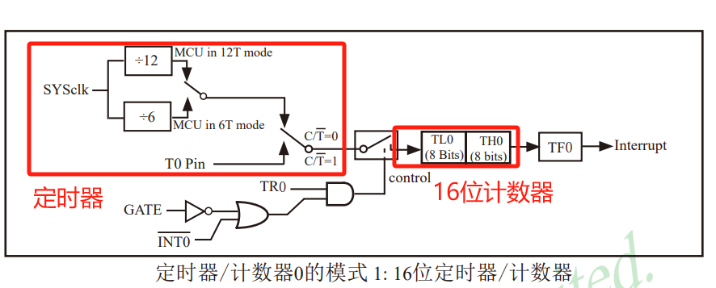
- 晶振每振动一次产生一个脉冲，计数器就加一
- TR0控制定时器是否启动
- C/T位置0，为定时器；置1，为计数器
- GATE置0，由TR0单独控制定时器启动；GATE置1，由INT0外部中断位与TR0共同控制定时器启动

#### 定时器时钟

- SYSclk：系统时钟，即晶振周期，晶振振动一次所需的时间，51单片机开发板上的晶振频率为12Mhz。晶振振动会产生脉冲，一般将这个脉冲信号称为系统时钟信号。但一般会经过分频来使用系统时钟，比如，定时器模式下对系统频率进行12分频，则系统频率变成1Mhz。即原本1个系统时钟定时器计数一次，现在要12个系统时钟，定时器才计数一次即得到一次计数脉冲，计数周期也变成1微秒一次。也就是**机器周期为十二个系统时钟**的由来。
- 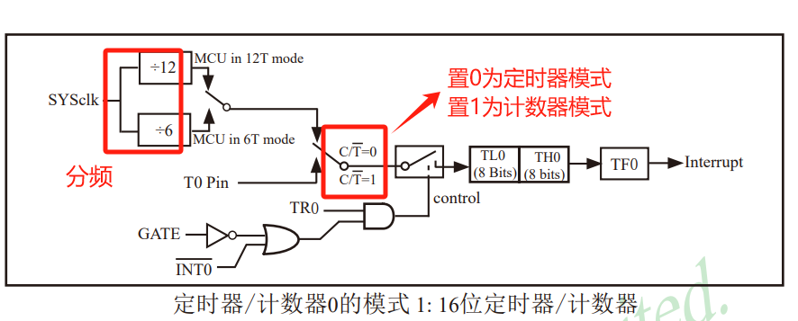

### 中断系统

#### 中断系统介绍

- 中断系统是为了使**CPU**具有对外界紧急事件的**实时处理能力而设置的**
- 当CPU正在处理某件事的时候外界发生了紧急事件请求，要求CPU暂停当前的工作，转而去处理这个紧急事件，处理完以后回到**原来被中断的地方继续原来的工作**，这个过程就称为中断。实现这种功能的部件称为中断系统，请示CPU中断的请求源称为中断源。中断系统一般允许多个中断源，当几个中断源同时发起中断请求时，需要按照中断优先级依次执行中断服务程序，CPU总是先响应**优先级别最高的中断请求**。
- 当CPU在处理一个中断源请求的时候（**执行相应的中断服务程序**），发生了另一个优先级比它还高的中断源请求。如果CPU能暂停对原来中断源的服务程序，**转而去处理优先级比它还高的中断请求源**，处理完以后再回到原低级中断服务程序，这样的过程称为**中断嵌套**。这样的中断系统称为**多级中断系统**，没有中断嵌套功能的中断系统称为单极中断系统。

#### 中断程序流程

- 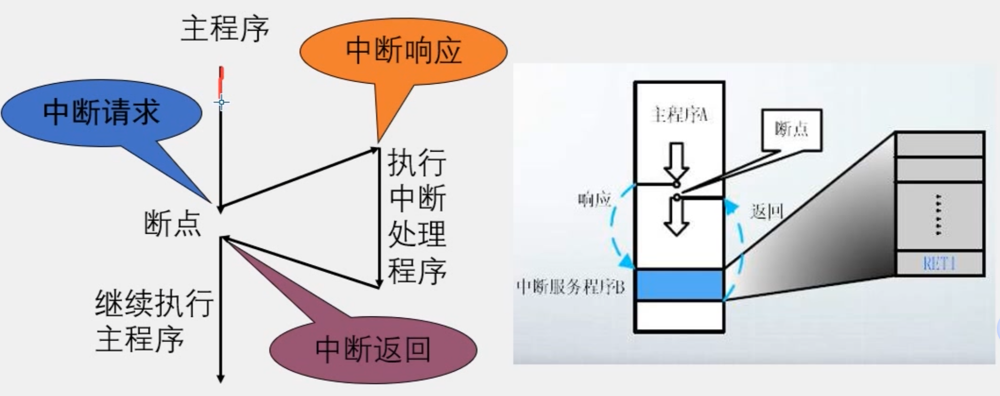

#### 中断资源

- 中断源个数：8个（外部中断0、定时器中断0、外部中断1、定时器中断1、串口中断、定时器中断2、外部中断2、外部中断3）
- 中断优先级个数：4个，其中数字越高优先级越高，即从高到低：3 2 1 0
- 中断号：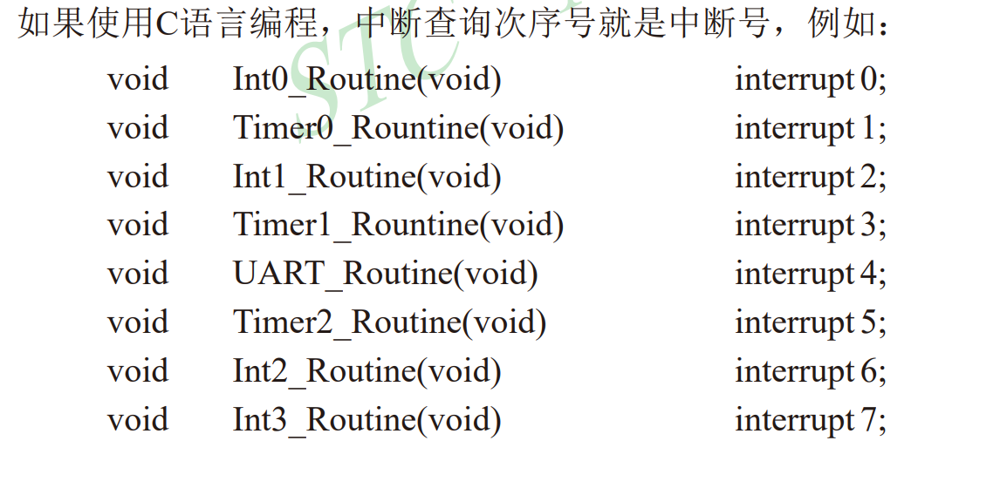

定时器和中断系统的连接

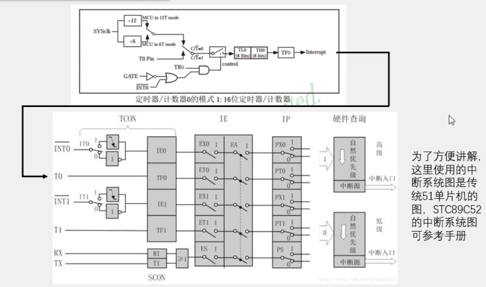

#### 定时器相关寄存器

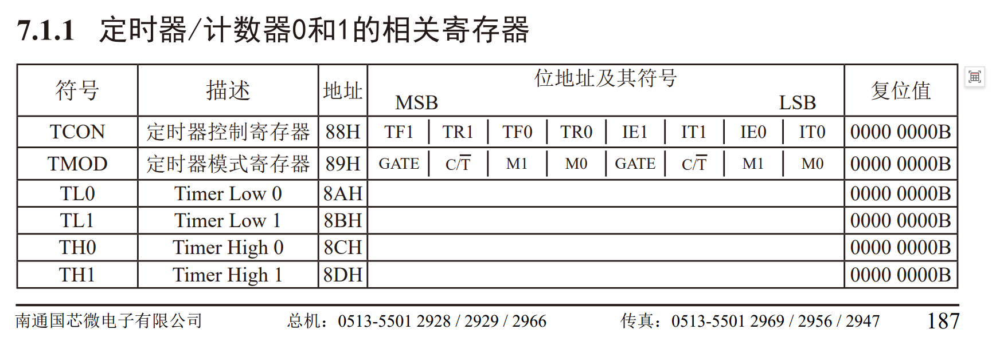

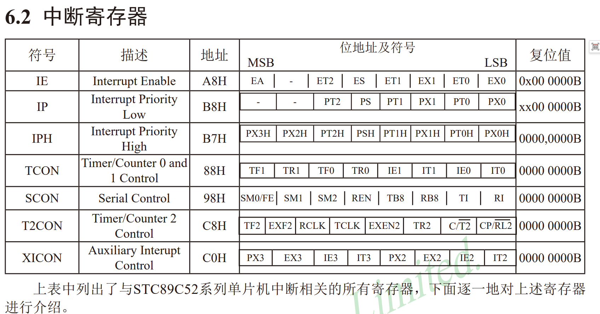

- 定时器相关且比较常用的寄存器有TCON、TMOD、TL0、TH0、TL1、TH1
- 中断相关且比较常用的寄存器有IE、IP（中断优先级）

#### 定时器配置

- TCON：TR0置1允许T0开始计数
- TMOD：C/T置0，定时器模式；M1置0，M0置1，选择16位定时器
- TH0、TL0为计数单元

#### 中断配置

- IE：EA置1，CPU开放所有中断源的申请；ET0\ET1\ET2，允许各个定时器中断
- IP与IPH：PT0与PTH0一起用，决定中断的优先级
- 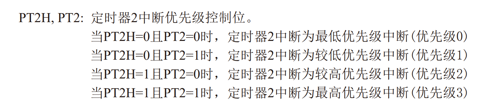

#### 中断实时流程

- **当每次计数器计数溢出，中断发生后，计数器默认从0开始计数。因此如果想按照固定时间发生中断，要记得中断服务函数里面将计数器赋予对应的初值。**
- 中断里执行对不同变量的操作的前提是，变量不能在主函数的循环里变化，否则中断函数里对变量的操作可能会发生冲突。主函数的循环时间与定时器中断的循环时间不一样。
- 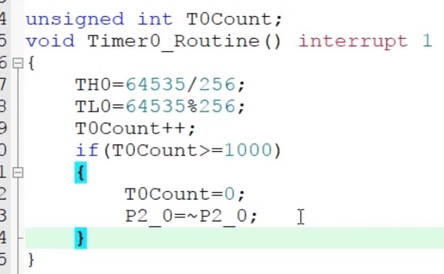
- 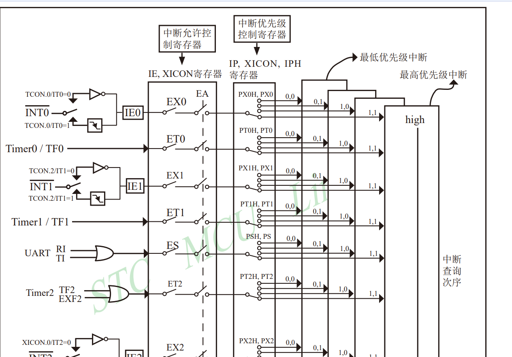

#### 额外知识

- 可位寻址代表可以单独给位赋值，不可位寻址则只能给寄存器整体赋值，即8位同时赋值。

### 串口通信

#### 串口介绍

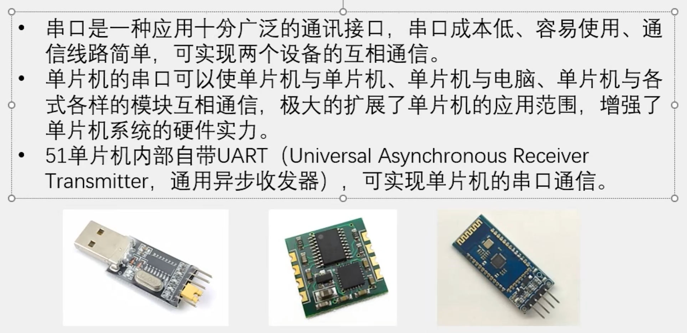

#### 硬件电路

- 简单双向串口通信有两根通信线（发送端TXD(transmit exchange data)和接收端RXD(receive exchange data)）
- TXD和RXD要交叉连接
- 当只需要单向的数据传输时，可以直接一根通信线
- 当电平标准不一致时，需要加电平转换芯片（比如降压模块升压模块）
- 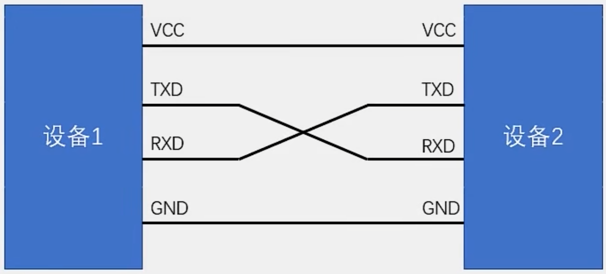

#### 电平标准

- 电平标准是数据1和数据0的表达方式，是传输线缆中人为规定的电压与数据的对应关系，串口常用的电平标准有如下三种：
- TTL电平：+5V表示1，0V表示0
- RS232电平：-3~-15V表示1， +3~+15表示0
- RS485电平：两线（TXD与RXD）压差+2~+6V表示1，-2 ~-6V表示0（差分信号）
- TTL和RS232通讯协议信号传输只能13米以内，RS485是千米。RS232一般是用于电脑的电平标准，因为电压接受的范围大

#### 流控制

[UART串口流控制](https://blog.csdn.net/qq_42992084/article/details/104761474)

对于数据的接收与发送双方会有请求与响应

#### 常见通信接口比较

- 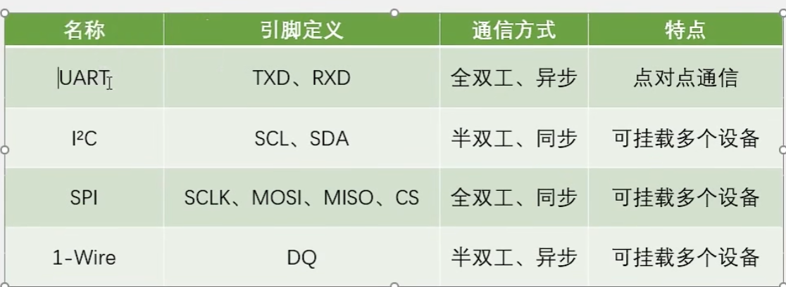
- 除此以外，还有：CAN（汽车领域的多传感器连接）、USB等

#### 相关术语

- 全双工：通信双方可以在同一时刻互相传输数据
- 半双工：通信双方可以互相传输数据，但必须分时复用一根数据线（也就是A发B收和B发A收同一时间只能执行一个）
- 单工：通信只能有一方发送到另一方，不能反向传输
- 异步：通信双方各自约定通信速率（也就是数据采样周期的规定，一秒发送一次信号，然后一秒采样一次和半秒采样一次的信号是不同的）异步就是约定输出和输入的速率，可以同时输入输出。**例如串口通信中双方可以设定不同的波特率来传输和接收数据，但是一般来说波特率要相同。**
- 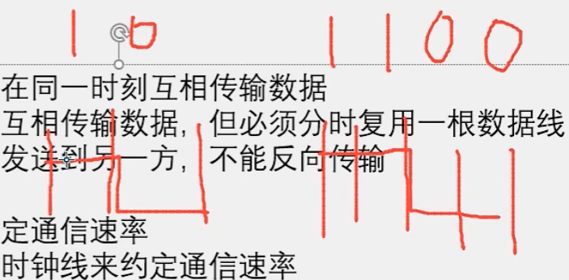

- 同步：通信双方靠一根时钟线来约定通信速率。同步就类似于检测，有输出的数据了，另一头同步输入数据。检测上升沿来判断信号采样成功

- 总线：连接各个设备的数据传输线路（类似于一条马路，把路边各个用户连接起来，使用户可以相互交流，即相互传输信号）

上升沿：0->1

- 定时器溢出率：定时器溢出的频率，若定时器中断开启，则可以看作一秒钟发生多少个定时器中断
- 波特率：串口传输的波特率即为每秒钟传输二进制的位数，定时器有溢出就可以生成波特率？
  - [什么是波特率，波特率怎么计算](https://blog.csdn.net/qq_40147893/article/details/106539081?ops_request_misc=%257B%2522request%255Fid%2522%253A%25223A3B2366-DC30-473F-8D92-D6D27C9EBED1%2522%252C%2522scm%2522%253A%252220140713.130102334..%2522%257D&request_id=3A3B2366-DC30-473F-8D92-D6D27C9EBED1&biz_id=0&utm_medium=distribute.pc_search_result.none-task-blog-2~all~top_positive~default-1-106539081-null-null.142^v100^pc_search_result_base9&utm_term=%E6%B3%A2%E7%89%B9%E7%8E%87&spm=1018.2226.3001.4187)
- 大端存储与小端存储
  - [计算机中的大端存储与小端存储](https://blog.csdn.net/weixin_43886592/article/details/106336154?ops_request_misc=%257B%2522request%255Fid%2522%253A%2522e9fa6551e498f4f56c838c403da56658%2522%252C%2522scm%2522%253A%252220140713.130102334.pc%255Fall.%2522%257D&request_id=e9fa6551e498f4f56c838c403da56658&biz_id=0&utm_medium=distribute.pc_search_result.none-task-blog-2~all~first_rank_ecpm_v1~rank_v31_ecpm-6-106336154-null-null.142^v101^pc_search_result_base5&utm_term=%E5%A4%A7%E7%AB%AF%E5%AD%98%E5%82%A8%E5%92%8C%E5%B0%8F%E7%AB%AF%E5%AD%98%E5%82%A8&spm=1018.2226.3001.4187)


#### 51单机的UART

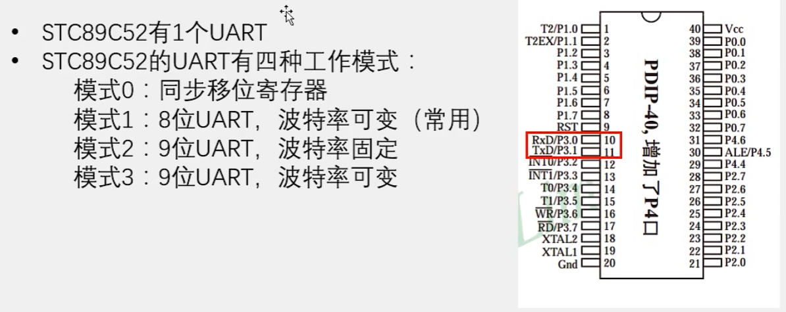

#### 串口参数及时序图

- 波特率：串口通信的速率（一秒钟可以传输多少位二进制数，倒数为发送和接收各数据位的间隔时间）。发送与接收双方的波特率必须一致，否则数据传输会出错。
  
- 溢出率其实就是溢出频率，即溢出时间的倒数，一次溢出时间等于系统时钟* 12 * (256-定时器计数器高八位)，也就是一秒溢出多少次
  
- SMOD为51单片机中频率加倍标志
  - 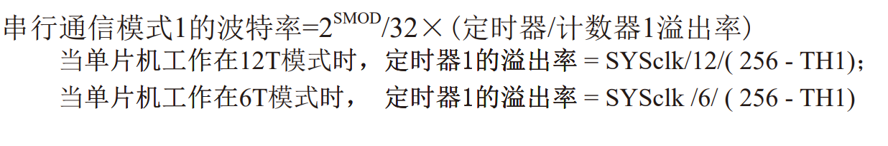

- 检验位：用于数据验证（双方都约定好用什么校验方式）
  - 奇校验：即检测传输的信号中高电平1的位数必须是奇数位。如果信号里边是偶数位，检验位就会置1，从而得到奇数位高电平，如何检测位数由硬件解决。但是这种方式无法检测出乱序的情况，如下图所示：
  - 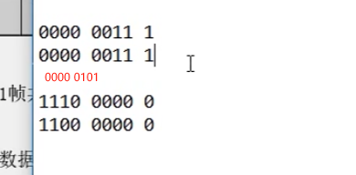
  - 偶校验：即检测传输的信号中高电平1的位数必须是偶数个。如果信号里边是奇数个，检验位就会置1，从而得到偶数个高电平
- 停止位：用于数据帧间隔
- 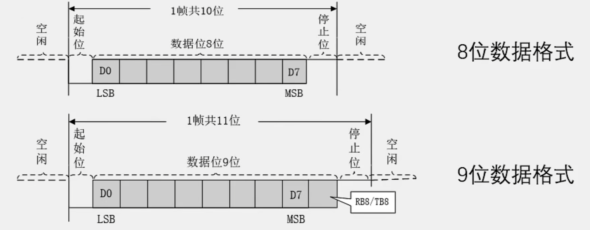
- 波特率表示电平变化的速度，比特率表示实际数据的传输速度

#### 串口模式图

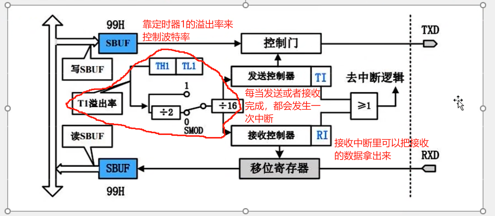

- SBUF：串口数据缓存寄存器，物理上是两个独立的寄存器，但占用相同的地址。写操作时，写入的是发送寄存器（即要发送数据时，将数据写入发送寄存器再发送出去），读操作时，读出的是接收寄存器（即接收寄存器存储了对方发送的数据，若要读取数据，直接在接收寄存器中读取）。

#### 串口相关寄存器

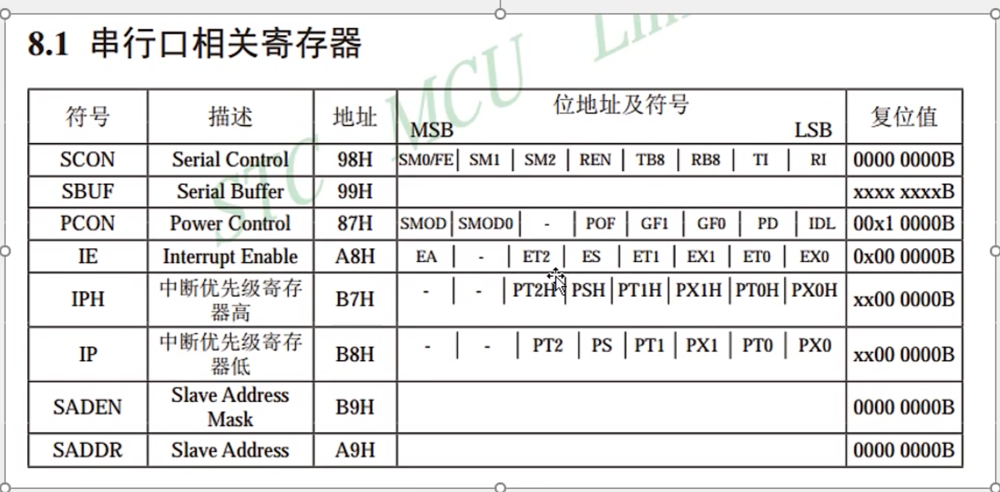

#### 串口配置

- SCON：当PCON的SMOD0置0时，SM0和SM1一同决定串口的工作模式
  - 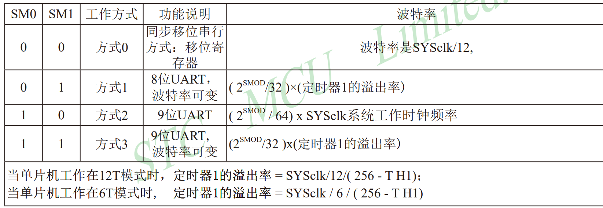
  - SM2：允许方式2或3多机通信控制位，暂时用不到，用到去数据手册看
  - REN：允许/禁止串行接受控制位。由软件置位REN，即REN=1时位允许串行接收状态，可以启动串行接收器RXD，开始接收信息。软件复位REN，即REN=0，则进制接收
  - TB8和TB9都是用于方式2和3
  - TI：发送中断请求标志位，在方式1中，在停止位开始发送时有内部硬件置1，即TI=1，向主机请求中断，响应中断后必须由软件复位。
  - RI：接收中断请求标志位，在方式1中，串行接收到停止位的中间时刻由内部硬件置位，即RI=1，向主机请求中断，响应中断后必须由软件复位。
- PCON：C/T置0，定时器模式；M1置0，M0置1，选择16位定时器
- TH0、TL0为计数单元

#### 串口中断

- 串口发送数据时，只需设置串口对应寄存器的值，设置对应模式。串口接收数据时，由于无法预测什么时候对方发数据，因此需要开启串口中断。每当接收到数据时，在串口中断里处理数据。
- 同一个函数不能同时出现在主函数的循环和中断函数中，否则会导致函数的重录，对函数的执行造成冲突
- 中断函数要用的时候要放在主函数下边

#### 数据显示模式

- HEX模式/十六进制模式/二进制模式：以原始数据的形式显示
- 文本模式/字符模式：以原始数据编码后的形式显示
- 参考ASCII码表：
- 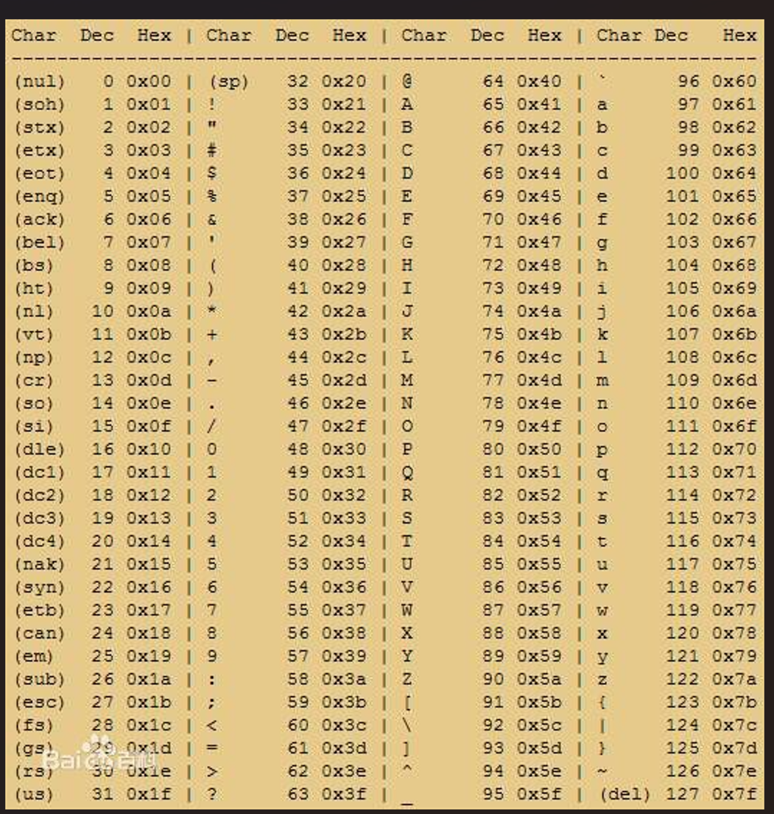

