# C++

### 头文件

C++头文件不必是.h结尾，C语言中的标准库头文件如math.h,stdio.h在C++被命名为cmath,cstdio

```c++
#include <cmath>
#include <cstdio>
```

### 命名空间

为了防止名字冲突（出现重名），C++引入了名字空间（namespace），通过：：运算符限定某个名字属于哪个名字空间。

```c++
//如“计算机1702”李平
//如“自动化1603”李平
#include <stdio>
namespace first
{
    int a;
    void f();
    int g();
}
namespace second
{
    double a;
    double f();
    char g;    
}
```

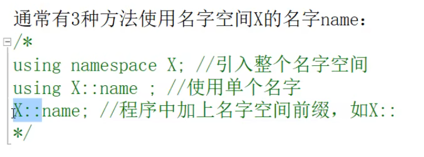

### 标准输入输出流

C++的新的输入输出流库（头文件iostream）将输入输出看成一个流，并用输出运算符<<和输入运算符>>对数据（变量和常量进行输入输出）

其中有cout和cin分别代表标准输出流对象（屏幕窗口）和标准输入流对象（键盘）

标准库中的名字都属于标准名字空间std

```c
#include <iostream>
using std::cout;
int main()
{
  double a;
  cout<<"从键盘输入一个数"<<std::end1;//end1表示换行符，并强制输出
  std::cin>>a;//通过名字限定std::cin,
              //cin是代表键盘的输入流对象，>>等待键盘输入一个实数
  a=sin(a);
  cout<<a;    //cout是代表屏幕窗口的输出流对象
  return 0;
}
```

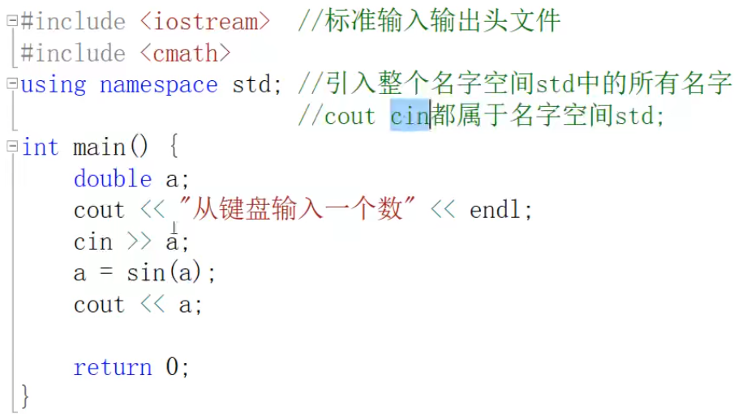

这里由于使用using namespace std，下面的cout和cin都可以直接使用

### 变量及其作用域

变量“即用即定义”，且可用表达式初始化

```c++
#include <iostream>
using namespace std;
int main()
{
	double a = 3.25 * 3;
	double b = a + 1.112;
	cout << "a contains:" << a << endl;
	cout << "b contains:" << b << endl;

	double c = a + b * a;
	cout << "c contains:" << c << endl;
	std::cout << "I love you";
	return 0;
}
```

程序块{}内部作用域可以定义域外部作用域同名的变量，在该块内隐藏了外部变量，也就是外部同名变量在内部不起作用。主要：变量一定都要指明类型

```c++
#include <iostream>
using namespace std;

int main()
{
	double a;
	cout << "Type a number:";
	cin >> a;
	{
		int a = 1;//int a 隐藏了外部作用域的double a
		cout << "Local Number:" << a << endl;
	}
	cout << "You Type Number:" << a << endl;

	return 0;
}
```

for循环语句可以定义局部变量，for循环块跟上一部分一样，外部变量无法影响块内部

```c++
#include <iostream>
using namespace std;

int main()
{
	int i = 0;
	for (int i=0;i<4;i++)
	{
		cout << i << endl;
	}
	cout << "i contains:" << i << endl;

	for (int i = 0;i<4;i++)
	{
		for (int i = 0;i<4;i++)
		{
			cout << i << " ";
		}
		cout << endl;
	}
	return 0;
}
```

这里的i一定都要指明变量的类型，否则会被定义为离你最近的变量的类型，这样操作的是外部变量

访问和内部作用域变量同名的全局变量，要使用全局作用域限定：：

```c++
#include <iostream>
using namespace std;
double a = 3.14;
int main()
{
	for (int a = 0;a<4;a++)//内部变量一定要定义类型，否则会被自动定义为double型，也就是外部的a
	{
		cout << ::a << endl;//::是全局变量限定
	}
	return 0;
}
```

### 引用

C++引入了引用类型，即一个变量是另一个变量的别名

```c++
#include <iostream>
using namespace std;
int main()
{
	double a = 3.14;
	double& b = a;//b是a的别名，b就是a
	b = 90;//也就是a的内存块值为90
	cout << a << endl;
	return 0;
}
```

引用经常用作函数的形参，表示形参和实参实际上是同一个对象，在函数中对形参的修改也就是对实参的修改

例1：为正常的形参和实参使用

```c++
#include <iostream>
using namespace std;
void swap(int x,int y)
{
    cout<<"swap函数内交换前："<< x <<" "<< y <<end1;
    int t = x;x=y;y=t;
    cout<<"swap函数内交换后："<< x <<" "<< y <<end1;
}
int main()
{
    int a = 3,b = 4;
    swap(a,b);
    cout<< a <<", "<< b <<end1;//这里a和b仍然是3和4
    return 0;
}
```

例2：使用指针进行修改实参值，修改的是x,y指向的那两个int型变量中的内容

```c++
#include <iostream>
using namespace std;
void swap(int *x,int *y)
{
    cout<<"swap函数内交换前："<< *x <<" "<< *y <<end1;
    int t = *x;*x = *y;*y = t;
    cout<<"swap函数内交换后："<< *x <<" "<< *y <<end1;
}
int main()
{
    int a = 3,b = 4;
    swap(&a,&b);//这里&是取a和b的地址
    cout<< a <<", "<< b <<end1;//这里a和b是4和3
    return 0;
}
```

例3：使用引用类型做形参，从而修改实参内部值

```c++
#include <iostream>
using namespace std;
void swap(int &x,int &y)
{
    cout<<"swap函数内交换前："<< x <<" "<< y <<end1;
    int t = x;x = y;y = t;
    cout<<"swap函数内交换后："<< x <<" "<< y <<end1;
}
int main()
{
    int a = 3,b = 4;
    swap(a,b);//这里&x = a，&y = b，x和y分别是a和b的引用，即x就是a，y就是b
    cout<< a <<", "<< b <<end1;//这里a和b是4和3
    return 0;
}
```

当实参栈内存大时，用引用代替传值（需要把值从一个内存块复制到另一个内存块）可提高效率，如果不希望因此无意中修改实参，可以用const修改符。如：

```c++
#include <iostream>
using namespace std;
void change(double &x,const double &y,double &z)
{
    x=100;
    y=200;//会报错，y是不可修改的，因为为const double &
    z=300;
}
int main()
{
    double a,b,c;//内在类型变量未提供初始化式，默认初始化为0
    change(a,b,c);
    return 0;
}
```

### 内联函数

- 对于不包含循环的简单函数，建议用inline关键字声明为“inline内联函数”，编译器将内联函数调用，用其代码展开。
- 也就是在调用函数时，用函数的内容替换函数调用，称为“内联展开”，避免函数调用开销，提高程序执行效率
- 当函数内部有循环体或者函数内容较多，可能不会执行内联展开

```c++
#include <iostream>
#include <cmath>
using namespace std;
inline double distance(double e,double b)
{
    return sqrt(a*a+b*b);
}
int main()
{
    double k = 6,m = 9;
    //下面两行将产生同样的代码：
    cout<<distance（k,m）<<end1;//即把distance()用其函数内容替代
    cout<<return sqrt(k*k+m*m)<<end1;
    return 0;
}
```

### 默认形参

函数的形参可带有默认值，必须一律在最右边

```c++
#include <iostream>
using namespace std;
double test(double a,double b = 7)
{
    return a-b;
}
int main()
{
    cout<<test（14,5）<<end1;
    cout<<test(14)<<end1;
    return 0;
}
/*错：默认参数一律靠右*/
double test(double a,double b = 7,double c)
{
    return a-b;
}
```

### 函数重载

- C++允许函数同名，只要他们的形参不一样（个数或对象参数类型），调用函数时将根据实参和形参的匹配选择最佳函数。（freertos的任务创建对于函数复用，是只要形参内容不一样就能复用）
- 如果有多个难以区分的最佳函数，则变化一起报错
- 注意：不能根据返回类型区分同名函数

```c++
#include <iostream>
using namespace std;
double add(double a,double b)
{
    return a-b;
}
int add(int a,int b)
{
    return a-b;
}
//错：编译器无法区分int add(int a,int b),void add(int a,int b)
void add(int a,int b)
{
    return a-b;
}
```

### 模板template函数

比方说对每种类型求最小值

```c++
#include <iostream>
using namespace std;
double minValue(double a,double b)
{
    if(a<b)return a;//return a<b?a:b
    else return b;
}
int minValue(int a,int b)
{
    if(a<b)return a;//return a<b?a:b
    else return b;
}

//如果是结构体类型的变量，就又要重写一次，现在可以利用模板函数直接定义取最小值的模板函数
//可以对任何能比较大小(<)的类型使用该模板让编译器自动生成一个针对该数据类型的具体函数
template<class T>
T minValue(T a,T b)
{
    if(a<b)return a;//return a<b?a:b
    else return b;   
}

//但是该模板函数还有一个问题是，当实参传入的是两个不同类型的数据时，会无法确定输出什么类型的参数。因此，再设定可以以不同类型参数输入的模板函数
template <class T1，class T2>
T1 minValue(T1 a,T2 b)
{
    if(a<b)return a;//return a<b?a:b
    else return (T1)b;   
}
int main()
{
	    int i = 3,j = 4;
    cout<<"min of "<<i<<" and "<<j<<" is "<<minValue(i,j)<<endl;
    double x = 3.5,y = 10;
    cout<<"min of "<<x<<" and "<<y<<" is "<<minValue(x,y)<<endl;    
    return 0;
}
```

### 动态内存分配

从堆存储区分配类型大小的内存，并返回地址。关键字new和delete比C语言的malloc/alloc/realloc和free更好，可以对类对象调用初始化构造函数或销毁析构函数。

```c++
#include<iostream>
#include <cmath>
#include <cstdio>
#include <cstring>
int main()
{
    	double* dp;
	dp = new double;//new分配正好容纳double值的内存块(如4或8个字节)
	                //并返回这个内存块的地址，而且地址的类型是double*
					//这个地址被保存在dp中，dp指向新的内存块，不再是原来的dp
					//但目前这个内存块的值是未知的

					//注意：new分配的是堆存储空间，即所有程序共享的自由内存
					//而d,dp等局部变量是这个程序自身的静态存储空间
					//new会对这个double元素调用double类型的构造函数做初始化
	double d = 3.14;
	dp = &d;
	cout<<"d = "<<d<<" *dp = "<<*dp<<endl;
	dp = new double[8];
	for(int i=0;i<8;i++)
	{
		dp[i]=i;
		cout<<dp[i]<<endl;
	}
	dp[0]=45.28;
	*(dp+1) = *dp+5;
	cout<<"*dp = "<<*dp<<" *(dp+1) = "<<*(dp+1)<<endl;
	int n = 8;
	dp = new double[n];//new 可以分配随机大小的double元素
	                   //而静态数组则必须是编译期固定大小，即大小为固定数值
					   //如 double arr[20]:通过下标访问每个元素
	delete[] dp;//释放dp指向的多个double元素占据的内存块,
	            //对每个double元素调用析构函数以释放资源
				// 缺少[]，只能释放第一个double元素的内存块
	return 0;
}
```

### 类

在C的struct类型上，增加了”成员函数“。

C的struct可将一个概念或实体的所有属性组合在一起，描述同一类对象的共同属性。

C++使得strurt不但包含数据，还包含函数（方法）用于访问或修改类变量（对象）的特性。

```c++
#include <iostream>
using namespace std;
struct Date 
{int d,m,y;
 void init(int dd, int mm, int yy)
 {d = dd;m=mm;y = yy;}
void print()
{cout<< y <<"-"<<m<<"-"<<d<<endl}
}

int main()
{
    Date day;
    day.print();////通过类Date对象day调用类Date的print方法
    day.init(4,6,1999);//通过类Date对象day调用类Date的init方法
    day.print();//通过类Date对象day调用类Date的print方法
}
```

然而class类相比于struct又多出了公开属性public和隐私属性private。public成员可以被外界访问修改，private成员只能被类内部成员访问修改。class类对象创建时,所有成员变量和函数都默认是私有属性的.

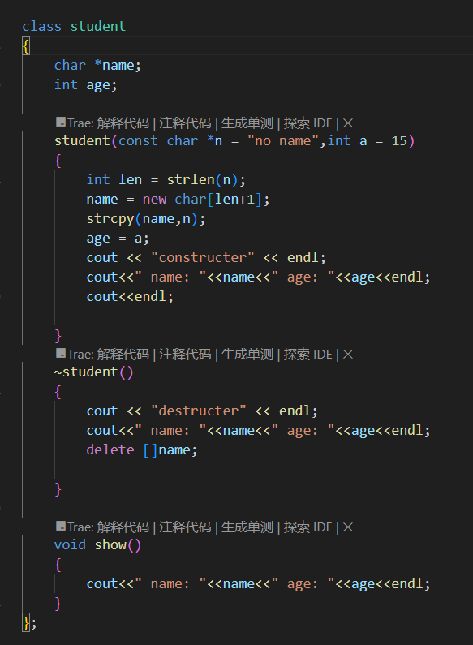

比如主函数调用类的成员函数,就会显示私有属性不可访问.

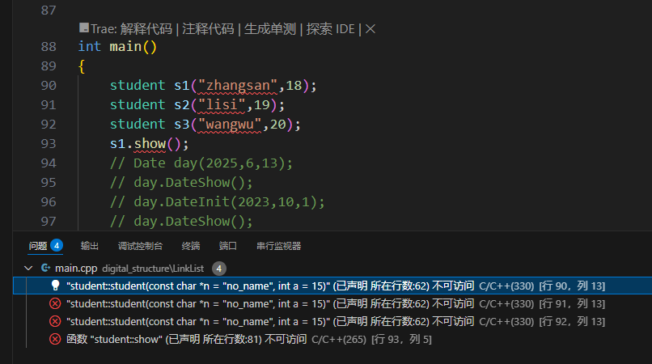

当将成员赋予public属性以后,外部函数就能使用

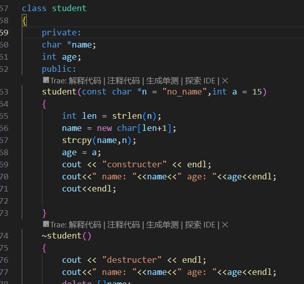

如果外部函数想要访问类私有成员的值,可以在类公开成员中定义函数范围内部成员访问,将访问值赋予外部函数.

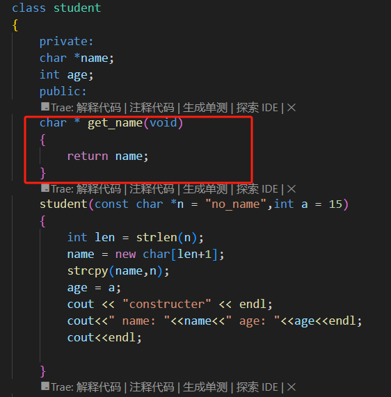

接口:public的公开成员(一般是成员函数),称为这个类的对外接口,外部函数只能通过这些接口访问类对象成员,private等非public的包含内部细节的成员,不对外公开,从而可以封装保护类对象.

#### 成员函数自引用

```c++
struct Date
{
	int year,month,day;
	void DateInit(int y,int m,int d)
	{
		year = y;
		month = m;
		day = d;
	}
	void DateShow()
	{
		cout << year << "年" << month << "月" << day << "日" << endl;
	}
	Date& add(int d)
	{
		day += d;
		return *this;//this是指向调用这个函数的类型对象指针，
                     // *this就是调用这个函数的那个对象
                     //这个成员函数返回的是“自引用”，即调用这个函数的对象本身
                     //通过返回自引用，可以连续调用这个函数
                     // day.add(3);
                     //day.add(3).add(7)
	}
};
```

#### 成员函数重载”运算符函数“

类里面的成员函数也可以函数重载，只要所列参数不一致就行。

运算符重载是因为类的成员不能直接加减，因此重载运算符使得成员可以直接加减。

```c++
struct Date
{
	int year,month,day;
	void DateInit(int y,int m,int d)
	{
		year = y;
		month = m;
		day = d;
	}
	void DateShow()
	{
		cout << year << "年" << month << "月" << day << "日" << endl;
	}
	Date& add(int d)
	{
		day += d;
		return *this;
	}

	Date& operator+=(int dd)
	{
		day+=dd;
		return *this;
	}
};
int main()
{
	Date day;
	day.DateInit(2023,10,1);
	day.DateShow();
	day.add(4);
	day.DateShow();
	day+=5;
    day.operator+=(5);
	day.DateShow();
}
```

### 构造函数

类内部与类名称相同的函数称为构造函数，类变量一被定义就要执行构造函数,并且构造函数不用定义类型.

```c++
struct Date
{
	int year,month,day;
    //构造函数
    Date(int yy,int mm,int dd)
    {
        year = yy;
		month = mm;
		day = dd;
    }
	void DateInit(int y,int m,int d)
	{
		year = y;
		month = m;
		day = d;
	}
	void DateShow()
	{
		cout << year << "年" << month << "月" << day << "日" << endl;
	}
	Date& add(int d)
	{
		day += d;
		return *this;
	}

	Date& operator+=(int dd)
	{
		day+=dd;
		return *this;
	}
};

int main()
{
	Date day(2025,6,13);
    //若在类内部自定义了构造函数,构造函数定义了多少传入形参,在主函数中定义类变量时就要传入多少参数.
	day.DateShow();
	day.DateInit(2023,10,1);
    day.DateShow();
}
```

如果类里面没有定义构造函数，当定义一个类变量时，C++会自动执行一个默认的构造函数,定义类变量时,什么参数都不用传入.也就是什么都不做，但一定会执行构造函数。

```c++
    Date()
    {
    }
```

并且类内部可以定义多个构造函数,也就是构造函数也可以函数重载.

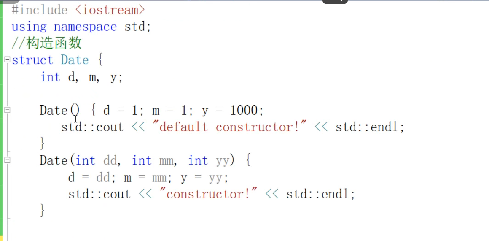

C++中字符串不能直接复制给字符串变量,应该使用new动态分配字符串大小的内存空间,然后再用strcpy把字符串复制到字符串变量.

```c++
struct student
{
	char *name;
	int age;
    //构造函数若有字符指针/字符串型的形参,形参前要加const,防止传入错误类型?
	student(const char *n = "no_name",int a = 15)
	{
		int len = strlen(n);
		name = new char[len+1];
		strcpy(name,n);
		age = a;
		cout << "constructer" << endl;
		cout<<" name: "<<name<<" age: "<<age<<endl;
		cout<<endl;
}
```

一般初始化一个对象的时候,就在构造函数里初始化,比如分配一块内存,打开一个文件,打开一个网络端口等到

### 析构函数

类的函数调用完以后,会自动调用析构函数释放类变量占据的内存空间,若不把申请的内存空间还给操作系统,就会造成内存泄漏(你的程序始终占据这片内存,其他程序无法使用该内存),析构函数不用定义类型.

```c++
struct student
{
	char *name;
	int age;

	student(const char *n = "no_name",int a = 15)
	{
		int len = strlen(n);
		name = new char[len+1];
		strcpy(name,n);
		age = a;
		cout << "constructer" << endl;
		cout<<" name: "<<name<<" age: "<<age<<endl;
		cout<<endl;

	}
    //与构造函数类似,析构函数名与定义的类名称一致,但是函数名前还有~符号.这就是析构函数
    //且虚构函数前一定要加virtual声明成虚函数
	virtual ~student()
	{
		delete []name;
		cout << "destructer" << endl;
	}

	void show()
	{
		cout<<" name: "<<name<<" age: "<<age<<endl;
	}
};
```

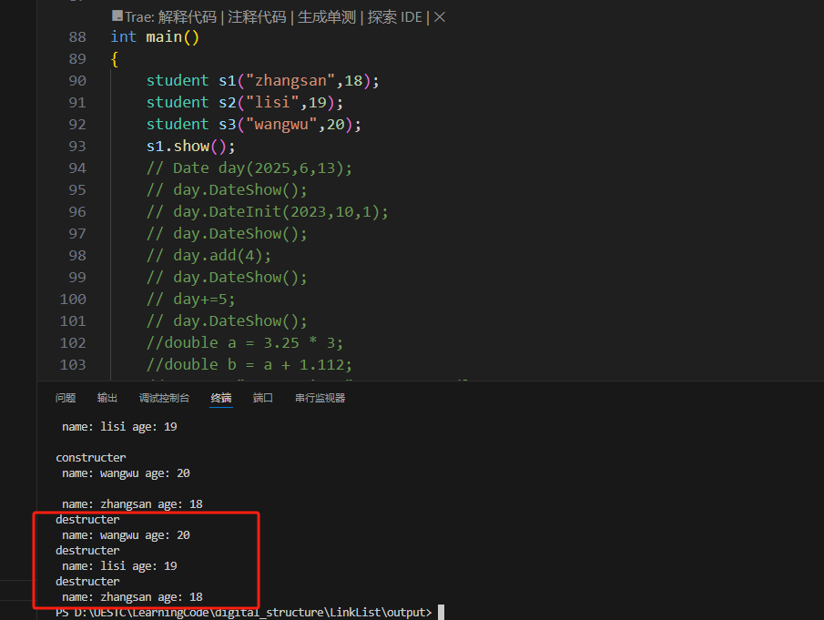

并且按照栈的特性,s3是最晚被创建的,会被最早释放内存空间.

当对象销毁的时候,要把内存还给操作系统,把文件关闭,把打开的网络端口关闭.

一般来说,析构函数不需要提供参数,因此要执行析构函数代表此时对象快要消亡了.

### 拷贝

下列赋值如果不自定义拷贝构造函数和类成员函数重载赋值运算符会出错:

- "student m(s)";这里程序会调用编译器自动生成的拷贝构造函数,也就是会使m.name = s.name,m.age = s.age,这是一种硬拷贝,直接把类的成员变量原封不动的赋值给新定义的类对象.name是字符指针类型的,因此m和s的name都指向同一块内存,后续执行析构函数的时候,会delete[] name两次,因此就会出错.

- s=k;这里程序会调用编译器自动生成的赋值运算符,这是和拷贝构造函数的结果相同,也是把类的成员变量赋值给新定义的类对象.
- 这两种情况都会出现以下现象

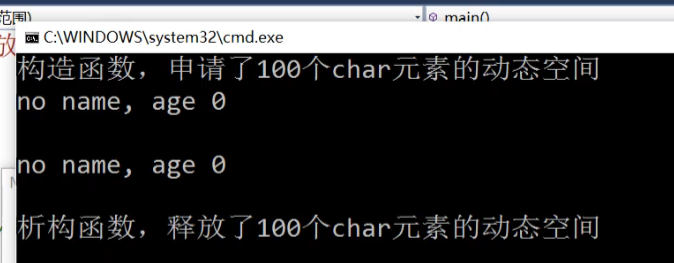


#### 拷贝构造函数

拷贝构造函数也不用定义类型

拷贝构造函数:定义一个类对象时,用同类型的另外对象初始化

```c++
class student
{
	private:
	char *name;
	int age;
	public:
    student(const student &s)
	{
		int len = strlen(s.name);
		name = new char[len+1];
		strcpy(name,s.name);
		age = s.age;
		cout << "copy constructer" << endl;
	}
}
```

#### 赋值运算符

赋值运算符:一个对象赋值给另一个对象

```c++
class student
{
	private:
	char *name;
	int age;
	public:
	student& operator=(student& s)
	{
		int len = strlen(s.name);
		name = new char[len+1];
		strcpy(name,s.name);
		age = s.age;
		cout << "copy operator=" << endl;
		return *this;
	}
}
```

### 类体外定义成员函数

类体外定义方法(成员函数),必须在类定义中声明,类体外要有类作用域,否则就是全局外部函数了

```c++
using namespace std;
class Date
{
    private:
	int year,month,day;
    public:
    void print();//成员函数可以在类体外定义,但是一定要在类体内声明
	Date(int yy,int mm,int dd)
	{
		year = yy;
		month = mm;
		day = dd;
		cout<<"Constructer"<<endl;
	}
};
//在函数名前加上函数的作用域Date::,说明不是全局函数,而是类的成员函数
void Date::print()
{
    cout << y <<"-"<< m << "-" << d <<endl;
}
```

### 类模板

可以将一个类变成“类模板”或“模板类”，正如一个模板函数一样。

```c++
template <class T>
class Array//template<class T> class Array<T>
{
private:
	int size;
	T* data;
public:
Array(int s)
{
	size = s;
	data = new T[size];
}
virtual ~Array()
{
	delete []data;
}
T& operator[](int i)
{
	if(i<0||i>=size)
	{
		cout<<"error"<<endl;
		exit(EXIT_FAILURE);
	}
	else return data[i];
}
};	
int main()
}
	Array<int> t(5);//使用模板类时，在主函数中定义类对象要在类名后面加<xxx>，指定T类型被替换成集体的类型。
	Array<string> s(5);

	t[0] = 51;
	t[4] = t[0]+7;
	for(int i = 0;i<5;i++)
	{
		cout << t[i] << endl;
	}
	s[0] = "hello";
	s[1] = "world";
	for(int i = 0;i<5;i++)
	{
		cout << s[i] << endl;
	}
	return 0;
}
```

### 用户定义类型string和vector

#### string

- 是一个用户定义类型，表示的是符串

```c++
string s = "hello",s2("world");//两种方法都可以赋值
```

- 用成员访问运算符.访问string类的成员。

```c++
cout<<s.size()<<endl;
string s3 = s.substr(1,3);
cout<<s3<<endl;
```

- 用运算符对string对象进行运算，如+、[]

```c++
string s4 = s +" " + s2;
cout<<s4<<endl;//"hello world"

s4[0] = 'H';
s4[6] = 'X';
cout<<s4<<endl;

int pos = s4.find("orl");
cout<<pos<<endl;
s4.insert(3,"ABCDE");

```

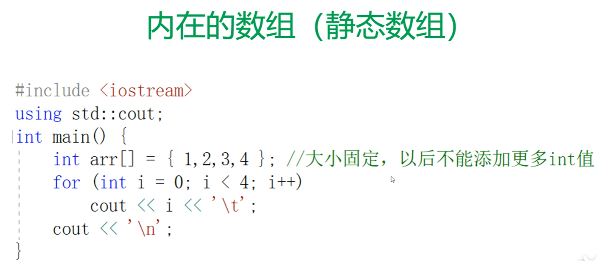

#### vector

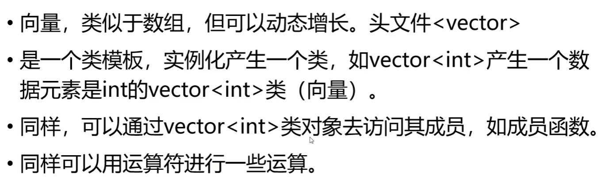

```c++
	vector<int> v;//也可以定义为其他类类型的vector
	v = {1,2,3,4,5};
	for(std::vector<int>::iterator it = v.begin();it!=v.end();it++)//这里是直接比较指针
	{
		cout << *it << endl;
	}
	v.push_back(1);
	for(std::vector<int>::size_type i = 0;i<v.size();i++)//使用size_type这个类型修饰变量，与v.size()比较会更安全
	{
		cout << v[i] << endl;
	}
	v.pop_back();
	cout << "pop_back" << endl;
	for(unsigned int i = 0;i<v.size();i++)
	{
		cout << v[i] << endl;
	}
	v.resize(2);
	for(unsigned int i = 0;i<v.size();i++)
	{
		cout << v[i] << endl;
	}
```

### 派生类

一个派生类从1个或多个父类/基类继承，即继承父类的属性和行为，但也有自己的特有属性和行为，但也有自己的特有属性和行为。如：

```c++
class Employee
{
private:
	char *name;
public:
	Employee(const char* n = "no name");
	~Employee();
	char* get_name(void)
	{
		return name;
	}
	void print()
	{
		cout<<" name: "<<name<<endl;
	}
};

Employee::Employee(const char* n)
{
	int len = strlen(n);
	name = new char[len+1];
	strcpy(name,n);
}

Employee::~Employee()
{
	delete[] name;
}
//类名后冒号加public/private/protect都是对基类的继承方式
//并且派生类无法访问父类/基类的私有成员，即使是公开方式的继承也不行
//派生类只能描述它自己的成员和其直接基类的初始式，不能去初始化基类的成员
class Manager:public Employee
{
private:
	char *title;
	int age;
public:
    //在 C++ 里，默认参数需要在函数声明处指定，而非定义处。需要检查 Manager 类构造函数的声明和定义，确保默认参数是在声明里指定的。
	Manager(const char *n = "no name",int a = 1);
	~Manager();
	void print()
	{
		cout<<" name: "<<Employee::get_name()<<" age: "<<age<<" title: "<<title<<endl;
	}
};
//默认参数在声明处指定
Manager::Manager(const char *n ,int a)
{
	int len = strlen(n);
	title = new char[len+1];
	strcpy(title,n);
	age = a;
}
Manager::~Manager()
{
	delete []title;
}
int main()
{
	Employee y("jichuanfulang");
	Manager m("manager",20);
	y.print();
	m.print();
}
```

### 虚函数和多态

#### 虚函数Virtual Functions

派生类的指针可以自动转化为基类指针，用一个指向基类的指针分别指向基类对象和派生类对象，并可以调用两个不同类的相同函数名的函数。

根据指向的对象的类型，调用不同类的同名函数称为多态性。

如果希望函数存在多态行为，就需要将函数声明为虚函数。

```c++
class Employee
{
private:
	char *name;
	int level;
public:
	Employee(const char* n = "no name");
	~Employee();
	char* get_name(void)
	{
		return name;
	}
	virtual void print()
	{
		cout<<" name: "<<name<<endl;
	}
};

Employee::Employee(const char* n)
{
	int len = strlen(n);
	name = new char[len+1];
	strcpy(name,n);
}

Employee::~Employee()
{
	delete[] name;
}

class Manager:public Employee
{
private:
	char *title;
	int age;
public:

	Manager(const char *n = "no name",int a = 1);
	~Manager();
	virtual void print()
	{
		cout<<" name: "<<Employee::get_name()<<" age: "<<age<<" title: "<<title<<endl;
	}
};
Manager::Manager(const char *n ,int a)
{
	int len = strlen(n);
	title = new char[len+1];
	strcpy(title,n);
	age = a;
}
Manager::~Manager()
{
	delete []title;
}

int main()
{
	Employee* employees[100];
	Employee* p;
	Employee y("jichuanfulang");
	Manager m("manager",20);
	p = &y;
	p->print();
	p = &m;//这里p仍然是Employee*类型的指针，但是可以调用Manager类下的print函数
	p->print();
}
```

假如一个公司的雇员（包括经理）要保存在一个数组，如vector中，怎么办？

肯定不希望用两个数组，实际上派生类的指针可以自动转化为基类指针。可以将所有的雇员保存在一个基类数组Employee* employees[100]下。

```c++
class Employee
{
private:
	char *name;
	int level;
public:
	Employee(const char* n = "no name",int l = 0);
	~Employee();
	char* get_name(void)
	{
		return name;
	}
	virtual void print()
	{
		cout<<" name: "<<name<<endl;
	}
};

Employee::Employee(const char* n,int l)
{
	int len = strlen(n);
	name = new char[len+1];
	strcpy(name,n);
}

Employee::~Employee()
{
	delete[] name;
}

class Manager:public Employee
{
private:
	char *title;
	int age;
public:
    // 修改构造函数，初始化基类
    Manager(const char *n = "no name", int a = 1) : Employee(n)
    {
        int len = strlen(n);
        title = new char[len + 1];
        strcpy(title, n);
        age = a;
    }
    ~Manager();
    virtual void print()
    {
        cout<<" name: "<<Employee::get_name()<<" age: "<<age<<" title: "<<title<<endl;
    }
};
Manager::~Manager()
{
	delete []title;
}

int main()
{
	Employee* employees[100];
	char cmd;
	int employee_num = 0;
	while (cin>>cmd)
	{
		if(cmd == 'M'||cmd == 'm')
		{
			char name[20];
			int age;
			cin>>name;
			cin>>age;
			// 修正对象创建方式
			employees[employee_num++] = new Manager(name, age);
			employees[employee_num - 1]->print();
		}
		else if(cmd == 'E'||cmd == 'e')
		{
			char name[20];
			int level_key;
			cin>>name;
			cin>>level_key;
			employees[employee_num++] = new Employee(name,level_key);
			employees[employee_num-1]->print();
		}
		else break;
	}
	return 0;
	}
```

### 多重继承

可以从一个类派生出多个不同的类，如：

```c++
class Employee
{
    public:
    virtual void print();
}
class Manager:public Employee
{
    public:
    void print();
}
class Secretary:public Employee
{
    public:
    void print();
}
//可以从多个不同的类派生出一个类来：多重派生
class One
{
}
class Two
{
}
class MultipleInheritance:public One,public Two
{
    public:
    void print();
}
```

### 纯虚函数和抽象类

函数体=0的虚函数称为纯虚函数。包含纯虚函数的类称为抽象类，抽象类通常用于做接口，可以不实现内部具体细节。

```c++
class  Animal
{
    protected:
    std::string m_name;
    public:
    Animal(std::string name):m_name(name)
    {}
    std::string getNmae()
    {
        return m_name;
    }
    virtual const char* speak() = 0;//纯虚函数
}

int main()
{
    Animal a;//错：抽象类不能实例化（不能定义抽象类的对象（变量））
}
//从抽象类派生的类型如果没有继承实现所有的纯虚函数，则仍然是抽象类
#include<iostream>
class Cow:public Animal
{
    public:
    Cow(std::string name):Animal(name)
    {}
    //没有重定义纯虚函数
}
int main()
{
    Cow cow("Betsy");//仍然错：因为Cow仍然是抽象类
    std::cout<<cow.getName()<<"says"<<cow.speak()<<'\n'
}
//像下面这样实现所有纯虚函数就可以了，Cow不是一个抽象类
#include<iostream>
class Cow:public Animal
{
    public:
    Cow(std::string name):Animal(name)
    {}
    virtual const char* speak(){return "Moo"}
}
int main()
{
    Cow cow("Betsy");//仍然错：因为Cow仍然是抽象类
    std::cout<<cow.getName()<<"says"<<cow.speak()<<'\n'
}
```

### volatile

`volatile` 是 C/C++ 等编程语言中的**类型修饰符**（Type Qualifier），用于声明一个变量可能被程序以外的因素（如硬件、中断、多线程等）意外修改，从而**禁止编译器对该变量进行优化**，确保每次访问都直接从内存读取或写入最新值

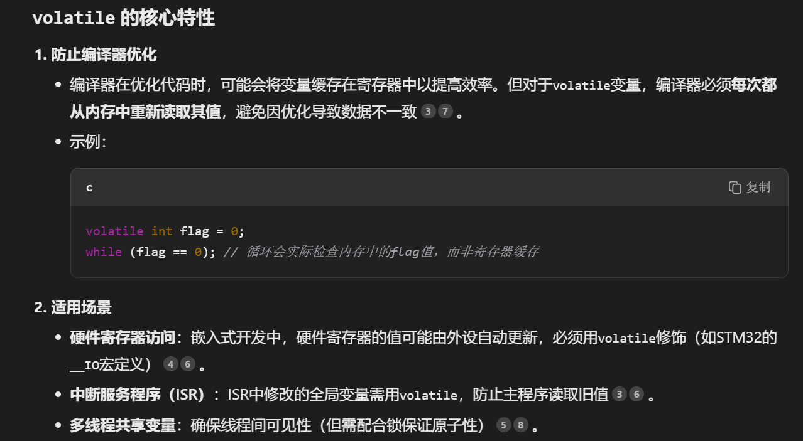

