# FreeRtos

## 编程规范

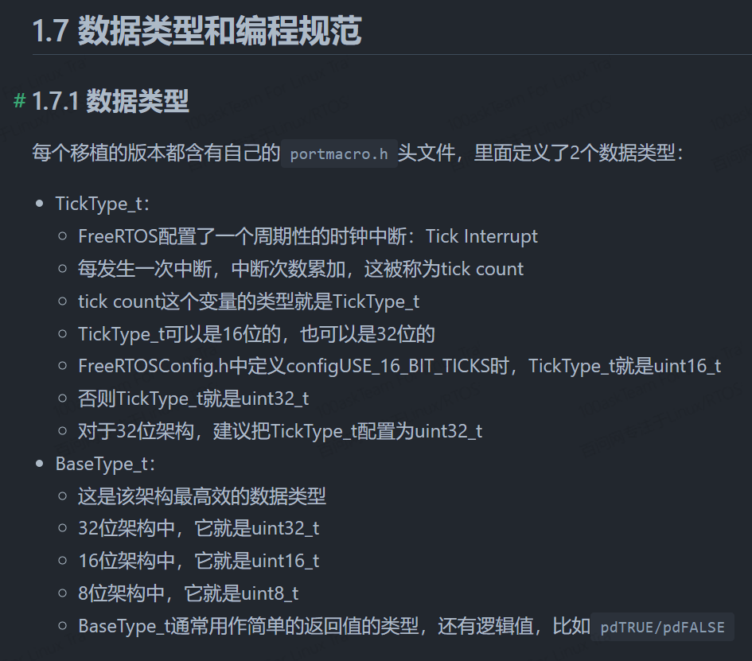

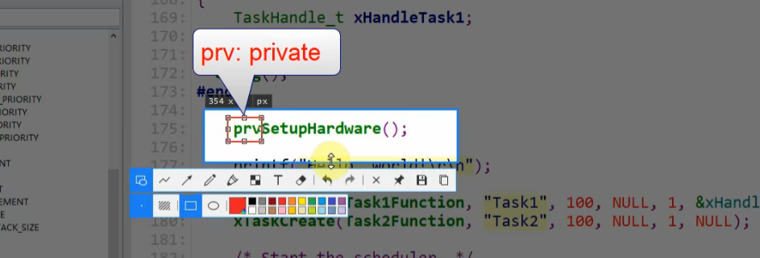

这里prv指private，即私人函数，在C语言里面用Static修饰函数来实现，意义是该函数只能在当前文件里边被使用。

### 变量命名含义

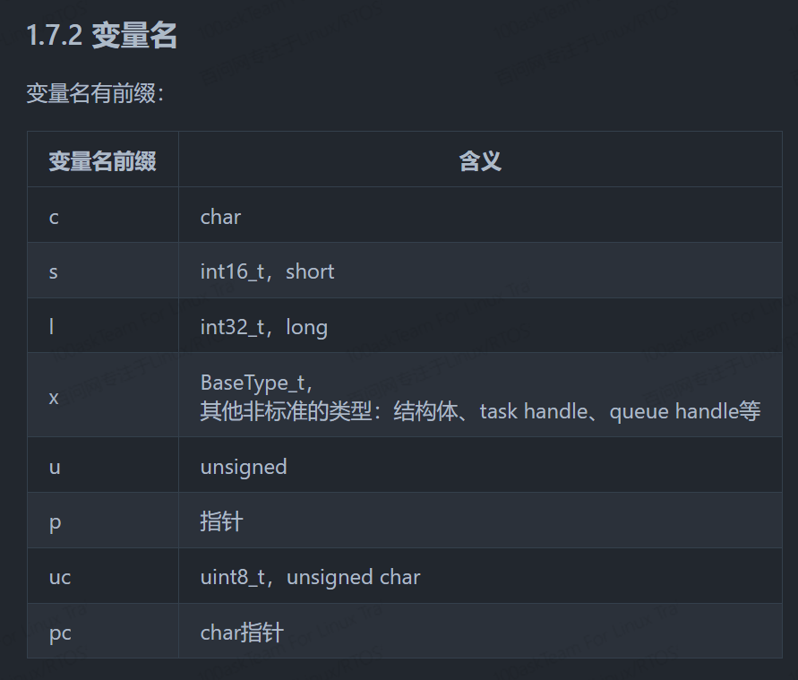

### 函数名含义

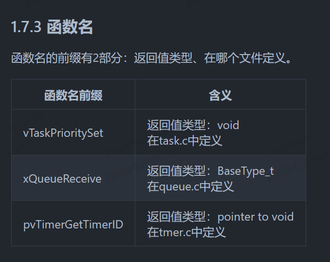

### 宏命名含义

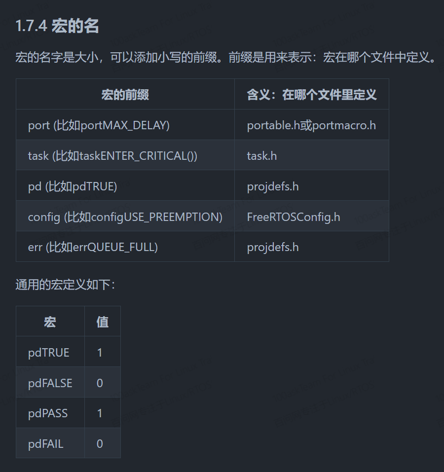

## 任务管理

优先级相同的任务，后创建先执行？任务管理源码里设定，当多个任务优先级相同时，新创建的任务优先级>=旧任务优先级，则新任务先运行。

### 静态创建任务

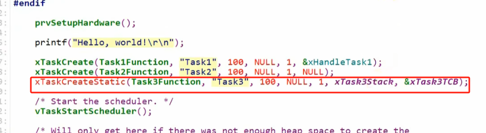

即任务的栈和任务控制块结构体要事先分配好和定义好，并且自己实现vApplicationGetIdleTaskMemory等接口

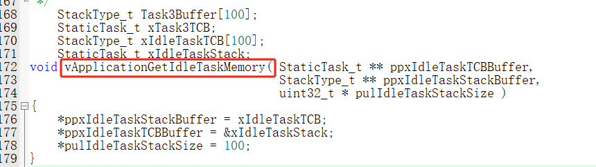

### 任务优先级

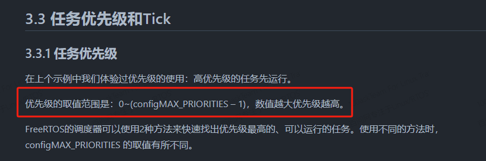

与所学操作系统的知识不同，freertos的优先级是数值越大优先级越高。

### 任务删除

任务创建的最后一个参数任务句柄是一个任务存在的标识，该句柄可以被用作删除该任务的函数的输入参数。

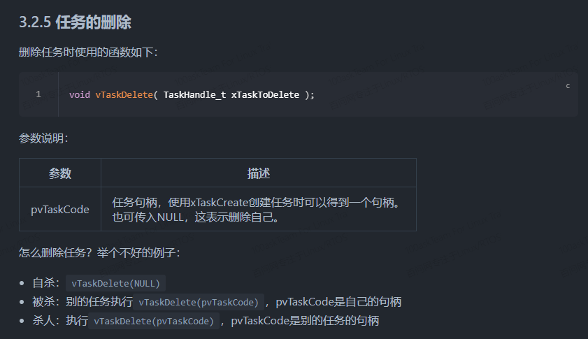

### 任务创建中的函数复用

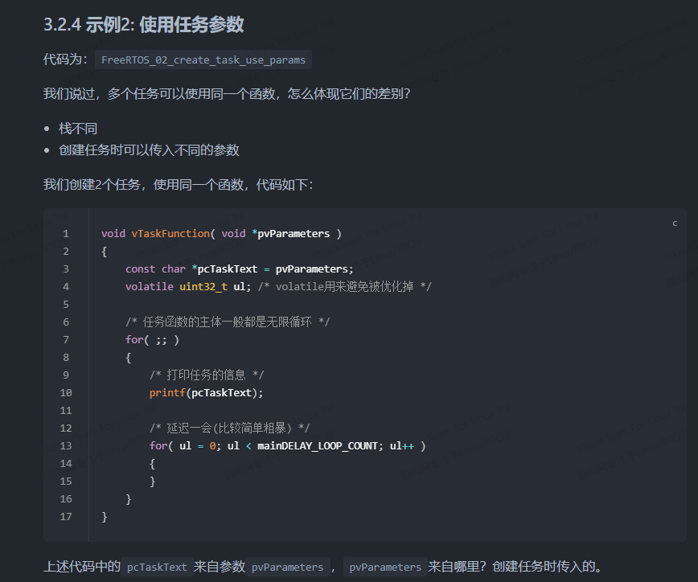

在任务创建时，所分配的任务栈空间不同，并且函数传入的参数不同，因此任务的内容页不同，可以多个任务使用同一个函数。

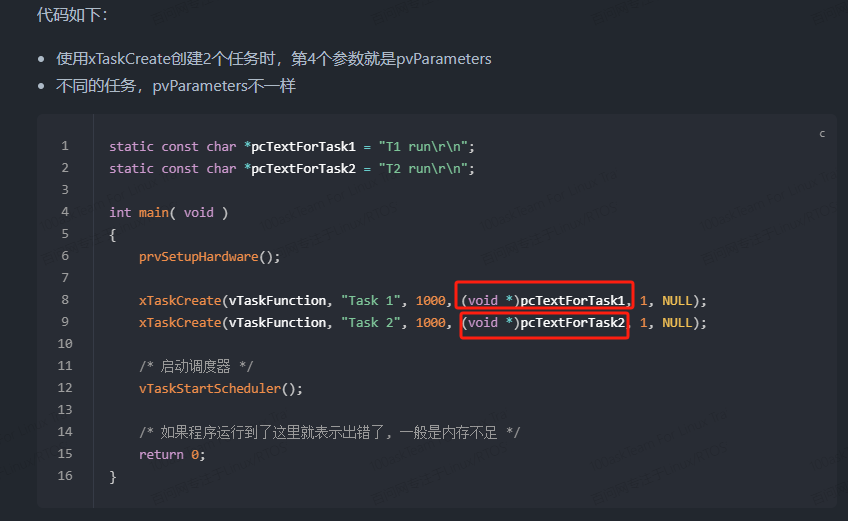

### 任务栈溢出

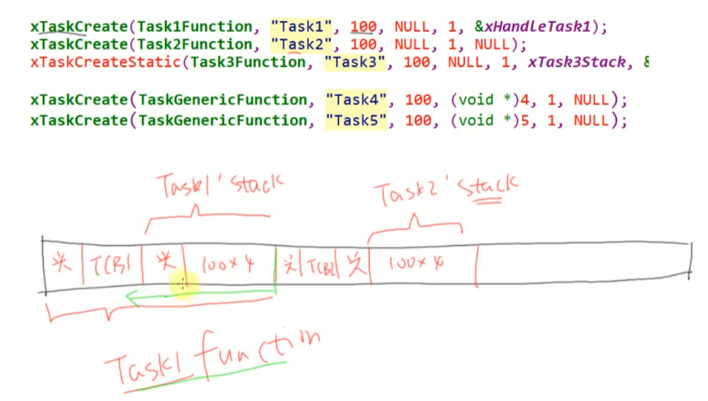

每个任务创建时，都会分配如下内存空间用于存放任务控制块TCB、任务栈空间。若任务函数中定义了超过栈大小的局部变量，如数组等，数组内容会从栈顶高地址向栈底低地址覆盖，这会破坏栈空间前的头结点和任务控制块的内容，从而引起硬件错误中断，陷入死循环。

### 任务状态

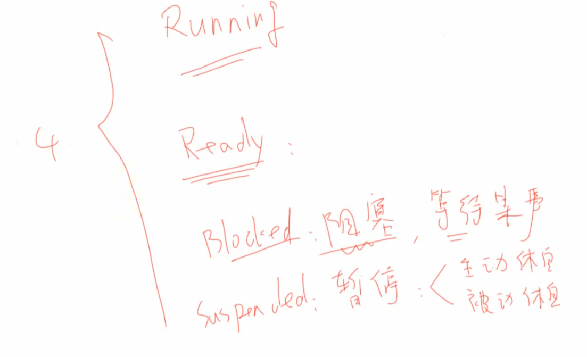

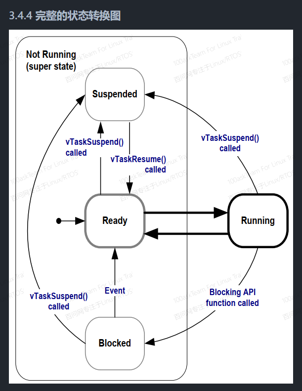

freertos中就只有四种任务状态：就绪态、运行态、阻塞态、暂停态

#### 暂停态

- 进入暂停态

这里暂停态指的是将进程移出内存区，直到有其他任务将其唤醒，再重新把它调入内存区。调入内存区后，此时暂停态任务被转换成就绪态。

其中任务可以自己挂起自己，也可以被其他任务挂起。

暂停函数为void vTaskSuspend( TaskHandle_t xTaskToSuspend );

参数xTaskToSuspend表示要暂停的任务，如果为NULL则表示暂停自己。

- 退出暂停态
  - 退出暂停态只能由别人来操作，有两种方法：
  - 别的任务调用：vTaskResume
  - 中断程序调用：xTaskResumeFromISR

有疑惑的地方是，任务退出暂停态，在就绪态进入运行态时只运行了半个时间片，这是为啥？任务在运行态的时间片使用已有一半？好像波形也不对啊？

#### 阻塞态

任务进入阻塞态一般是在等待什么事件发生，比如等待资源分配，或者vTaskDelay()延时，等待某个时间到达。

- vTaskDelay()延时是相对延时，即相对当前时刻延时若干个tick。
- vTaskDelayUntil()延时是绝对延时，即已确定当前时刻，以当前时刻为基准，若任务执行时间不同，会延时不同时间，从而延时到固定时刻再使任务转为就绪态。
- 这是使用vTaskDelayUntil()的波形图，其中任务2被延时。比较疑惑的地方是，任务2执行完以后，任务1执行那么短时间。
- 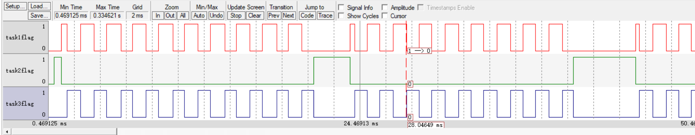

### 时间片

这里时间片就是一个tick，一个tick为1ms。

```c
//一般用vTaskDelay()来进行任务阻塞，阻塞时间单位为tick
vTaskDelay(2);  // 等待2个Tick，假设configTICK_RATE_HZ=100, Tick周期时10ms, 等待20ms

// 还可以使用pdMS_TO_TICKS宏把ms转换为tick
vTaskDelay(pdMS_TO_TICKS(100));	 // 等待100ms
```

注意，基于Tick实现的延时并不精确，比如`vTaskDelay(2)`的本意是延迟2个Tick周期，有可能经过1个Tick多一点就返回了。

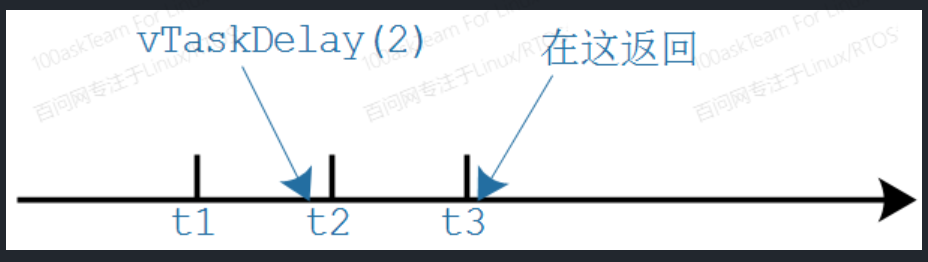

### 任务调度

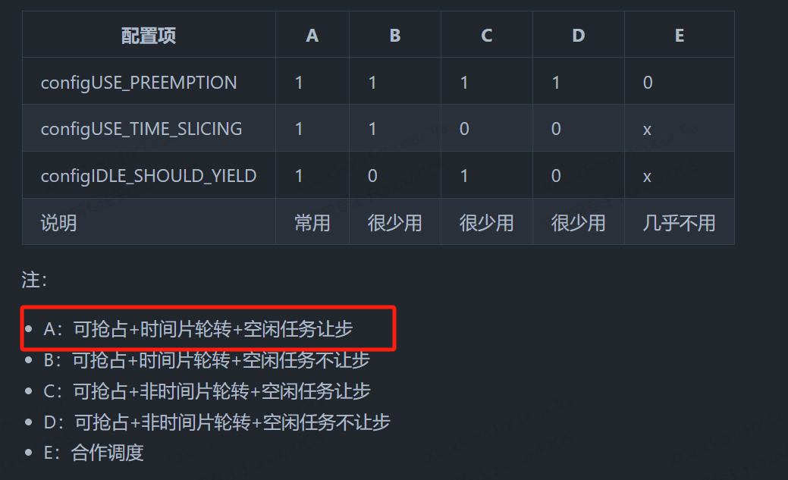

通常使用A方法。

### 空闲任务

空闲任务的优先级为0，即优先级最低。主要用于清除任务删除后占用的堆栈空间，通过设定钩子函数来执行空闲任务，但好像钩子函数只要有就行？

- 这是没有设定钩子函数时，任务自删除的情况，可以看到堆栈空间已经溢出。但这是任务2的优先级为2，任务1的优先级为1的情况下的模拟串口打印情况。
  - 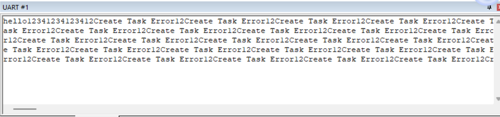

- 这是任务2的优先级为1，任务1优先级为0的情况下模拟串口打印情况
  - 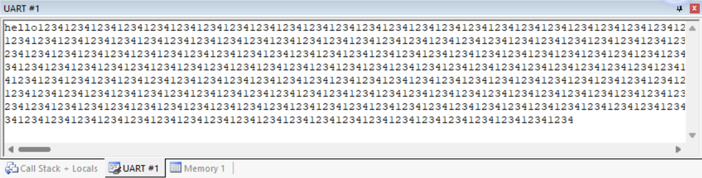

可以得出，只有当任务1的优先级和空闲任务优先级相同时，才能使空闲任务清除被删除任务的占用的内存。然后有没有钩子函数（或钩子函数内容为空）好像都可以运行成功清除删除任务的堆栈空间，但是你在FreeRTOSConfig.h中将configUSE_IDLE_HOOK这个宏定义置1以后就必须定义钩子函数。

### FreeRTOS基础配置

FreeRTOS还有很多基础配置要配，官网例程只用了一部分，还有很多没有列出来

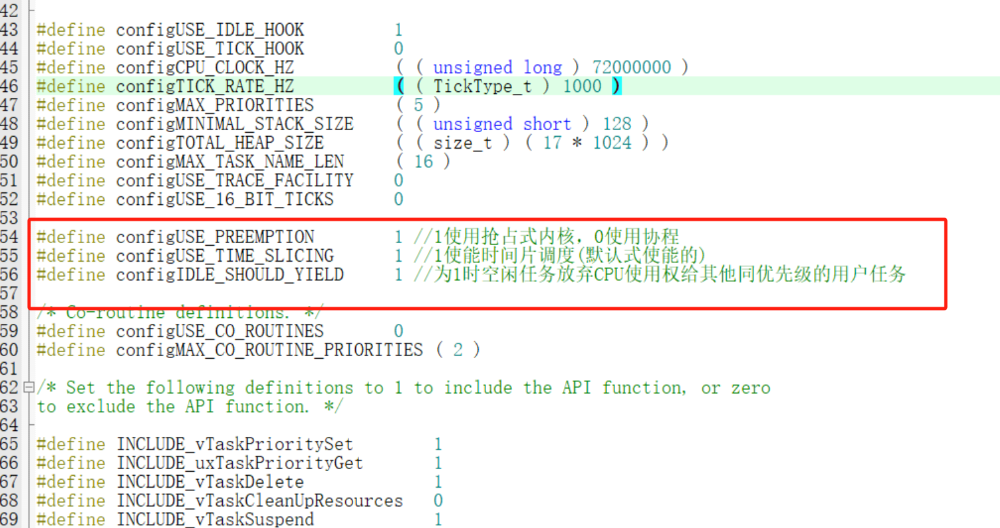

对比正点原子的FreeRTOS模板：

- 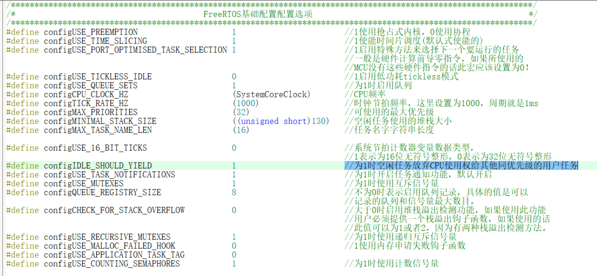
- 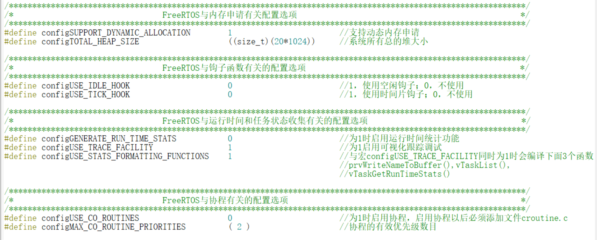
- 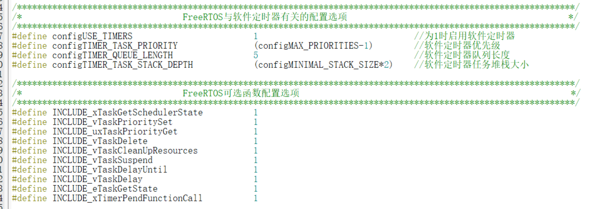
- 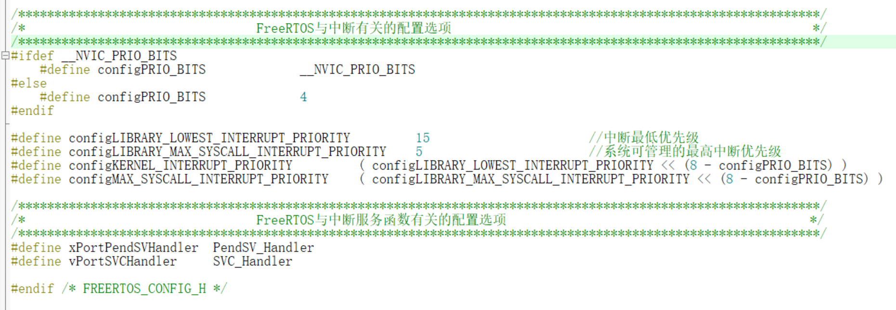

## 同步互斥与通信

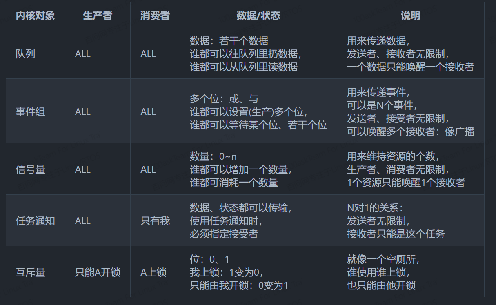

五种实现同步、互斥的通信方式

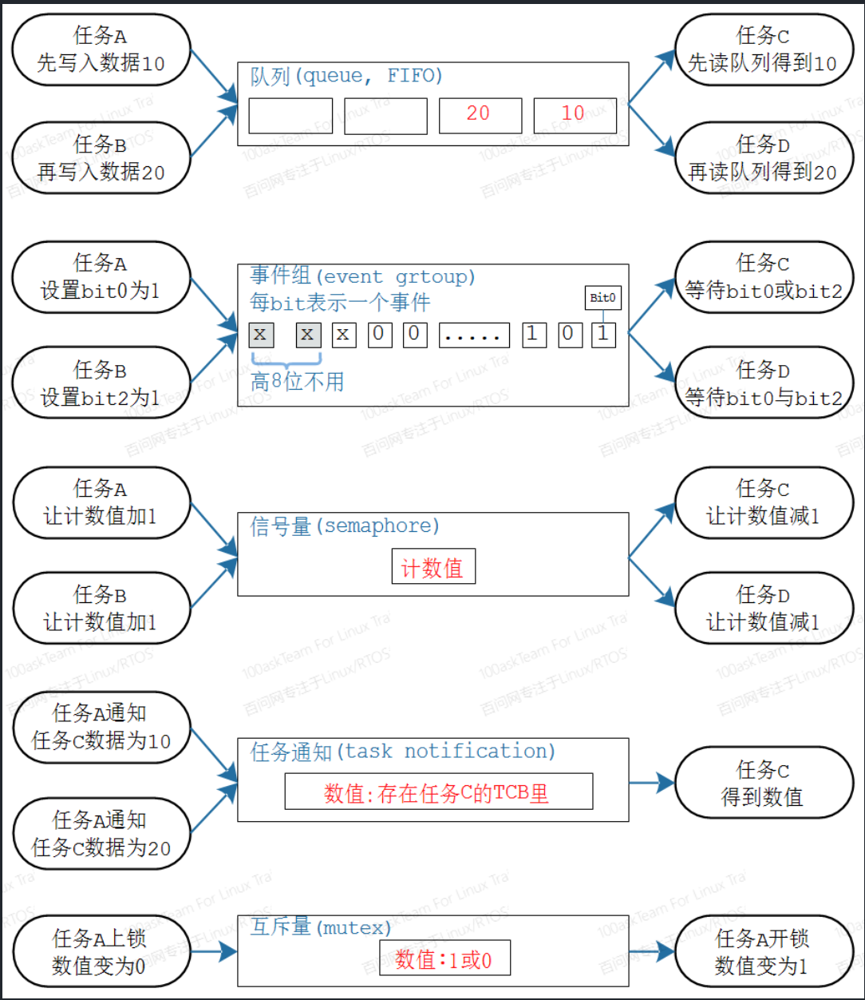

具体实现示例

## 队列

队列传输数据的两种方法：

- 拷贝：把数据、把变量的值复制进队列里
- 引用：把数据、把变量的地址复制进队列里
  - 当数据太大的时候，可以使用队列传输他的地址，如果是拷贝的话会消耗比较长的时间

- 注意：对于有内存保护功能的系统，如果队列使用引用方法，也就是使用地址，必须确保双方任务对这个地址都有访问权限。使用拷贝方法时，则无此限制：内核有足够的权限，把数据复制进队列、再把数据复制出队列。

当多个任务读取空队列时，这些任务都会被阻塞。

当多个任务读取有数据的队列时，哪个任务会进入就绪态：

- 优先级最高的任务
- 如果大家的优先级相同，那等待时间最久的任务会进入就绪态

### 队列创建

队列创建有两种方法：动态分配内存、静态分配内存

- 动态分配内存：xQueueCreate，队列的内存在函数内部动态分配

```c
QueueHandle_t xQueueCreate( UBaseType_t uxQueueLength, UBaseType_t uxItemSize );
```

- 静态分配内存：xQueueCreateStatic，队列的内存要事先分配好

```C
QueueHandle_t xQueueCreateStatic(
                           UBaseType_t uxQueueLength,
                           UBaseType_t uxItemSize,
                           uint8_t *pucQueueStorageBuffer,
                                 //uxQueueLength*uxItemSize大小的数组的指针
                           StaticQueue_t *pxQueueBuffer//静态队列结构体指针
                       );
```

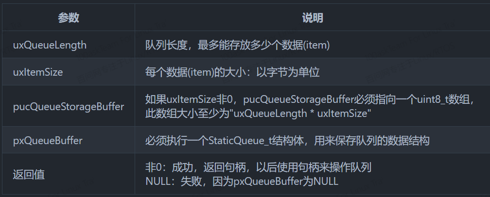

示例：

```c
// 示例代码
 #define QUEUE_LENGTH 10
 #define ITEM_SIZE sizeof( uint32_t )
 
 // xQueueBuffer用来保存队列结构体
 StaticQueue_t xQueueBuffer;
 
 // ucQueueStorage 用来保存队列的数据
 // 大小为：队列长度 * 数据大小
 uint8_t ucQueueStorage[ QUEUE_LENGTH * ITEM_SIZE ];
 
 void vATask( void *pvParameters )
 {
	QueueHandle_t xQueue1;
 
	// 创建队列: 可以容纳QUEUE_LENGTH个数据，每个数据大小是ITEM_SIZE
	xQueue1 = xQueueCreateStatic( QUEUE_LENGTH,
						  ITEM_SIZE,
						  ucQueueStorage,
						  &xQueueBuffer ); 
 }
```

### 复位

队列刚被创建时，里面没有数据；使用过程中可以调用xQueueReset()把队列恢复为初始状态，此函数原型为：

```c
/* pxQueue : 复位哪个队列;
 * 返回值: pdPASS(必定成功)
 */
BaseType_t xQueueReset( QueueHandle_t pxQueue);
```

### 删除

删除队列的函数为vQueueDelete()，只能删除使用动态方法创建的队列，它会释放内存。原型如下：

```c
void vQueueDelete( QueueHandle_t xQueue );
```

### 写队列

可以把数据写到队列头部，也可以写到尾部，这些函数有两个版本：在任务中使用、在ISR中使用。函数原型如下：

```c
/* 等同于xQueueSendToBack
 * 往队列尾部写入数据，如果没有空间，阻塞时间为xTicksToWait
 */
BaseType_t xQueueSend(
                                QueueHandle_t    xQueue,
                                const void       *pvItemToQueue,
                                TickType_t       xTicksToWait
                            );

/* 
 * 往队列尾部写入数据，如果没有空间，阻塞时间为xTicksToWait
 */
BaseType_t xQueueSendToBack(
                                QueueHandle_t    xQueue,
                                const void       *pvItemToQueue,
                                TickType_t       xTicksToWait
                            );


/* 
 * 往队列尾部写入数据，此函数可以在中断函数中使用，不可阻塞
 */
BaseType_t xQueueSendToBackFromISR(
                                      QueueHandle_t xQueue,
                                      const void *pvItemToQueue,
                                      BaseType_t *pxHigherPriorityTaskWoken
                                   );

/* 
 * 往队列头部写入数据，如果没有空间，阻塞时间为xTicksToWait
 */
BaseType_t xQueueSendToFront(
                                QueueHandle_t    xQueue,
                                const void       *pvItemToQueue,
                                TickType_t       xTicksToWait
                            );

/* 
 * 往队列头部写入数据，此函数可以在中断函数中使用，不可阻塞
 */
BaseType_t xQueueSendToFrontFromISR(
                                      QueueHandle_t xQueue,
                                      const void *pvItemToQueue,
                                      BaseType_t *pxHigherPriorityTaskWoken
    //比苏醒任务更高的优先级的指针？
                                   );
```

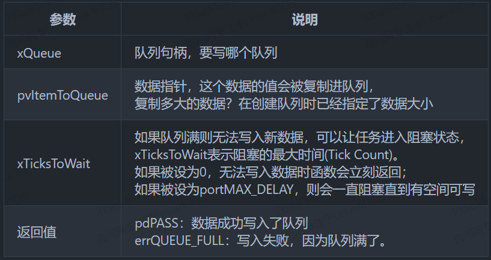

### 读队列

使用xQueueReceive()函数读队列，读到一个数据后，队列中该数据会被移除。这个函数有两个版本：在任务中使用、在ISR中使用。函数原型如下：

```c
BaseType_t xQueueReceive( QueueHandle_t xQueue,
                          void * const pvBuffer,
                          TickType_t xTicksToWait );

BaseType_t xQueueReceiveFromISR(
                                    QueueHandle_t    xQueue,
                                    void             *pvBuffer,
                                    BaseType_t       *pxTaskWoken
                                );
```

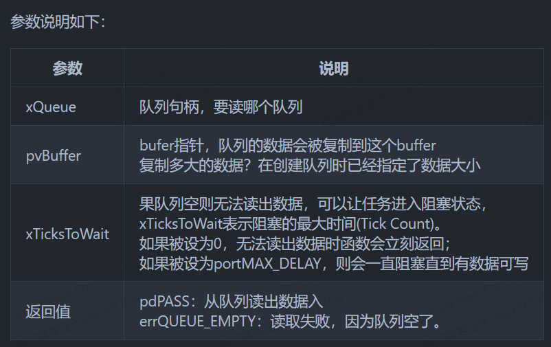

### 查询

可以查询队列中有多少个数据、有多少空余空间。函数原型如下：

```c
/*
 * 返回队列中可用数据的个数
 */
UBaseType_t uxQueueMessagesWaiting( const QueueHandle_t xQueue );

/*
 * 返回队列中可用空间的个数
 */
UBaseType_t uxQueueSpacesAvailable( const QueueHandle_t xQueue );
```

### 覆盖

当队列长度为1时，可以使用xQueueOverwrite()或xQueueOverwriteFromISR()来覆盖数据。 注意，队列长度必须为1。当队列满时，这些函数会覆盖里面的数据，这也意味着这些函数不会被阻塞。 函数原型如下：

```c
/* 覆盖队列
 * xQueue: 写哪个队列
 * pvItemToQueue: 数据地址
 * 返回值: pdTRUE表示成功, pdFALSE表示失败
 */
BaseType_t xQueueOverwrite(
                           QueueHandle_t xQueue,
                           const void * pvItemToQueue
                      );

BaseType_t xQueueOverwriteFromISR(
                           QueueHandle_t xQueue,
                           const void * pvItemToQueue,
                           BaseType_t *pxHigherPriorityTaskWoken
                      );
```

偷看

如果想让队列中的数据供多方读取，也就是说读取时不要移除数据，要留给后来人。那么可以使用"窥视"，也就是xQueuePeek()或xQueuePeekFromISR()。这些函数会从队列中复制出数据，但是不移除数据。这也意味着，如果队列中没有数据，那么"偷看"时会导致阻塞；一旦队列中有数据，以后每次"偷看"都会成功。 函数原型如下：

```c
/* 偷看队列
 * xQueue: 偷看哪个队列
 * pvItemToQueue: 数据地址, 用来保存复制出来的数据
 * xTicksToWait: 没有数据的话阻塞一会
 * 返回值: pdTRUE表示成功, pdFALSE表示失败
 */
BaseType_t xQueuePeek(
                          QueueHandle_t xQueue,
                          void * const pvBuffer,
                          TickType_t xTicksToWait
                      );

BaseType_t xQueuePeekFromISR(
                                 QueueHandle_t xQueue,
                                 void *pvBuffer,
                             );
```

## 互斥量

互斥量与信号量的根本区别就是互斥量只能由获得者释放。

用流程来演示：一个进程获取互斥量，然后在进程内使用设备时，其他进程不能使用。也就是必须在当前进程释放互斥量后，其他进程才能获得互斥锁，进入临界区使用设备。与此同时，其他进程不能恶意释放互斥量来获取设备的使用。但freertos的互斥锁没有实现这个功能，反而是递归锁实现了其他进程不能恶意释放互斥量的功能。

并且互斥量一创建就具有优先级继承的属性，也就是当前拥有互斥锁的进程的优先级会被提高到最高，从而解决优先级反转的问题。

## 软件定时器

使用软件定时器进行按键消抖的做法是，设置按键GPIO为双边沿触发中断，在外部中断函数中调用xTimerResetFromISR（）函数来延迟定时器超时，定时器回调函数中设置采集到一次按键触发。按键可能抖动多次，但用于抖动引起的外部中断重置了定时器超时的触发时间，从而延迟了回调函数的执行，实现了按键消抖的功能。

## 中断管理

中断的优先级和任务优先级不一样，中断优先级是数值越大，优先级越低。任务优先级是数值越大，优先级越高。
