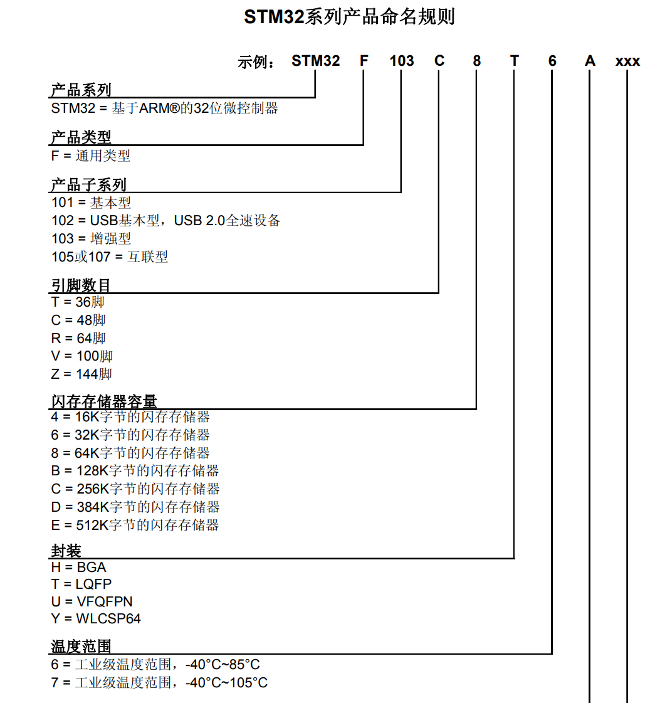
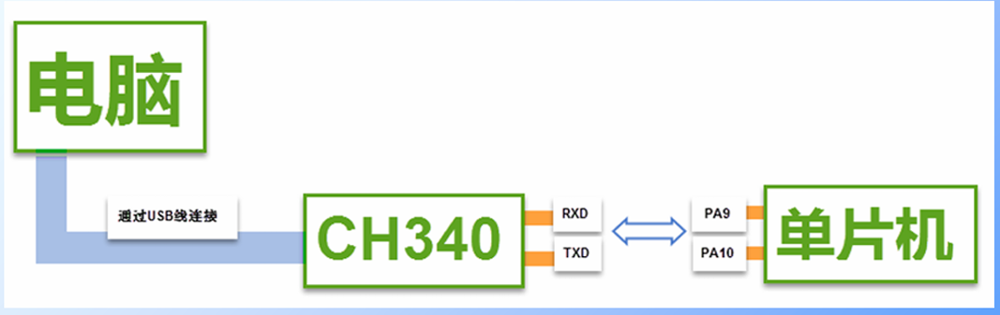
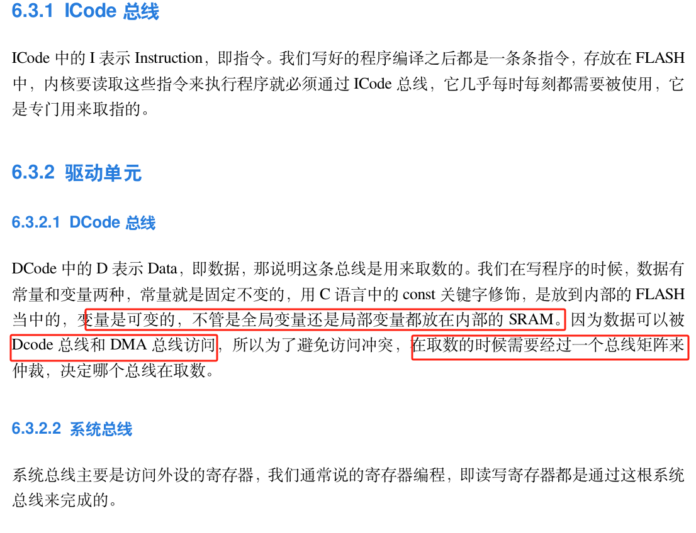

# STM32F103

## STM32简介


ST-意法半导体，是一个公司名，即SOC厂商，SOC（System on chip）为系统级芯片。

微控制器与微处理器的区别为，微控制器没有MMU（内存管理单元）

没有接入操作系统的单片机称为裸机，我们在没有接入操作系统的单片机上写的例程也成为裸机例程。

ST公司拿ARM公司设计的内核，再完善外围电路，将所有部分封装起来，就做成了STM32，32代表32位的微控制器，这也是目前最高的。


ARM处理器内核包括A、R、M三个系列，比如STM32F103C8T6使用的是Cortex M3型号的ARM处理器内核。


这里的RAM是运行内存，存储介质是SRAM，属于内存cache。ROM是程序存储器，存储介质是Flash闪存，应该是属于主存吧。

#### 片上资源与外设


STM32F1上的外设资源，要记住外设对应英文的缩写

- NVIC为嵌套向量中断控制器，这个是内核里面用于管理中断的设备，比如配置中断优先级之类的
- SysTick为系统滴答定时器，这个是内核里面的一个定时器，主要用来给操作系统提供定时服务的。STM32F1是可以搭载Freertos和UCOSII这些操作系统的，**如果用了这些操作系统，就需要SysTick提供定时来进行任务切换的功能。**
  - 所以感觉就是51上面的系统时钟/晶振周期不分频直接拿来当定时器？
  - 可以利用这个定时器来完成delay函数的功能
- RCC为复位和时钟控制，**这个可以对系统的时钟进行配置，还可以使能各模块的时钟。**STM32上的外设在上电的情况下默认是没有时钟的，不给时钟，操作外设是无效的。
- GPIO就是通用的IO口，用来点灯、读按键之类的
- AFIO为复用IO口，它可以完成复用功能端口的重定义，还有中断端口的配置。
- EXTI为外部中断，配置好外部中断后，当引脚有电平变化时，就可以触发中断，让CPU来处理任务。
- TIM为定时器，分为高级定时器、通用定时器、基本定时器三种类型。高级定时器最复杂，常用的时通用定时器。**这些定时器不仅可以完成定时中断的任务，还能完成测频率、生成PWM波形、配置成专用的编码器接口等功能**
- ADC为模数转换器，STM32F1内置了12位的AD转换器，可以直接读取IO口的模拟电压值，无需外部连接AD芯片
- DMA为直接内存访问，用于帮CPU搬运大量数据
- USART为同步或异步串口（即既支持同步串口也支持异步串口），平常使用的UART是异步串口的意思
- IIC、SPI、CAN、USB四种通信协议，单片机内部有产生通信时序的硬件电路，当然用IO电平输出来模拟时序也可以
- IWDG、WWDG为独立看门狗和窗口看门狗，当单片机因为电磁干扰死机或者程序设计不合理出现死循环时，看门狗会复位芯片保证系统的稳定。
- FSMC可用于拓展内存，或者配置成其他总线协议，用于某些硬件的操作


在操作外设之前要查看单片机数据手册看有没有相应的外设

#### STM32产品系列命名规则



也可以查阅单片机的参考手册了解STM32命名的规则

#### 系统结构介绍


并且需要了解单片机的系统结构，Cortex-M3为STM32F103的内核，也就是整台单片机的CPU。内核引出三条总线，**指令总线、数据总线、系统总线**。

指令总线、数据总线用于连接FLASH闪存，其中存放的是我们编写的程序。**指令总线是用来加载程序指令的，数据总线是用来加载数据的，比如常量和调试数据。**系统总线连接到了其他东西，如SRAM，用于存放程序运行中的变量数据。

下面的**AHB系统总线就是用于挂载主要的外设**，又叫做先进高性能总线，挂在的一般是最基本的或性能比较高的外设，比如RCC。

APB的意思是先进外设总线，用于连接一般的外设。由于AHB和APB在总线协议、总线速度等等差异，需要中间加两个桥接来完成数据的转换和缓存。**其中APB2为高速总线，一般是和AHB同频率，为72MHZ，APB1为低速总线，一般是36MHZ。所以APB2连接的是一般外设中较重要的部分**，比如其中的TIM1高级定时器，GPIO、AFIO等等。当然我们只需要知道哪些外设挂载在哪些总线上就行，具体区别没啥大问题。

**DMA用于帮CPU搬运数据**，相当于一个数据中转站，DMA总线连接在总线矩阵上，**它拥有和CPU一样的总线控制权**，用于访问APB总线上的外设。当外设有数据需要传输时，即可向DMA发起请求，再由DMA访问并转运数据。

#### STM32F103C8T6引脚定义


标蓝色的是最小系统相关的引脚，标绿色的是IO口、功能口引脚，**相关定义也可以在STM32F103C8T6数据手册中查看**


- S代表电源，I代表输入，O代表输出，IO代表输入输出。

- 主功能就是上电后默认的功能，一般和引脚名称相同。如果不相同，默认功能也是主功能。
- 默认复用功能就是IO口上连接的外设功能引脚，**配置IO口时可以选择使用通用IO口功能还是复用外设功能**
- 重定义功能的作用是，如果有两个功能同时复用在一个IO口上，但是又要同时用到这两个功能，**就可以把其中一个复用功能重映射到其他端口上，前提是重定义功能的表里有对应的端口。**


I/O口电平有FT的代表可以承受5V电压，没有的就只能承受3.3V电压。没有FT的IO口需要接5V的电平需要加装电平转换电路。

**系统的主晶振是8MHZ的，通过芯片内部的锁相环电路，把8MHZ倍频到72MHZ，作为系统的主时钟。**

VSS是负极，接GND,VDD是正极，接3.3V。

**BOOT引脚用于配置启动模式**


34、37-40都是调试端口，用于调试程序和下载程序的，STM32支持SWD和JTAG两种调试方式。

SWD只需要两根线，分别是SWDIO和SWCLK，st-link所使用的就是SWD调试方式

JTAG需要五根线，分别是JTMS、JTCK、JTDI、JTDO、NJTRST

#### 启动配置


具体介绍在51单片机的文档中程序下载部分，BOOT1和BOOT0都置1这个模式是用于程序的调试，也就是Debug。

BOOT引脚的值是上电后SYSCLK四个上升沿内有效，过了第四个上升沿就变成普通的IO口了。比如BOOT1是定义在PB2引脚上的，在第四个时钟后，引脚就从BOOT1的功能变成PB2的功能了。

#### 最小系统电路


启动配置这里是为了设置STM32启动的位置，也就是设置启动模式，用跳线帽来连接BOOT0、BOOT1和VCC、GND，从而设置启动模式。下载端口把SWDIO、SWCLK、GND、VCC引出来接st-link。

#### 原理图绘制


电源、晶振IO、下载IO、BOOT IO、复位IO都是必要的，这5部分也称为最小系统。

##### 查找引脚的功能说明


编程的时候查找参考手册，设计电路的时候查找数据手册。

#### 仿真器


DAP仿真器是免驱动的，不用下载驱动固件

像是J-Link和st-link就需要安装对应的驱动固件，由于开发板上用的是DAP仿真器，以后自己画的板是st-link仿真，因此要把固件下载好。

#### 仿真器配置

在STM32库开发实战指南中跟着流程来，需要注意的是，如果Debug的Reset选项没有autodetect选项，到后面的pack把enable勾去就能选了，顺便记得把Reset and Connect选项勾上。

#### 串口下载

bootloader是自举程序，在51单片机ISP那章有



通过CH340G电平转换芯片，电脑的USB电平转换为TTL电平标准的电平，这样就可以跟单片机的串口协议进行通信。所以CH340G是一个USB转TTL模块，也称为USB转串口模块。

#### 软件安装注意事项

之前给51单片机安装的Keil是Keil C51，是专门提供给C51系列单片机用的，所以STM32不能在这上面编程和开发，需要下载Keil  MDK5才行。

## 数据运算


亦或：相同为0，不同为1

1^0= 1, 0^0 = 0,1^1 = 0;

## 寄存器


芯片上的引脚排序对应小圆点按逆时针来排序

#### 三条总线的主要作用



变量存储在SRAM中，其实也就是内存。常量存储在FLASH中，也就是主存。DMA和DCode在取数的时候会有总线矩阵仲裁，决定哪一个总线取数，也就类似于优先级？

#### 存储器映射


厂商分配了4GB内存空间给存储器，并且给给存储器空间分配了具体的地址，这个过程称为存储器映射,注意地址的存储单位为Byte，内存的基本存储单元是字节。所以一个寄存器到下一个寄存器的地址间隔是4，也就代表了一个寄存器的存储空间为4字节。


#### 寄存器的定义


寄存器的地址偏移指的是基于寄存器对应外设在内存块内被分配的基地址的偏移


比如GPIOB的分配的内存空间的基地址是0x40010C00，那么GPIOB端口输出寄存器的基地址就是0x40010C0C


#### 寄存器映射


由于**外设的一系列寄存器的都是在一片连续的内存空间内**，因此只需设置对应于外设的结构体，结构体成员变量也占用一片连续的内存空间。其中结构体成员变量就是外设的寄存器（**寄存器成员变量定义的顺序也要符合外设中寄存器分配的顺序**）。如图所示，GPIO的寄存器列表。


并且可以通过设置外设的结构体指针，直接用外设的基地址来访问外设的寄存器。

注意：结构体访问成员变量用.，结构体指针访问成员变量用->


更加厉害的做法是**把外设的结构体指针宏定义为外设名**，从而可以直接用外设名 + ->来访问外设的寄存器。

## GPIO

#### GPIO简介

GPIO-general purpose input output，是通用输入输出端口的简称，简单来说就是软件可控制的引脚。

#### 推挽输出

推挽输出可以输出高低电平（0/1）


- 当1处输入为1时，高电平经过2非门变成低电平0，然后此时的PMOS管处的G极电压低于S极电压（VDD为3.3V），PMOS管导通。而NMOS管处的G极电压等于S极电压，NMOS管截止，因此此时IO引脚输出高电平3.3V。
- 当1处输入为0时，低电平经过2非门变成高电平1，然后此时的PMOS管处的G极电压等于S极电压（VDD为3.3V），PMOS管截止。而NMOS管处的G极电压低于S极电压，NMOS管导通，因此此时IO引脚输出低电平0V。
- 另外推挽输出的命名来源于当PMOS管导通时，电流从VDD流向IO引脚，相当于电流被推出去或灌出去，也把电流称为灌电流。
- 当NMOS管导通时，电流从IO引脚流向GND，相当于电流被挽进来或拉进来，也把电流称为拉电流。

#### 开漏输出

开漏输出若不外借上拉电阻，只能输出低电平0.


- 当1处输入高电平1时，经过非门2变成低电平0，此时NMOS管处的G极电压等于GND，NMOS管截止。若无外接上拉电阻，此时引脚悬空，呈现高阻态，也就是什么都不输出。若外接上拉电阻，则输出高电平。
- 当1处输入低电平0时，跟推挽输出的挽输出一样。
- 开漏输出通常用于IIC总线

#### 输入


- 引脚电平输入首先要经过上拉或下拉，上拉和下拉通过GPIO_CRL和GPIO_BSRR寄存器设置。
- 然后再经过肖特基触发器，肖特基触发器的原理是输入电平高于2V认定为高电平，低于1.2V认定为低电平，在1.2V~2V之间就不输入，起到电压比较的作用。
- 此时可以选择输入到GPIO_IDR寄存器或外设的数据输入寄存器。
- 第三种是不经过肖特基触发器，直接输入到ADC芯片，因为模拟电压需要最开始输入的信息。

#### 复用

GPIO若不复用为其他功能就是普通的IO口，若复用，则可以复用为其他外设的功能引脚。

#### 总结


##### GPIO寄存器

GPIO_ODR用于IO口电平输出

GPIO_IDR用于单片机读入IO口的电平


之所以通过寄存器指针可以连续访问四个字节的寄存器内存，是因为把寄存器指针定义为32位无符号整型指针的同时，寄存器的内存空间大小也被定义成4个字节。

```c
#define RCC_APB2ENR  (unsigned int)(RCC_BASE+0x18)//这里在定义指针变量的类型，也相当于在定义指针所指向的内存空间的大小
```

## 构建库函数雏形

```c
#define Peripheral_Base 0x40000000

#define APB1_Base Peripheral_Base
#define APB2_Base Peripheral_Base+0x10000
#define AHB_Base Peripheral_Base+0x20000

#define RCC_Base AHB_Base+0x1000
#define GPIOB_Base APB2_Base+0x0C00

#define RCC_APB2ENR *((unsigned int*)(RCC_Base+0x18))

typedef unsigned int uint32_t;
typedef unsigned short uint16_t;

typedef struct
{
	uint32_t CRL;
	uint32_t CRH;
	uint32_t IDR;
	uint32_t ODR;
	uint32_t BSRR;
	uint32_t BRR;
	uint32_t LCKR;
}GPIO_Typedef;

#define GpioB ((GPIO_Typedef*)(GPIOB_Base))
int main(void)
{
	RCC_APB2ENR |=(1<<3);
	GpioB->CRL &= 0xFFFFFFF0;//标记在这里！！！
	GpioB->CRL |= 0x01;
	GpioB->ODR |= ~(1<<0);
	while(1)
	{
	}
}
//实际上就是构建结构体，结构体中定义与外设寄存器内存大小相同的无符号32位整型变量，按照外设寄存器地址顺序定义。再把外设的基地址强制类型转换为结构体指针类型，宏定义赋值给与外设名相同的变量。便可以直接访问外设中的任一寄存器，如标记处所示。
```

```c
#define GpioB ((GPIO_Typedef*)(GPIOB_Base))
#define RCC_init ((RCC_Typedef*)(RCC_Base))

typedef unsigned int uint32_t;
typedef unsigned short uint16_t;


typedef struct
{
	uint32_t CRL;
	uint32_t CRH;
	uint32_t IDR;
	uint32_t ODR;
	uint32_t BSRR;
	uint32_t BRR;
	uint32_t LCKR;
	
}GPIO_Typedef;

typedef struct
{
	uint32_t CR;
	uint32_t CFGR;
	uint32_t CIR;
	uint32_t APB2RSTR;
	uint32_t APB1RSTR;
	uint32_t AHBENR;
	uint32_t APB2ENR;
	uint32_t APB1ENR;
}RCC_Typedef;
#define GPIO_Pin_0  ((uint16_t)0x0001)
#define GPIO_Pin_1  ((uint16_t)0x0002)
#define GPIO_Pin_2  ((uint16_t)0x0004)
#define GPIO_Pin_3  ((uint16_t)0x0008)
#define GPIO_Pin_4  ((uint16_t)0x0010)
#define GPIO_Pin_5  ((uint16_t)0x0020)
#define GPIO_Pin_6  ((uint16_t)0x0040)
#define GPIO_Pin_7  ((uint16_t)0x0080)
#define GPIO_Pin_8  ((uint16_t)0x0100)
#define GPIO_Pin_9  ((uint16_t)0x0200)
#define GPIO_Pin_10 ((uint16_t)0x0400)
#define GPIO_Pin_11 ((uint16_t)0x0800)
#define GPIO_Pin_12 ((uint16_t)0x1000)
#define GPIO_Pin_13 ((uint16_t)0x2000)
#define GPIO_Pin_14 ((uint16_t)0x4000)
#define GPIO_Pin_15 ((uint16_t)0x8000)
void Gpiox_Set(GPIO_Typedef *gpiox,uint16_t Gpio_pin)
{
	gpiox->BSRR |= Gpio_pin;
}

void Gpiox_Reset(GPIO_Typedef *gpiox,uint16_t Gpio_pin)
{
	gpiox->BRR |= Gpio_pin;
}

	Gpiox_Reset(GpioB,GPIO_Pin_0);
	Gpiox_Set(GpioB,GPIO_Pin_0);
//由于在ODR寄存器里手动用十六进制数据赋值不利于移植与可读性差，因此直接使用BSRR和BRR寄存器来置位与重置，并且在置位函数与重置函数可以使用相同的宏定义
```

```c
//GpioB->CRL &= 0xFFFFFFF0;
//GpioB->CRL |= 0x01;
//这里用枚举类型，是为了让GPIO配置结构体的成员变量只能在对应枚举类型定义的值中选值
typedef enum
{
	GPIO_Speed_10MHZ = 0x01,
	GPIO_Speed_2MHZ ,
	GPIO_Speed_50MHZ 
	
}GPIOInit_Speed;
typedef enum
{
	GPIO_Mode_AIN = 0x0,           //模拟输入
	GPIO_Mode_IN_FLOATING = 0x04,  //浮空输入
	GPIO_Mode_IPD = 0x28,          //下拉输入
	GPIO_Mode_IPU = 0x48,          //上拉输入
	
	GPIO_Mode_OUT_OD = 0x14,       //开漏输出
	GPIO_Mode_OUT_PP = 0x10,       //推挽输出
	GPIO_Mode_AF_OD = 0x1C,        //复用开漏输出
	GPIO_Mode_AF_PP =0x18,         //复用推挽输出
}GPIOInit_MODE;
//输入与输出模式之所以这么赋值看引脚工作模式真值表分析
typedef struct
{
	uint16_t PIN; 
	GPIOInit_Speed GPIO_SPEED;//只能在GPIOInit_Speed类型定义的符号值之间选
	GPIOInit_MODE GPIO_MODE;//只能在GPIOInit_MODE类型定义的符号值之间选
}GPIOx_Init;

int main()
{
    GPIOx_Init GPIO_Init_structure;
	GPIO_Init_structure.GPIO_SPEED = GPIO_Speed_10MHZ;
	GPIO_Init_structure.GPIO_MODE = GPIO_Mode_OUT_PP;
	GPIO_Init_structure.PIN = GPIO_Pin_0;
    while(1)
    {
        
    }
}
//后面还是觉得GPIO端口配置不易于阅读与移植，将外设端口配置的模式、速度、引脚号作为端口配置结构体的成员变量
//在编写端口初始化函数，将外设寄存器结构体和外设配置结构体的指针作为形式参数。
```


## 固件库

### 固件库文件分析

- 汇编编写的启动文件
  - startup_stm32f10x_hd.s：设置堆栈指针、设置PC指针、初始化中断向量表、配置系统时钟、调用C库函数_main最终去到C的世界
- 时钟配置文件
  - system_stm32f10x.c：把外部时钟（晶振）HSE=8Mhz，经过PLL倍频为72Mhz
  - 
- 外设相关的
  - stm32f10x.h：实现了内核之外的外设的寄存器映射
  - xxx：GPIO、USART、I2C、SPI、CAN
  - stm32f10x_xx.c：外设的驱动函数库文件
  - stm32f10x_xx.h：存放外设的初始化结构体，外设初始化结构体成员的参数列表，外设固件库函数的声明
- 内核相关的
  - CMSIS-Cortex 微控制器软件接口标准
  - core_cm3.h：实现了内核里面外设的寄存器映射
  - core_cm3.c：内核外设的驱动固件库
- NVIC（嵌套向量中断控制器）、SysTick（系统滴答计时器）应该是操作系统要用的
  - misc.c
  - misc.h
- 头文件的配置文件
  - stm32f10x_conf.h：外设头文件的头文件
  - 包含：stm32f10x_usart.h、stm32f10x_gpio.h、stm32f10x_can.h等等
- 专门存放中断服务函数的C文件
  - stm32f10x_it.c
  - stm32f10x_it.h
  - 中断服务函数可以随意放在其他地方，并不一定是要放在stm32f10x_it.c，所以这里的意思是stm32f10x_it.c不是定义中断服务函数的地方，而是使用的地方？

### 固件库模板配置


记得把stm32f10x.h中的这两个宏在魔术棒C/C++里定义，上面那个是对应版本的MCU可以使用的特殊函数，下面是包含所有外设驱动函数头文件的头文件

### 固件库操作GPIO

BSP:board support package 板级支持包


操作任何外设都要先使能外设的时钟，根据外设挂载的总线寻找时钟使能函数，然后再配置外设

只支持在特定的开发板、电路板上使用的外设驱动程序，是因为外围电路设计使用芯片的引脚不同。


可以利用带参宏实现简化复位和置位函数的调用、


反斜杠符后面什么都不加，可以作为续行符

### 位带操作

51单片机有sbit映射寄存器位，可以直接操作寄存器位。stm32也有位带区和位带别名区可以操作寄存器位。


位带命名区的每四个字节对应位带区的一个位，可以通过位带命名区的地址访问对应的寄存器位，寄存器位对应位带命名区的地址计算公式如下：


带参宏把n作为参数，传入位带命名区的寄存器位偏移量，也就是在寄存器中为第n位。

### GPIO端口引脚初始化


可以连续初始化多个引脚，本质上是GPIO_Init()这个函数设置一次后，引脚的配置就不变了，不用担心改了结构体成员变量会对原来引脚配置修改什么，除非你再对原来的引脚GPIO_Init()一次。

### AFIO

AFIO的作用是复用功能引脚重映射，外部中断引脚选择，只有用到AFIO才要开AFIO时钟。

## 启动文件详解

stm32中中断优先级越小，优先度越高

从启动文件进入到main函数：

1. 初始化堆栈指针
2. 初始化PC指针（程序计数器），也就是把PC指针置0（实际上0是相对于中断向量表初始地址的偏移），指向复位中断函数，
3. 初始化中断向量表，也就是把中断函数都外部声明一下，然后分配内存给中断函数，进而也给中断函数分配内存地址了。（**中断函数名在编译后其实就是函数地址**）
4. 初始化系统时钟
5. 调用_main()函数，初始化用户堆栈，最后调用main()函数进入到C的世界


初始化中断向量表的过程中，定义了内核的中断服务函数的内容，外设的中断服务函数定义为死循环。但是外设的中断函数是弱定义的，当我们在自己写的源文件中定义了中断服务函数，MCU会优先使用我们定义的中断函数。

**注意：若自己定义的中断服务函数名与启动文件设定的不一样，或者忘记些配套的中断服务函数，程序发生中断的时候会直接进入启动文件的中断服务函数，直接死循环**

## RCC(Reset Clock Control)复位与时钟控制

#### 时钟树


- OSC为外部晶振，可以接4-16Mhz的晶振，f103接的是8Mhz，因此作为MCU的HSE（外部高速时钟）。
  - OSC32接的是外部低速晶振，32.768kHZ = 0.032768Mhz，用于RTC（实时时钟的时钟来源）
- PLL是锁相环，用于倍频时钟，如外部晶振时钟从8Mhz倍频为72Mhz的系统时钟。
  - 具体流程为：OSC时钟HSE经过PLLXTPRE选择不分频，接入到PLLSRC（锁相环时钟源），选择HSE作为时钟源。此时再乘以PLLMUL（锁相环倍频因子），最大倍频因子为9，因为系统时钟最高为72MHZ，得到锁相环时钟。通过SW（系统时钟源切换器），选择锁相环时钟作为STSCLK（系统时钟），此时系统时钟为72MHZ。
- AHB总线时钟（HCLK）由SYSCLK（系统时钟）经过AHB预分频器分频得到，通常SYSCLK为72MHZ时，选择不分频。
- APB1外设总线时钟由AHB总线时钟（HCLK）经过APB1预分频器分频得到，通常会选择2分频得到36MHZ，作为APB1总线上外设的时钟源。
  - 但是定时器时钟不同，若APB1时钟预分频系数为1，则使用APB1总线时钟作为时钟源，否则要把分频后的时钟频率X2再作为定时器的时钟源。
- APB2外设总线由AHB总线时钟（HCLK）经过APB2预分频器分频得到，通常会选择不分频得到72MHZ，作为APB2总线上外设的时钟源。
  - 与APB1一样，接在APB2总线上的定时器外设时钟为APB2时钟，若APB2预分频器分频系数为1，否则要把分配后的时钟频率X2再作为定时器时钟源
- ADC外设时钟由APB2总线时钟经过ADC预分频器分配得到
- MCO为微控制器时钟输出，他的时钟来源可以是SYSCLK、PLLCLK/2、HSE、HSI，由PA8复用得到
  - 可用于将引脚输出的电平接入到示波器，观察SYSCLK有没有配置正确

#### 系统时钟初始化


系统在执行复位中断函数时，会调用系统时钟初始化函数.该函数内部会调用系统时钟配置函数SetSysClockTo72()，该函数的功能是利用HSE把时钟设置为：PCLK2=HCLK=SYSCLK=72MHZ,PCLK1=HCLK/2=36MHZ


## 中断（NVIC外设中断）

中断就是异常，异常就是中断


- 也就是在主函数的while循环中，特定条件下会发生中断，主程序会暂停然后去执行中断服务函数。在执行完中断服务函数后,再回来执行主程序。
- 中断也可以嵌套，中断服务函数执行的过程中有优先级更高的中断发生，会对程序的现场进行保护，转而执行更高优先级的中断函数。执行完后，再回来执行优先级低的中断服务函数。


中断通道其实就是中断源，也就是EXTI中断、串口中断、CAN中断之类的外设中断。

不可屏蔽中断和可屏蔽中断：

- 不可屏蔽中断一般是为了响应紧急事件中断，如没有电源，电路烧毁。
- 可屏蔽中断也就是可以选择是否开启的中断，比如一些外设不需要使用就可以不使能外设的中断。


- NVIC（嵌套中断向量控制器）基本结构，用于统一分配中断优先级和管理中断，包括内核与片上所有外设。
- 外设的中断使能要配置NVIC寄存器和外设中断使能寄存器，也就是NVIC为中断的总开关，外设中断使能寄存器为具体开启哪个外设寄存器的开关。

- 其中同一个外设的中断会有不同通道，也就是EXTI中断可以由不同GPIO端口引发，这时候需要设置有多路通道触发中断。

- 具体中断结构体的定义可以在core_cm3.h和misc.h中查看


- NVIC的中断优先级有优先级寄存器的4位决定，然而由于有4位，所以可以把4位分成5个中断优先级分组。
- 也就是有n个位可以用来表示抢占优先级，剩下5-n个位用来表示响应优先级。如分组0，有0位抢占优先级，4位响应优先级
- 响应优先级按照优先级来执行中断服务程序，谁的优先级高谁先执行，一个接一个，不能打断在执行的中断。优先级的值越小，优先级越高，0就是最高优先级。
- 抢占优先级高的中断服务函数可以直接在在抢占优先级低的中断服务函数上进行中断，也就是进行中断嵌套。
- 总结就是，中断发生会先比较抢占优先级，再比较响应优先级。如果当前有中断程序在执行，突然来了一个中断，先比较抢占优先级，如果抢占优先级比在执行的高，进行中断嵌套。如果相同，或者比在执行的低，就老实排队。
- 当响应优先级和抢占优先级都相同是，按照中断向量表的顺序来执行中断

并且为了方便管理，所有中断函数的定义都放在stm32f10x_it.c

## EXTI外部中断


- EXTI为外部中断/事件控制器。由监测的GPIO端口发生电平变换来引发中断，相同的Pin不能同时触发中断是指PA1、PB1不能同时触发中断。
- 事件响应是指原本用于中断请求的信号不传给CPU，而是传给其他外设，让外设进行操作，比如传给ADC进行数模转换。


#### 外部中断配置流程

- NVIC外设中断配置
  - 设置中断分组（实际上这个应该在主函数里设置）
  - 设置中断优先级，初始化中断类型结构体。
- 外设配置
  - GPIO配置
    - 开启GPIO外设时钟，初始化GPIO类型结构体
    - 开启复用AFIO外设时钟，将对应引脚复用为EXTI信号线
  - EXTI配置
    - 初始化EXTI类型结构体
- 编写中断服务函数

## SysTick（系统滴答定时器）


SysTick通常用于操作系统，用于产生时基，维持操作系统的心跳？也可以利用它写类延时函数，也就是在定时一段时间后在中断里边操作，并且记住**这个定时器只能递减计数**。

#### 定时器寄存器介绍


#### SysTick定时器定时时间计算


#### SysTick定时器中断优先级的配置说明


也就是虽然SysTick定时器中断没有中断优先级分组，但是可以根据外设中断优先级分组来拆分它的优先级，也就是我们自己来拆分它的优先级。所以并不是内核的中断就比外设的中断优先级高

## 通信的基本概念

#### 并行与串行


- 并行通信是指多位数据同时收发，多少位并行就有多少根数据线。（SDIO、FMSC）

- 串行通信只能一位一位接收发射，只有一根数据线（USART、IIC、SPI）


串行通信之所以可以远距离通信且抗干扰能力强，是因为一位一位传输受干扰小。并行通讯多位传输，受干扰概率大。

#### 全双工、半双工、单工


全双工和半双工都有两条数据线，全双工可以同时收发，半双工只能分时收发。单工只有一条数据线，只能单向传输数据。

#### 同步与异步


- 同步：通信双方靠一根时钟线来约定通信速率。同步就类似于检测，有输出的数据了，另一头同步输入数据。检测上升沿来判断信号采样成功

- 异步：通信双方各自约定通信速率（也就是数据采样周期的规定，一秒发送一次信号，然后一秒采样一次和半秒采样一次的信号是不同的）异步就是约定输出和输入的速率，可以同时输入输出。**例如串口通信中双方可以设定不同的波特率来传输和接收数据，但是一般来说波特率要相同。**
- 区分同步与异步的简便方法，有时钟线规定通讯速率的就是同步通信

#### 电平标准

- 电平标准是数据1和数据0的表达方式，是传输线缆中人为规定的电压与数据的对应关系，串口常用的电平标准有如下三种：
- TTL电平：+5V表示1，0V表示0
- RS232电平：-3~-15V表示1， +3~+15表示0
- RS485电平：两线（TXD与RXD）压差+2~+6V表示1，-2 ~-6V表示0（差分信号）
- TTL和RS232通讯协议信号传输只能13米以内，RS485是千米。RS232一般是用于电脑的电平标准，因为电压接受的范围大

## 串口


#### 比特率与波特率


当一位表示一个码元的时候，波特率与比特率一样；当两位表示一个码元的时候，则波特率与比特率不同。

#### 数据帧格式


起始位为一位逻辑0，停止位为一位逻辑1，校验位根据奇校验、偶校验、不校验来设置、主体数据有8位。

#### 复用功能配置

好像F103并没有像F4那样有库函数指定GPIO复用为什么功能，而是先配置GPIO然后开启复用，最后配置对应外设，这样配置了什么外设就复用为什么外设的功能。

#### 注意事项

串口在每发送完八位数据后一定要等TXE置位后才能发送下一个八位数据。


数据发送程序末尾加while(USART_GetFlagStatus(pUSART,USART_FLAG_TC) == RESET);，是为了保证数据发送完毕之前没有新的程序被执行，以免数据发送不完全。


printf()函数的前置设置


这里重新定义fputc()函数，是因为printf()函数会调用该函数把数据打印到控制台上，现在把打印通道改成串口打印，又叫做串口的重定向。


## 定时器TIMER


- 定时器的功能包括定时、输出比较（可用作PWM输出）、输入捕获、互补输出（也能用作PWM，用于驱动三相无刷电机）
- 基本定时器的功能只有定时
- 通用定时器的功能有输出比较、输入捕获、互补输出
- 高级定时器全部功能都有


#### 定时器功能框图


- 时基决定了定时器计数和中断的周期，是定时器最主要的部分
- 定时器时钟源来自系统内部时钟，其实也就是外设总线的时钟，但是定时器时钟都是72MHZ，具体原因参照RCC时钟树
- 控制器用于使能定时器、设置计数复位值、计数结束值

##### 影子寄存器


也就是设定的新值不马上生效，而是等当前定时周期结束后在修改原配置，相当于一个缓冲。**ARR为自动重载寄存器，存放定时器目标计数值，也就是计数器目标值，计数到ARR设定值产生一次中断，为完成一次定时，并且会自动清空计数值。**PSC为预分频器，存放定时器时钟预分频系数

#### 定时器的计数频率计算（为什么公式中PSC要+1）


**这里要除以PSC加1是因为，当PSC=0时，时钟不分频，也就是1分频，输入频率=输出频率=72MHZ；当PSC=1时，时钟2分频，输出频率=输入频率/2=36MHZ。所以预分频器的值和实际分频系数相差了1，因此在公式中，时钟频率计算才要除以PSC+1。**


ARR为1000-1是因为ARR从0开始计数0~999，计数了1000次。

#### 定时器计数方式

- 向上计数：计数器从0开始向上自增计数，计数到自动重载值，计数值清零，申请中断，同时开始下一次循环。
- 向下计数：计数器从自动重载值开始向下自减，减到0之后，计数器回到自动重载值并申请中断。
- 中央对齐：计数器从0开始向上计数，计数到自动重载值，申请中断。下一次计数从自动重载值开始向下计数，计数到0，申请中断。后面按照这样计数循环。
- 

#### 各寄存器工作时序


- 这里是使能了预分频器的影子寄存器，也就是预分频缓冲器，等到上一次计数完成再改变定时器时钟频率。
- 预分频计数器是对应预分频器几分频，如果是2分频，预分频计数器每计数两次，定时器计数器计数一次。
- 计数器计数频率也就是计数器按照分频后的时钟频率计数，PSC+1为分频系数


- 计数器溢出后，会更新中断标志（UIF），这个标志一置位就会向CPU申请中断，中断响应后，要在中断程序中手动清零该标志位。

#### 定时器及其中断初始化配置


- 主要配置的有五部分，外设时钟源、时基单元、定时器中断配置、片上外设中断配置、定时器使能

- **使能外设的中断输出的是指通过配置外设的寄存器，允许该外设发生特定事件后触发中断信号，向CPU发起中断申请**

##### 内部时钟定时中断

```c
void Timer2_Init(void)
{
	NVIC_InitTypeDef NVIC_TimerITInit_Structure;
	TIM_TimeBaseInitTypeDef TIM2_TimeBaseInitStructure;

	//定时器2时钟使能
	RCC_APB1PeriphClockCmd(RCC_APB1Periph_TIM2,ENABLE);
	//时钟来源为内部时钟
	TIM_InternalClockConfig(TIM2);
	
	//时基单元配置
	TIM2_TimeBaseInitStructure.TIM_ClockDivision=TIM_CKD_DIV1;
	TIM2_TimeBaseInitStructure.TIM_CounterMode=TIM_CounterMode_Up;
	TIM2_TimeBaseInitStructure.TIM_Period=10000;
	TIM2_TimeBaseInitStructure.TIM_Prescaler=7200;
	TIM2_TimeBaseInitStructure.TIM_RepetitionCounter=0;
	//时基初始化
	TIM_TimeBaseInit(TIM2,&TIM2_TimeBaseInitStructure);
	//清除时基初始化中的立即中断标志位
	TIM_ClearFlag(TIM2,TIM_FLAG_Update);
	//定时器2中断使能
	TIM_ITConfig(TIM2,TIM_IT_Update,ENABLE);
	
	//片上外设中断设置及使能
	NVIC_TimerITInit_Structure.NVIC_IRQChannel = TIM2_IRQn;
	NVIC_TimerITInit_Structure.NVIC_IRQChannelPreemptionPriority= 1;
	NVIC_TimerITInit_Structure.NVIC_IRQChannelSubPriority = 1;
	NVIC_TimerITInit_Structure.NVIC_IRQChannelCmd = ENABLE;
	NVIC_Init(&NVIC_TimerITInit_Structure);
	
	//定时器2使能
	TIM_Cmd(TIM2,ENABLE);
}
```

#### TIM定时器输出比较OC(Output Compare)


输出比较是由计数器与CCR(Capture/Compare Register)捕获比较寄存器的值进行比较，若计数器的值达到CCR的值，引脚输出高电平。

**主要用于输出PWM波形**

##### PWM简介


这里以脉冲宽度的调制来输出模拟的电压，也就是高电平时间占脉冲时间百分比越高，输出的模拟电压越高。

##### 输出比较功能框图


- 工作流程：当CNT值>=CCR值时，输出比较参考电平ocref会发生变化，对于ocref输出模式的控制由TIMx_CCMR1来控制，有下图几种模式。
- 参考电平ocref再输出到输出比较通道前，还可以设置它的输出极性，由TIMx_CCER控制。极性为0，参考电平ocref不变，输出到通道。极性为1，参考电平ocref接到非门，电平反转，再输出到通道。


一般常用的就是PWM模式1，向上计数方式，正好符合占空比的高低电平时间分配。这里的有效电平和无效电平分别为1和0。

完整的PWM配置框图如下


- 上图的表格中，黄线为定时器重载值，红线为CCR比较值，蓝线为定时器计数值，绿线为输出电平。
- 
- 这里PWM波是以计数器重载值*定时器单次计数周期的时间为一个周期。
- 其中占空比为CCR/(ARR+1)，也就是CCR值占重载值百分之几。
- PWM的分辨率是重载值1/(ARR+1)，也就是重载值的倒数。

**舵机使用说明**


设置PWM波形周期为20ms，Ton可以为0.5ms、1ms、1.5ms、2ms、2.5ms，分别对应以上角度。


舵机硬件电路比较简单，只需要一根信号线来控制。

**直流电机及其驱动简介**


由于直流电机所需驱动电流较大，单片机GPIO口无法直接驱动，需要用电机驱动电路放大电流供给电机。

电机驱动内部电路为H桥电路，即左右两边各两个MOS管，当左上和右下导通，电机正转，左下和右上导通，电机反转。


电机驱动模块连接图，电机控制模式其实就只需要控制PWM引脚输出和两个GPIO引脚输出高低电平，区别是电机正反转。

##### 外设引脚重映射配置


第三行不用配置，那个是把调试端口给解除复用，然后重映射为定时器通道，会影响正常的下载程序。

### TIM定时器输入捕获IC(Intput Capture)


- 测频法就是在固定时间内测量有多少个方波信号，从而得到一段时间内的信号平均频率
- 测周法是测量方波信号一个周期内，定时器计数器计数了多少次，用CNT*定时器时钟周期得到一个方波的周期。
- 测频法适用于高频信号，测周法适用于低频信号。中界频率用于区分高频和低频信号，高于中界频率，适用测频法；低于中界频率，适用测周法。


- 信号进入输入捕获通道之前要先经过滤波处理，滤波的工作原理为设置固定的信号采样频率，连续多次采样到相同的信号，则认为该信号稳定，可以输入到边沿检测器。
- 边沿检测器检测上升沿或下降沿，信号输入到分频器后，CNT的值会被转运到CCR中，这样就能计算信号一个周期的时间。
- 由于信号在进图分频器之前，也可以设置进入从模式控制器，因此可以在CNT值转运到CCR后，硬件自动清零CNT。


- 主模式可以定时器的输出映射为TRGO引脚，用于触发别的外设
- 从模式需要选择触发源，即接收其他外设或者自身外设的一些信号，用作TRGI触发定时器事件，可以执行最右边表里的操作。上面的CNT值清空就是执行了RESET操作。


- CCR每次保存的值就是一个信号周期内，CNT的计数值。同时也要注意，CNT最多计数65535，当CNT溢出后置零后，计数值会损失。所以一些信号周期太长，也是无法测量的。
- GPIO浮空输入模式没有上拉电阻或者下拉电阻去影响外部信号，缺点就是当引脚悬空是，没有默认的电平，容易受噪声干扰，来回不断的跳变。


通道1设置上升沿捕获，CCR1用于存储CNT值，也就是一个信号周期；通道2设置下降沿捕获，CCR2用于存储高电平时期的计数值，可以直接用CCR2/CCR1得到外部信号的占空比。

### TIM编码器接口模式(Encoder Interface)

#### 简介


- 定时器的编码器模式可以设定两个编码器接口，根据接口的边沿电平变化，从而控制计数器计数值自增或自减。
- 原本计数器值为无符号32位，后面可能强制更改为有符号32位数据。从而可以计数负数，也就是判断编码器旋转方向是正转还是反转。
- 此外编码器AB相只能接在高级定时器和通用定时器的通道1和通道2。

#### 正交编码器


编码器的正转方向和反转反向状态判断各有四种。A相信号超前B相90°为正转，A相信号滞后B相90°为反转。


编码器接口电路：AB相的信号先通过通道1和通道2输入，经过滤波器和边沿检测进入到编码器接口。编码器接口判断编码器正转或反转后，将信号输入到预分频器，经过分频后输入到计数器CNT自增或自减。此时的计数器不受内部时钟控制进行增减，计数器时钟完全由编码器接口托管。


- 这里的极性选择是指是否要将输入电平反转，即在输入到编码器接口前加一个非门。
- 编码器接口接到计数器之前还要考虑是否分频。


- 计数器的工作模式对应了前面计数器正向计数和反向计数的工作逻辑

- TI1FP1和TI2FP2分别为AB相，相对信号的电平指的是：若为TI1FP1信号，其相对信号为TI2的信号。若为TI1FP2信号，其相对信号为TI1的信号。

- 仅在TI1或TI2计数是计数器的计数仅由通道1或通道2的信号决定，这样计数的精度不如在TI1和TI2上计数，所以一般都使用在TI1和TI2上计数。

- 

- 毛刺信号是指在某一通道的信号没有跳变的情况下，另一通道的信号连续跳变，如第二个红框所示。正常的信号都是AB相相互跳变如第一个红框所示

- 实例这里毛刺信号的计数值最终都会回到毛刺刚开始出现的值，本质就是为了滤除毛刺，这就是正交编码器抗噪声的原理。

- 实例这里均不反相是指信号在输入到编码器接口前不经过非门

- 

- 这里是TI1的极性选择反相

- ```c
  TIM_EncoderInterfaceConfig(TIM4,TIM_EncoderMode_TI12,TIM_ICPolarity_Rising,TIM_ICPolarity_Rising);
  //这是选择通道1和通道2是否反相，两个通道都是Rising或Falling不反相，一个通道是RisingFalling另一个通道是Falling则反相
  ```

#### 编码器测速


编码器上的磁铁磁极对数表现了电机的角度分辨率（无减速器情况下），比如磁铁转一圈，编码器输出13个脉冲。360°/13约等于27.69°，最小可识别角度约为27.69°。

当只检测一个霍尔编码器的输出的上升沿，1个编码器值代表霍尔传感器扫过了一对磁极。当检测一个霍尔编码器的输出的上下升沿时，2个编码器值代表扫过了一对磁极。当检测两个霍尔编码器的输出的上下升沿时，4个编码器值代表扫过了一对磁极，也就是输出一个脉冲。


#### PID


- 比例环节是依靠目标值与当前时刻值的偏差乘比例系数kp得到，主要用于以误差来调节输出。但是由于现实环境总有外部阻力来抵消比例环节的施加的驱动力，当比例环节的驱动力与阻力相等时，系统稳定，误差也稳定，实际值一直达不到目标值，这就是稳态误差
- 积分环节用来消除稳态误差，积分环节主要用于累计系统每次反馈的误差，这部分累计的误差可以用于抵消外部阻力，从而让比例环节更好快速响应。单独的积分环节也有滞后性的问题，因为当系统目标值突然降低时，积分环节累计误差也需要时间，这部分时间就会让系统的变化滞后。
  - 比例环节和积分环节如果比重都很大，系统变化就会产生超调和震荡
  - 
  - 
- 微分环节是误差的变化率，也就是当前时刻的误差-前一时刻的误差，用于给系统变化添加阻尼，也就是阻碍系统快速变化。比如当汽车离红灯斑马线很近时，需要急刹车来停在斑马线前。急刹车就可以看作微分环节，让系统减缓变化，从而抑制超调。
  - 微分环节在连续系统中就是某时刻误差的变化率乘kd，也就是对误差曲线求导，再把某时刻带进去。在离散系统中，就是当前时刻误差-上一时刻误差，再除以时间。

##### 连续形式PID与离散形式PID


- 连续形式PID是刚开始是用模拟电路实现的。

- 计算机或单片机上运行使用离散形式PID，因为都是数字信号。然后每次PID执行时都有个调控周期，每隔一段时间调控一次，误差对时间的积分和微分如下所示。


##### 位置式PID和增量式PID


- 这里位置式PID实际就是连续形式的PID离散化处理后得到的最直接、最通用的PID公式，对于它来说更合适的名字其实是全量式PID，可以应用在几乎所有要用到PID的场合中。
- 增量式PID是输出相较于上一次PID输出的增量值，其实公式的来源也就是位置式PID的当前输出-上一次输出。图中可以看到
  - 之所以用增量式PID是因为，两次位置式PID相减的运算时间长，要消费的算力资源比直接通过简化的增量式PID计算要多。
- 
  - 这里用阀门打开程度做例子，位置式PID输出阀门打开30%、40%、50%
  - 增量式PID输出阀门加大5%、加大8%、减小2%，都是相对于当前阀门状态的增量

PID调控周期


- 调控周期一般取决于被控对象变化的快慢，比如说四轴飞行器和平衡车，如果一秒进行一次PID输出，那四轴早就掉下来了
- 一般20ms、10ms、5ms，甚至1ms进行一次调控，但是也不能调控的太快，因为会受硬件传感器等设备分辨率限制。比如姿态传感器每隔5ms菜更新一下数据，那每1ms调控一次PID就没有意义
- 对于电机控速来说，调控周期不需要特别快，一般20~100ms调控一次就行

##### 增量式PID的适用场景

- 增量式PID中在将PID参数重置后，PID累计输出值会保持不变，因为增量式PID每次输出的都是增量值。此时相当于进入了手动控制模式，用户可以直接操作PID累计输出值给被控对象。在手动模式切换回自动模式后，自动模式下由于有原本PID参数，会在PID累计输出值的基础上再进行PID计算和累计输出，会非常平稳的过渡。因此增量式PID适用于手动模式和自动模式切换。
- 而位置式PID由于有积分项，在自动模式切换到手动模式后，需要一定的时间才能达到变化后的PID输出值，这个过程中被控对象的转速或其他参量会出现抖动。

##### PID参数整定

三个参数的数量级一般由输出范围和输入范围的比值确定，比如说速度环里输入是单位时间编码器计数值（-180~+180 ），输出是PWM调控力度也就是电压大小（-100~+100），那kp数量级就是100/180=0.56

##### 浮点数比较的注意事项


##### 积分限幅

- 生成的PID代码

- ```c
  #include <stdio.h>
  
  typedef struct {
      float Kp;               // 比例增益
      float Ki;               // 积分增益
      float Kd;               // 微分增益
      float integral;         // 积分累积值
      float prev_measurement; // 上一次的测量值
      float integral_limit;   // 积分项限幅（绝对值）
      float output_max;       // 输出上限
      float output_min;       // 输出下限
  } PIDController;
  
  /**
   * @brief 初始化PID控制器
   * @param pid PID控制器结构体指针
   * @param Kp 比例增益
   * @param Ki 积分增益
   * @param Kd 微分增益
   * @param integral_limit 积分项限幅（绝对值）
   * @param output_max 输出上限
   * @param output_min 输出下限
   */
  void PID_Init(PIDController *pid, float Kp, float Ki, float Kd, 
                float integral_limit, float output_max, float output_min) {
      pid->Kp = Kp;
      pid->Ki = Ki;
      pid->Kd = Kd;
      pid->integral = 0.0f;
      pid->prev_measurement = 0.0f;
      pid->integral_limit = integral_limit;
      pid->output_max = output_max;
      pid->output_min = output_min;
  }
  
  /**
   * @brief 更新PID控制器计算输出
   * @param pid PID控制器结构体指针
   * @param setpoint 设定值
   * @param measurement 当前测量值
   * @param dt 时间步长（秒）
   * @return PID控制器输出
   */
  float PID_Update(PIDController *pid, float setpoint, float measurement, float dt) {
      // 计算误差
      float error = setpoint - measurement;
  
      // 1. 比例项计算
      float proportional = pid->Kp * error;
  
      // 2. 积分项计算与限幅
      pid->integral += error * dt; // 积分累积
      float integral_term = pid->Ki * pid->integral;
  
      // 积分项限幅处理
      if (pid->Ki != 0.0f) {
          if (integral_term > pid->integral_limit) {
              integral_term = pid->integral_limit;
              pid->integral = pid->integral_limit / pid->Ki; // 反向计算积分限值
          } else if (integral_term < -pid->integral_limit) {
              integral_term = -pid->integral_limit;
              pid->integral = -pid->integral_limit / pid->Ki;
          }
      } else {
          // Ki为零时，清空积分防止无效累积
          integral_term = 0.0f;
          pid->integral = 0.0f;
      }
  
      // 3. 微分项计算（基于测量值变化，避免设定值突变）
      float derivative = 0.0f;
      if (dt > 0.0f) { // 避免除以零
          derivative = (measurement - pid->prev_measurement) / dt;
      }
      float derivative_term = -pid->Kd * derivative; // 注意符号处理
  
      // 更新历史测量值
      pid->prev_measurement = measurement;
  
      // 计算总输出
      float output = proportional + integral_term + derivative_term;
  
      // 输出限幅
      if (output > pid->output_max) {
          output = pid->output_max;
      } else if (output < pid->output_min) {
          output = pid->output_min;
      }
  
      return output;
  }
  
  /****************************** 使用示例 ​******************************/
  int main() {
      PIDController pid;
      // 初始化PID参数：Kp=2.0, Ki=0.5, Kd=0.1, 积分限幅50, 输出限幅±200
      PID_Init(&pid, 2.0, 0.5, 0.1, 50.0, 200.0, -200.0);
  
      float setpoint = 100.0;    // 目标值
      float measurement = 0.0;   // 模拟当前测量值
      float dt = 0.01;           // 10ms控制周期
  
      // 模拟100次控制循环
      for (int i = 0; i < 100; ++i) {
          float output = PID_Update(&pid, setpoint, measurement, dt);
          
          // 模拟系统响应（此处需要替换为实际系统模型）
          measurement += output * dt * 0.1; // 简单积分过程示例
          
          printf("Step %d: Output=%.2f, Measurement=%.2f\n", i, output, measurement);
      }
  
      return 0;
  }
  ```


#### 电流环(最内层)

- 控制目标：调节电机的电流（扭矩），确保实际电路快速跟踪设定值
- 反馈信号：通过电流传感器（如霍尔传感器、采样电阻）实时测量电机相电流。

- 作用：
  - 电流直接决定电机的输出扭矩（扭矩=电流*扭矩常数）。
  - 抑制负载突变或电压波动引起的电流波动，提升动态响应。
- 控制器设计：
  - 通常采用**PI控制器**，带宽最高（响应最快），以应对电流的瞬时变化。
  - 输出为电压或PWM占空比，直接驱动功率电路（如逆变器）。

**示例**：
当负载突增时，电流环迅速增大电流以维持扭矩，避免转速下降。

#### 速度环(中间层)

- **控制目标**：调节电机的**转速**，使其跟踪设定值。
- **反馈信号**：通过编码器、测速发电机等获取电机实际转速。
- 作用：
  - 将速度误差（设定值 vs. 实际值）转换为电流（扭矩）需求，传递给电流环。
  - 抑制外部扰动（如摩擦、惯性变化）对转速的影响。
- 控制器设计：
  - 常用**PI或PID控制器**，带宽低于电流环，但需兼顾稳定性和响应速度。
  - 输出为电流环的设定值（*I**re**f*）。

**示例**：
若电机转速低于设定值，速度环会增大电流需求，迫使电机加速

#### 位置环(最外层)

- **控制目标**：控制电机的**位置**（如角度或直线位移），使其精准到达目标位置。
- **反馈信号**：通过编码器、光栅尺等获取实际位置。
- 作用：
  - 将位置误差转换为速度需求，传递给速度环。
  - 适用于需要精确定位的场景（如机器人、CNC机床）。
- 控制器设计：
  - 常用**PID或P控制器**，带宽最低，避免高频噪声干扰。
  - 输出为速度环的设定值（*ω**re**f*）。

**示例**：
当机械臂需移动到指定角度时，位置环计算所需速度，逐步逼近目标。

#### 三环协作流程


## OLED屏幕


## I2C通信


- 一主多从的意思是单片机作为主机主导IIC总线的运行，挂载在IIC总线的所有外部模块都是从机，从机只有被主机点名之后才能控制IIC总线。
- 也就是每个模块在IIC总线上都会有自己的ID，当数据帧中的ID字节匹配到对应模块的ID，该模块即可控制IIC总线数据的传输。


- 这里右图是开漏输出，开漏输出只能输出低电平。
- 引脚浮空等于引脚在设备内部什么都没接，引脚上的电平是总线给予的高电平1。总线上接的弱上拉电阻可以作为开漏输出在引脚浮空情况下的高电平输出，但是该高电平完全没有驱动能力，只能作为信号传输，在iic中体现为CPU与总线上连接的设备通信断开。
- **开漏输出下，IIC总线存在线与，任何一个引脚为低电平都能把整条线电平拉低**。因此开漏输出在iic中起到CPU与总线上某一设备通信时，避免其他设备干扰的作用。

### IIC时序


接收一个字节这里，SDA实线部分代表主机释放SDA，如果从机想传输高电平，则SDA的电平变化会继续往高电平变；如果从机想传输低电平，则SDA的电平在上升到一半，会降成低电平。


- 这里发送应答和接收应答的主体都是主机，主机每发送完一个字节的数据，都会接收一位数据的应答，若该位为0，表示从机可以继续接收，若该位为1，则表示没有从机接收。
- 主机每接收完一个字节的数据，都会发送一位数据的应答，若该位为0，则表示会继续接收，从机继续发送；若该位为1，则表示不接收，从机停止发送。

### 指定地址写数据帧格式


第一个字节的数据前七位为从机地址（ID），第八位为读写标志位，0为写，1为读


第二个字节为要读或写的模块内寄存器的地址，第三个字节为要写入寄存器的数据。最后主机接收应答之后，进行终止。

### 当前地址读数据帧格式


- 当前数据读没有指明读哪个寄存器，被读出的寄存器是当前地址指针指向的寄存器。模块的地址指针会在当前指向的寄存器被读写后，自动+1，跳转到下一个寄存器。
- 因此如果刚刚执行完指定地址写命令，在0x19写入数据，那当前地址指针指向的是0x1A，
- 后面读取完成后，主机给从机发送应答，然后停止接收。

### 指定地址读数据帧格式


- 指定地址读在发送完读的地址后，不发送数据，而是直接再来个开始条件，因为指定读写标志位只能是跟着起始条件的第一个字节，所以只能重开数据帧。
- 之所以第一段数据帧后面不加停止条件，是因为开发商想把两条数据帧合成一条。
- 开始下一个读数据帧，由从机发送上一帧指定地址的数据。


### 外设模块地址的确定


一般模块的高位地址由厂家决定，低位地址可由用户定义，比如MPU6050的最低为地址可以由AD0来改变，AT24C02的低三位地址可以由模块上的A0、A1、A2来决定。

### MPU6050姿态传感器


- 6轴是3轴加速度计+3轴陀螺仪
- 9轴是3轴加速度计+3轴陀螺仪+3轴磁力计
- 10轴是3轴加速度计+3轴陀螺仪+3轴磁力计+气压计（一般气压值反映的是高度信息，海拔越高，气压越低）
- 加速度计测量xyz轴的加速度，陀螺仪测量绕xyz轴的角速度
- 姿态角，也称为欧拉角，表示了物体自身坐标系相对于世界坐标系的姿态。前面所说的加速度计、陀螺仪、磁力计的数值都无法计算得到精确且稳定的欧拉角，需要通过数据融合算法将以上数据融合，才能得到精确且稳定的欧拉角。
- 常见的数据融合算法包括互补滤波算法、卡尔曼滤波算法等，用他们进行姿态解算。


- MPU6050输出的数据通过模拟电压转换为数字信号传输，即ADC模数转换。这里要选择加速度计和陀螺仪的输出量程。
- 这里加速度量程单位为重力加速度g（m/(s*s)），陀螺仪量程为度每秒
- MPU6050一般使用自身内部的时钟


- XCL、XDA是MPU6050用于拓展芯片功能，比如可以外接磁力计或气压计。
- 由于只有加速度计、陀螺仪六个轴融合出来的姿态角是有缺陷的，这个缺陷是绕Z轴的角度，物体的偏航角无法通过加速度计矫正。
- 就像你坐火车，不给你看窗外，此时火车不断变换方向，短时间内你可以知道火车的行驶方向。但是长时间多次的转向，会令你没有稳定的方向参考，最终会迷失方向。
- 磁力计起到指南针的作用，会始终提供给你自身相对于地球磁场的偏航角参考，从而纠正陀螺仪感知的方向。
- MPU6050自带DMP姿态解算单元，好像解算精度不错，但是一般都用自己写的数据融合、姿态解算算法。
- 左上角是个LDO电路，用于5V稳压3.3V，左下把MPU6050需要使用的引脚都引出。


#### 所需配置的寄存器


### 硬件IIC外设


这里标准速度下，无论IIC初始化结构体中占空比设置为多少，IIC的SCL线占空比始终为50%。


这里2是低电平比高电平为2:1

#### 硬件IIC功能框图


这里IIC的收发和串口的几乎一样，不同之处在于串口是全双工，可以同时收发，因此发送和接收都有对应的数据寄存器和移位寄存器。而IIC是半双工，同时只能一方发送或一方接收，因此发送和接收的数据寄存器、移位寄存器共用。


IO口的数据流通


- 只接受一个字节的话，要在事件6发生之后，也就是事件6-1处，立即把发送应答设置为非应答和设置停止条件。因为设置晚了，时序到了下一个应答时，移位寄存器就会接收多一个数据。
- 在事件7响应时，就要读取数据寄存器。


**外设结构体成员设定值查看快捷键：结构体成员名字 Ctrl+Alt 空格，再加下划线_**

## CAN通信


### 内核态驱动架构概述


## MQTT智能家居

### 项目功能

APP上展示温度、湿度，可在APP上开关LED，OLED屏幕展示温度、湿度、台灯亮灭。按键控制LED亮灭，并能将LED状态同步到APP。MCU通过WIFI连接到服务器，通过MQTT协议和手机相互通信。

#### 模块划分

#### OLED显示(IIC)

#### LED亮灭(GPIO)

#### 温度传感器驱动

#### 湿度传感器驱动

#### 超声波传感器驱动

#### MQTT驱动

#### WIFI模块驱动(ESP8266、USART)

串口发送AT指令给esp8266要加\r\n?（确实）


```shell

```

