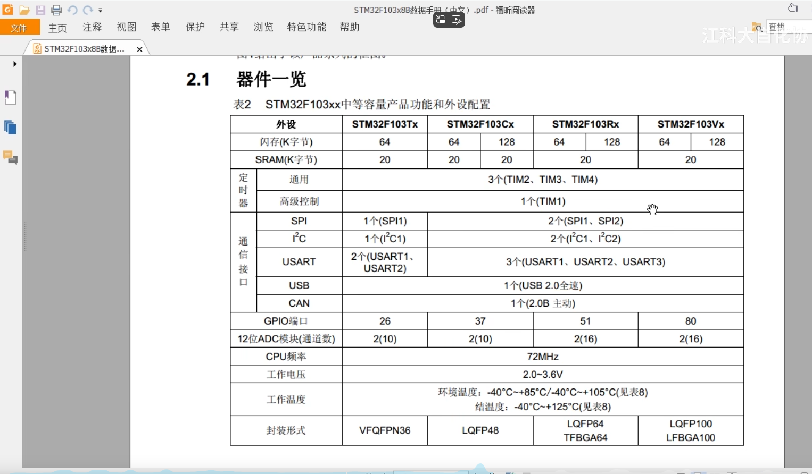
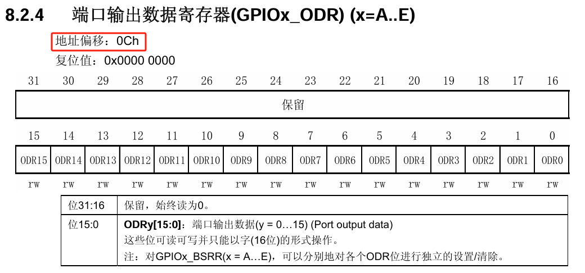
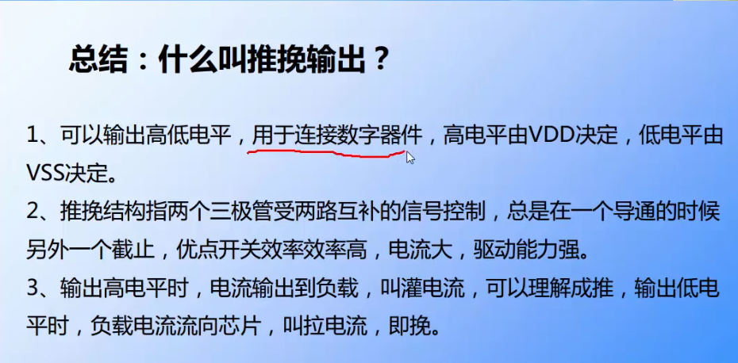

# STM32F103

## STM32简介


ST-意法半导体，是一个公司名，即SOC厂商，SOC（System on chip）为系统级芯片。

微控制器与微处理器的区别为，微控制器没有MMU（内存管理单元）

没有接入操作系统的单片机称为裸机，我们在没有接入操作系统的单片机上写的例程也成为裸机例程。

ST公司拿ARM公司设计的内核，再完善外围电路，将所有部分封装起来，就做成了STM32，32代表32位的微控制器，这也是目前最高的。


ARM处理器内核包括A、R、M三个系列，比如STM32F103C8T6使用的是Cortex M3型号的ARM处理器内核。


这里的RAM是运行内存，存储介质是SRAM，属于内存cache。ROM是程序存储器，存储介质是Flash闪存，应该是属于主存吧。

#### 片上资源与外设


STM32F1上的外设资源，要记住外设对应英文的缩写

- NVIC为嵌套向量中断控制器，这个是内核里面用于管理中断的设备，比如配置中断优先级之类的
- SysTick为系统滴答定时器，这个是内核里面的一个定时器，主要用来给操作系统提供定时服务的。STM32F1是可以搭载Freertos和UCOSII这些操作系统的，**如果用了这些操作系统，就需要SysTick提供定时来进行任务切换的功能。**
  - 所以感觉就是51上面的系统时钟/晶振周期不分频直接拿来当定时器？
  - 可以利用这个定时器来完成delay函数的功能
- RCC为复位和时钟控制，**这个可以对系统的时钟进行配置，还可以使能各模块的时钟。**STM32上的外设在上电的情况下默认是没有时钟的，不给时钟，操作外设是无效的。
- GPIO就是通用的IO口，用来点灯、读按键之类的
- AFIO为复用IO口，它可以完成复用功能端口的重定义，还有中断端口的配置。
- EXTI为外部中断，配置好外部中断后，当引脚有电平变化时，就可以触发中断，让CPU来处理任务。
- TIM为定时器，分为高级定时器、通用定时器、基本定时器三种类型。高级定时器最复杂，常用的时通用定时器。**这些定时器不仅可以完成定时中断的任务，还能完成测频率、生成PWM波形、配置成专用的编码器接口等功能**
- ADC为模数转换器，STM32F1内置了12位的AD转换器，可以直接读取IO口的模拟电压值，无需外部连接AD芯片
- DMA为直接内存访问，用于帮CPU搬运大量数据
- USART为同步或异步串口（即既支持同步串口也支持异步串口），平常使用的UART是异步串口的意思
- IIC、SPI、CAN、USB四种通信协议，单片机内部有产生通信时序的硬件电路，当然用IO电平输出来模拟时序也可以
- IWDG、WWDG为独立看门狗和窗口看门狗，当单片机因为电磁干扰死机或者程序设计不合理出现死循环时，看门狗会复位芯片保证系统的稳定。
- FSMC可用于拓展内存，或者配置成其他总线协议，用于某些硬件的操作



在操作外设之前要查看单片机数据手册看有没有相应的外设

#### STM32产品系列命名规则


也可以查阅单片机的参考手册了解STM32命名的规则

#### 系统结构介绍


并且需要了解单片机的系统结构，Cortex-M3为STM32F103的内核，也就是整台单片机的CPU。内核引出三条总线，**指令总线、数据总线、系统总线**。

指令总线、数据总线用于连接FLASH闪存，其中存放的是我们编写的程序。**指令总线是用来加载程序指令的，数据总线是用来加载数据的，比如常量和调试数据。**系统总线连接到了其他东西，如SRAM，用于存放程序运行中的变量数据。

下面的**AHB系统总线就是用于挂载主要的外设**，又叫做先进高性能总线，挂在的一般是最基本的或性能比较高的外设，比如RCC。

APB的意思是先进外设总线，用于连接一般的外设。由于AHB和APB在总线协议、总线速度等等差异，需要中间加两个桥接来完成数据的转换和缓存。**其中APB2为高速总线，一般是和AHB同频率，为72MHZ，APB1为低速总线，一般是36MHZ。所以APB2连接的是一般外设中较重要的部分**，比如其中的TIM1高级定时器，GPIO、AFIO等等。当然我们只需要知道哪些外设挂载在哪些总线上就行，具体区别没啥大问题。

**DMA用于帮CPU搬运数据**，相当于一个数据中转站，DMA总线连接在总线矩阵上，**它拥有和CPU一样的总线控制权**，用于访问APB总线上的外设。当外设有数据需要传输时，即可向DMA发起请求，再由DMA访问并转运数据。

#### STM32F103C8T6引脚定义


标蓝色的是最小系统相关的引脚，标绿色的是IO口、功能口引脚，**相关定义也可以在STM32F103C8T6数据手册中查看**


- S代表电源，I代表输入，O代表输出，IO代表输入输出。

- 主功能就是上电后默认的功能，一般和引脚名称相同。如果不相同，默认功能也是主功能。
- 默认复用功能就是IO口上连接的外设功能引脚，**配置IO口时可以选择使用通用IO口功能还是复用外设功能**
- 重定义功能的作用是，如果有两个功能同时复用在一个IO口上，但是又要同时用到这两个功能，**就可以把其中一个复用功能重映射到其他端口上，前提是重定义功能的表里有对应的端口。**


I/O口电平有FT的代表可以承受5V电压，没有的就只能承受3.3V电压。没有FT的IO口需要接5V的电平需要加装电平转换电路。

**系统的主晶振是8MHZ的，通过芯片内部的锁相环电路，把8MHZ倍频到72MHZ，作为系统的主时钟。**

VSS是负极，接GND,VDD是正极，接3.3V。

**BOOT引脚用于配置启动模式**


34、37-40都是调试端口，用于调试程序和下载程序的，STM32支持SWD和JTAG两种调试方式。

SWD只需要两根线，分别是SWDIO和SWCLK，st-link所使用的就是SWD调试方式

JTAG需要五根线，分别是JTMS、JTCK、JTDI、JTDO、NJTRST

#### 启动配置


具体介绍在51单片机的文档中程序下载部分，BOOT1和BOOT0都置1这个模式是用于程序的调试，也就是Debug。

BOOT引脚的值是上电后SYSCLK四个上升沿内有效，过了第四个上升沿就变成普通的IO口了。比如BOOT1是定义在PB2引脚上的，在第四个时钟后，引脚就从BOOT1的功能变成PB2的功能了。

#### 最小系统电路


启动配置这里是为了设置STM32启动的位置，也就是设置启动模式，用跳线帽来连接BOOT0、BOOT1和VCC、GND，从而设置启动模式。下载端口把SWDIO、SWCLK、GND、VCC引出来接st-link。

#### 原理图绘制


电源、晶振IO、下载IO、BOOT IO、复位IO都是必要的，这5部分也称为最小系统。

##### 查找引脚的功能说明


编程的时候查找参考手册，设计电路的时候查找数据手册。

#### 仿真器


DAP仿真器是免驱动的，不用下载驱动固件

像是J-Link和st-link就需要安装对应的驱动固件，由于开发板上用的是DAP仿真器，以后自己画的板是st-link仿真，因此要把固件下载好。

#### 仿真器配置

在STM32库开发实战指南中跟着流程来，需要注意的是，如果Debug的Reset选项没有autodetect选项，到后面的pack把enable勾去就能选了，顺便记得把Reset and Connect选项勾上。

#### 串口下载

bootloader是自举程序，在51单片机ISP那章有


通过CH340G电平转换芯片，电脑的USB电平转换为TTL电平标准的电平，这样就可以跟单片机的串口协议进行通信。所以CH340G是一个USB转TTL模块，也称为USB转串口模块。

#### 软件安装注意事项

之前给51单片机安装的Keil是Keil C51，是专门提供给C51系列单片机用的，所以STM32不能在这上面编程和开发，需要下载Keil  MDK5才行。

## 寄存器


芯片上的引脚排序对应小圆点按逆时针来排序

#### 三条总线的主要作用


变量存储在SRAM中，其实也就是内存。常量存储在FLASH中，也就是主存。DMA和DCode在取数的时候会有总线矩阵仲裁，决定哪一个总线取数，也就类似于优先级？

#### 存储器映射


厂商分配了4GB内存空间给存储器，并且给给存储器空间分配了具体的地址，这个过程称为存储器映射,注意地址的存储单位为Byte，内存的基本存储单元是字节。所以一个寄存器到下一个寄存器的地址间隔是4，也就代表了一个寄存器的存储空间为4字节。


#### 寄存器的定义


寄存器的地址偏移指的是基于寄存器对应外设在内存块内被分配的基地址的偏移


比如GPIOB的分配的内存空间的基地址是0x40010C00，那么GPIOB端口输出寄存器的基地址就是0x40010C0C



#### 寄存器映射


由于**外设的一系列寄存器的都是在一片连续的内存空间内**，因此只需设置对应于外设的结构体，结构体成员变量也占用一片连续的内存空间。其中结构体成员变量就是外设的寄存器（**寄存器成员变量定义的顺序也要符合外设中寄存器分配的顺序**）。如图所示，GPIO的寄存器列表。


并且可以通过设置外设的结构体指针，直接用外设的基地址来访问外设的寄存器。

注意：结构体访问成员变量用.，结构体指针访问成员变量用->


更加厉害的做法是**把外设的结构体指针宏定义为外设名**，从而可以直接用外设名 + ->来访问外设的寄存器。

## GPIO

#### GPIO简介

GPIO-general purpose input output，是通用输入输出端口的简称，简单来说就是软件可控制的引脚。

#### 推挽输出

推挽输出可以输出高低电平（0/1）


- 当1处输入为1时，高电平经过2非门变成低电平0，然后此时的PMOS管处的G极电压低于S极电压（VDD为3.3V），PMOS管导通。而NMOS管处的G极电压等于S极电压，NMOS管截止，因此此时IO引脚输出高电平3.3V。
- 当1处输入为0时，低电平经过2非门变成高电平1，然后此时的PMOS管处的G极电压等于S极电压（VDD为3.3V），PMOS管截止。而NMOS管处的G极电压低于S极电压，NMOS管导通，因此此时IO引脚输出低电平0V。
- 另外推挽输出的命名来源于当PMOS管导通时，电流从VDD流向IO引脚，相当于电流被推出去或灌出去，也把电流称为灌电流。
- 当NMOS管导通时，电流从IO引脚流向GND，相当于电流被挽进来或拉进来，也把电流称为拉电流。

#### 开漏输出

开漏输出若不外借上拉电阻，只能输出低电平0.


- 当1处输入高电平1时，经过非门2变成低电平0，此时NMOS管处的G极电压等于GND，NMOS管截止。若无外接上拉电阻，此时引脚悬空，呈现高阻态，也就是什么都不输出。若外接上拉电阻，则输出高电平。
- 当1处输入低电平0时，跟推挽输出的挽输出一样。
- 开漏输出通常用于IIC总线

#### 输入


- 引脚电平输入首先要经过上拉或下拉，上拉和下拉通过GPIO_CRL和GPIO_BSRR寄存器设置。
- 然后再经过肖特基触发器，肖特基触发器的原理是输入电平高于2V认定为高电平，低于1.2V认定为低电平，在1.2V~2V之间就不输入，起到电压比较的作用。
- 此时可以选择输入到GPIO_IDR寄存器或外设的数据输入寄存器。
- 第三种是不经过肖特基触发器，直接输入到ADC芯片，因为模拟电压需要最开始输入的信息。

#### 总结




##### GPIO寄存器

GPIO_ODR用于IO口电平输出

GPIO_IDR用于单片机读入IO口的电平


之所以通过寄存器指针可以连续访问四个字节的寄存器内存，是因为把寄存器指针定义为32位无符号整型指针的同时，寄存器的内存空间大小也被定义成4个字节。

```c
#define RCC_APB2ENR  (unsigned int)(RCC_BASE+0x18)//这里在定义指针变量的类型，也相当于在定义指针所指向的内存空间的大小
```

## 构建库函数雏形

```c
#define Peripheral_Base 0x40000000

#define APB1_Base Peripheral_Base
#define APB2_Base Peripheral_Base+0x10000
#define AHB_Base Peripheral_Base+0x20000

#define RCC_Base AHB_Base+0x1000
#define GPIOB_Base APB2_Base+0x0C00

#define RCC_APB2ENR *((unsigned int*)(RCC_Base+0x18))

typedef unsigned int uint32_t;
typedef unsigned short uint16_t;

typedef struct
{
	uint32_t CRL;
	uint32_t CRH;
	uint32_t IDR;
	uint32_t ODR;
	uint32_t BSRR;
	uint32_t BRR;
	uint32_t LCKR;
}GPIO_Typedef;

#define GpioB ((GPIO_Typedef*)(GPIOB_Base))
int main(void)
{
	RCC_APB2ENR |=(1<<3);
	GpioB->CRL &= 0xFFFFFFF0;//标记在这里！！！
	GpioB->CRL |= 0x01;
	GpioB->ODR |= ~(1<<0);
	while(1)
	{
	}
}
//实际上就是构建结构体，结构体中定义与外设寄存器内存大小相同的无符号32位整型变量，按照外设寄存器地址顺序定义。再把外设的基地址强制类型转换为结构体指针类型，宏定义赋值给与外设名相同的变量。便可以直接访问外设中的任一寄存器，如标记处所示。
```

```c
#define GpioB ((GPIO_Typedef*)(GPIOB_Base))
#define RCC_init ((RCC_Typedef*)(RCC_Base))

typedef unsigned int uint32_t;
typedef unsigned short uint16_t;


typedef struct
{
	uint32_t CRL;
	uint32_t CRH;
	uint32_t IDR;
	uint32_t ODR;
	uint32_t BSRR;
	uint32_t BRR;
	uint32_t LCKR;
	
}GPIO_Typedef;

typedef struct
{
	uint32_t CR;
	uint32_t CFGR;
	uint32_t CIR;
	uint32_t APB2RSTR;
	uint32_t APB1RSTR;
	uint32_t AHBENR;
	uint32_t APB2ENR;
	uint32_t APB1ENR;
}RCC_Typedef;
#define GPIO_Pin_0  ((uint16_t)0x0001)
#define GPIO_Pin_1  ((uint16_t)0x0002)
#define GPIO_Pin_2  ((uint16_t)0x0004)
#define GPIO_Pin_3  ((uint16_t)0x0008)
#define GPIO_Pin_4  ((uint16_t)0x0010)
#define GPIO_Pin_5  ((uint16_t)0x0020)
#define GPIO_Pin_6  ((uint16_t)0x0040)
#define GPIO_Pin_7  ((uint16_t)0x0080)
#define GPIO_Pin_8  ((uint16_t)0x0100)
#define GPIO_Pin_9  ((uint16_t)0x0200)
#define GPIO_Pin_10 ((uint16_t)0x0400)
#define GPIO_Pin_11 ((uint16_t)0x0800)
#define GPIO_Pin_12 ((uint16_t)0x1000)
#define GPIO_Pin_13 ((uint16_t)0x2000)
#define GPIO_Pin_14 ((uint16_t)0x4000)
#define GPIO_Pin_15 ((uint16_t)0x8000)
void Gpiox_Set(GPIO_Typedef *gpiox,uint16_t Gpio_pin)
{
	gpiox->BSRR |= Gpio_pin;
}

void Gpiox_Reset(GPIO_Typedef *gpiox,uint16_t Gpio_pin)
{
	gpiox->BRR |= Gpio_pin;
}

	Gpiox_Reset(GpioB,GPIO_Pin_0);
	Gpiox_Set(GpioB,GPIO_Pin_0);
//由于在ODR寄存器里手动用十六进制数据赋值不利于移植与可读性差，因此直接使用BSRR和BRR寄存器来置位与重置，并且在置位函数与重置函数可以使用相同的宏定义
```

```c
//GpioB->CRL &= 0xFFFFFFF0;
//GpioB->CRL |= 0x01;
//这里用枚举类型，是为了让GPIO配置结构体的成员变量只能在对应枚举类型定义的值中选值
typedef enum
{
	GPIO_Speed_10MHZ = 0x01,
	GPIO_Speed_2MHZ ,
	GPIO_Speed_50MHZ 
	
}GPIOInit_Speed;
typedef enum
{
	GPIO_Mode_AIN = 0x0,           //模拟输入
	GPIO_Mode_IN_FLOATING = 0x04,  //浮空输入
	GPIO_Mode_IPD = 0x28,          //下拉输入
	GPIO_Mode_IPU = 0x48,          //上拉输入
	
	GPIO_Mode_OUT_OD = 0x14,       //开漏输出
	GPIO_Mode_OUT_PP = 0x10,       //推挽输出
	GPIO_Mode_AF_OD = 0x1C,        //复用开漏输出
	GPIO_Mode_AF_PP =0x18,         //复用推挽输出
}GPIOInit_MODE;
//输入与输出模式之所以这么赋值看引脚工作模式真值表分析
typedef struct
{
	uint16_t PIN; 
	GPIOInit_Speed GPIO_SPEED;//只能在GPIOInit_Speed类型定义的符号值之间选
	GPIOInit_MODE GPIO_MODE;//只能在GPIOInit_MODE类型定义的符号值之间选
}GPIOx_Init;

int main()
{
    GPIOx_Init GPIO_Init_structure;
	GPIO_Init_structure.GPIO_SPEED = GPIO_Speed_10MHZ;
	GPIO_Init_structure.GPIO_MODE = GPIO_Mode_OUT_PP;
	GPIO_Init_structure.PIN = GPIO_Pin_0;
    while(1)
    {
        
    }
}
//后面还是觉得GPIO端口配置不易于阅读与移植，将外设端口配置的模式、速度、引脚号作为端口配置结构体的成员变量
//在编写端口初始化函数，将外设寄存器结构体和外设配置结构体的指针作为形式参数。
```


## 固件库

### 固件库文件分析

- 汇编编写的启动文件
  - startup_stm32f10x_hd.s：设置堆栈指针、设置PC指针、初始化中断向量表、配置系统时钟、调用C库函数_main最终去到C的世界
- 时钟配置文件
  - system_stm32f10x.c：把外部时钟（晶振）HSE=8Mhz，经过PLL倍频为72Mhz
- 外设相关的
  - stm32f10x.h：实现了内核之外的外设的寄存器映射
  - xxx：GPIO、USART、I2C、SPI、CAN
  - stm32f10x_xx.c：外设的驱动函数库文件
  - stm32f10x_xx.h：存放外设的初始化结构体，外设初始化结构体成员的参数列表，外设固件库函数的声明
- 内核相关的
  - CMSIS-Cortex 微控制器软件接口标准
  - core_cm3.h：实现了内核里面外设的寄存器映射
  - core_cm3.c：内核外设的驱动固件库
- NVIC（嵌套向量中断控制器）、SysTick（系统滴答计时器）应该是操作系统要用的
  - misc.c
  - misc.h
- 头文件的配置文件
  - stm32f10x_conf.h：外设头文件的头文件
  - 包含：stm32f10x_usart.h、stm32f10x_gpio.h、stm32f10x_can.h等等
- 专门存放中断服务函数的C文件
  - stm32f10x_it.c
  - stm32f10x_it.h
  - 中断服务函数可以随意放在其他地方，并不一定是要放在stm32f10x_it.c，所以这里的意思是stm32f10x_it.c不是定义中断服务函数的地方，而是使用的地方？

### 固件库模板配置


记得把stm32f10x.h中的这两个宏在魔术棒C/C++里定义，上面那个是对应版本的MCU可以使用的特殊函数，下面是包含所有外设驱动函数头文件的头文件

## 固件库操作GPIO