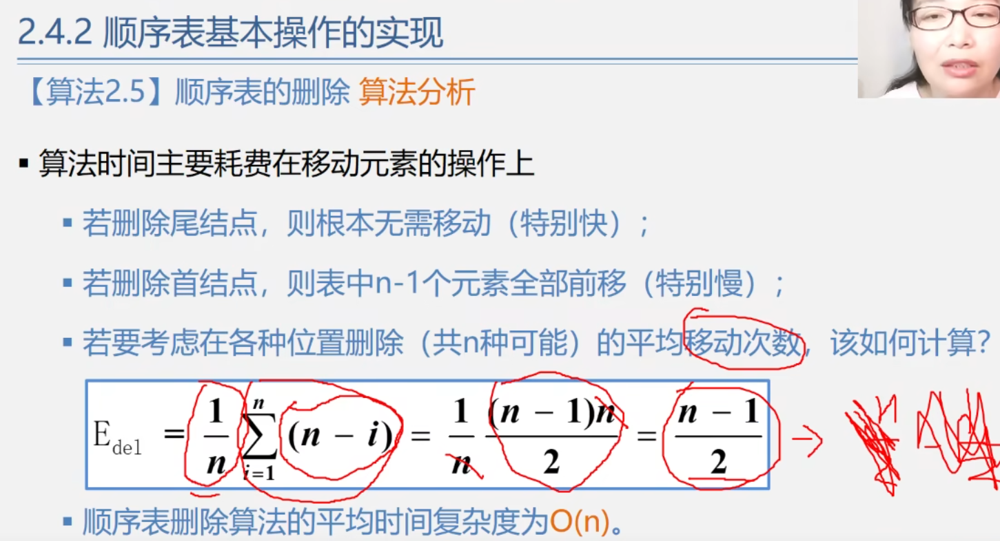

# 数据结构与算法

**程序=数据结构+算法**

#### 课程内容


### 前言


### 基本概念和术语

- 数据
  - 
  - 数值型的数据可以进行加减乘除、微积分等等数学运算
- 数据元素
  - 
  - **数据元素是数据的基本单位**，也就是数据由所有数据元素构成。数据是集合，数据元素是元素。
  - 数据元素也简称为元素，或者称为记录、结点、顶点，这都是在不同数据结构下的名称
  - **一个数据元素可以由若干个数据项组成**，比如图里其中一条学生信息记录为一个数据元素，其中包含学号、姓名、性别、出生日期、政治面貌五个数据项
- 数据项
  - 
- 数据对象
  - 
  - **数据对象是性质相同的数据元素的集合**，是数据的一个子集。也就是说，在库中，字符型的数据就是一个数据对象
  - 数据元素 - 组成数据的基本单位
    - 与数据的关系：是集合的个体
  - 数据对象 - 性质相同的数据元素的集合
    - 与数据的关系：集合的子集
- 数据结构
  - 
- 逻辑结构
  - 
  - 逻辑结构分为**线性结构与非线性结构**
  - 线性结构：**只有一个开始结点和一个终端结点，并且所有结点最多只有一个直接前趋与一个直接后继。**也就是学生排队，一个学生前面最多排一个人，后面也最多排一个人。如果是开头第一个学生，前面没有人。如果是最后一个学生，后面没有人
  - 非线性结构：**一个结点可能有多个直接前趋与多个直接后继。**树状结构的一个父对象有多个子对象，也就是有多个直接后继。图状结构，地铁中转站点对应多条路线，也就是可以由多个方向来，再通往不同方向，即多个前趋与多个后继。
  - 
- 存储结构
  - 
    - 主要了解顺序存储结构和链式存储结构就行
  - 顺序存储结构：
  - 
    - 用一组连续的存储单元依次存储数据元素，数据元素之间的逻辑关系由数据元素的存储位置来表示
    - C语言中用数组来实现顺序存储结构
  - 链式存储结构：
  - 
    - 根据数据的首地址，也就是头指针，找到第一个数据元素。在存储第一个数据元素的同时，也把后继数据元素的地址存储在一起。
    - 所以可以根据首地址指向的存储单元中，找到第一个数据元素和下一个元素的地址。通过这样的链式结构可以用不同地址的存储单元来存储数据单元。
    - 最后一个地址对应的存储单元中只存储了数据单元和一个空地址（或者空指针）
  - 索引存储结构：
  - 
  - 散列存储结构：
  - 
- 数据类型
  - 
  - 
- 抽象数据类型
  - 
  - 
  - 参数表那里，引用参数以&打头，意味着该参数除了可以提供输入值进行操作，还能将操作结果返回到该参数对应的变量中。例如C语言中的Scanf（“%d”，&data），也就是把键盘输入的内容存储到data中，data也可以作为函数参数提供输入。
  - 
  - 
  - 

- 抽象数据类型的实现
  - 
  - 也就是用结构体定义存储结构，用函数描述操作
  - 
  - 
  - 使用结构体指针

### 算法与算法分析

#### 算法的定义

- 算法是对特定问题求解方法和步骤的一种描述，它是指令的有限序列。其中每个指令表示一个或多个操作。
- 总而言之，算法就是解决问题的方法和步骤
- 

#### 算法分析

##### 算法时间效率的度量


由于计算机硬件的性能不同，因此算法每条语句在不同硬件上执行所需的时间也不同。可以假设执行每条语句所需时间都为单位时间，从而脱离硬件的限制，改为**讨论算法中语句的执行次数来判断算法的复杂度**。


由于计算语句执行次数也比较麻烦，因此改变成比较算法语句数量级来比较算法复杂度。

##### 算法时间复杂度


##### 算法的渐进时间复杂度


因为算法中的某些操作对于算法的贡献较小，所以只计算算法中基本操作的执行次数


可以把语句频度中的低次幂和最高次幂忽略，得到算法的时间复杂度

##### 示例


##### 算法时间复杂度计算


只考虑最坏情况下的算法复杂度


##### 空间复杂度


算法1只需要一个变量t来存储数值，算法2需要有n个元素的一维数组来存储数据。

## 线性表

### 线性表（Linear List）的定义和特点


- 其中元素的个数n定义为表的长度
- 当n=0时，称为空表
- 将非空的线性表（n>0）记作：（a1，a2，...，an）

#### 线性表的例子


- 线性关系可以总结为，非首尾数据元素都有一个直接前趋和一个直接后继
- 非空线性表有且只有一个开始结点a1，他没有直接前趋，而仅有一个直接后继
- 有且只有一个终端结点an，他没有直接后继，只有一个直接前趋


遇到这种稀疏多项式可以用结构体数组来存储对应多项式的幂次与系数

```c
struct polynomial_element_1[5]
{
unsigned char index;//指数
int coefficient;//系数
}

struct polynomial_element_2[5]
{
unsigned char index;
int coefficient;
}
```


但是顺序存储结构存在存储空间分配不灵活、运算的空间复杂度高的问题，难以确定具体数组需要多大的内存空间。因此可以采用链式存储结构，单向链表。


算法思路：-1的意思是表头，然后A和B两个表中的第一个元素比较指数，若指数不同，则保留指数较小的项；若指数相同则系数相加，若系数不为0，则把系数相加后的项保留；若系数相加为0，则不保留这两项，若这两项还有元素，把后面所有的元素加到这两项的位置上。

这样不需要申请额外的空间，需要多少用多少。


图书管理系统则需要更复杂的数据元素，以及实现上述功能

**总结**：

- 线性表中数据元素的类型可以为**简单类型**，也可以为**复杂类型**
- 像图书管理系统之类的应用基本都需要增删查改等操作，所以不用为每个具体的应用编写一个程序，只需知道其中共用的算法即可。
- 根据应用抽象出共性的逻辑结构和基本操作（**抽象数据类型**），然后实现其**存储结构和基本操作**，比如线性表为线性结构，可以用顺序表和链表实现

#### 线性表的类型定义


- 数据元素的数据关系为序偶关系，其实也就是有对有序的数
- 基本操作参数表里边用&是为了返回操作结果到L，返回操作后的线性表


- 销毁线性表与清除线性表的区别为：销毁线性表清空线性表所有元素并把所占内存释放，清空线性表只是清除线性表内的数据元素，内存空间还在


- GetElem(L,i,&e)为给定数据元素的线性表位序，查找线性表中的数据元素
- LocateElem(L,e,compare())为查找满足对应条件元素的位序，具体判定条件是<、>、=,由compare()函数决定


- PriorElem(L,cur_e,&pre_e)为给定当前元素cur_e，求它的直接前趋数据元素。若cur_e不是第一个元素，则用pre_e返回它的前趋，否则返回空值，pre_e无意义。
- NextElem(L,cur_e,&next_e)为给定当前元素cur_e，求它的直接后继数据元素。若cur_e不是最后一个元素，则用pre_e返回它后继，否则返回空值，next_e无意义。


- 也就是在第i个位置插入元素，插入范围为1~n+1


- ListDelete(&L,i,&e)为删除线性表中第i个元素，并用e将其值返回。
- ListTraverse(&L,visited())为遍历线性表，具体对线性表元素进行什么操作由visited()决定。


### 线性表的顺序存储（顺序表）


顺序表中不能有空的存储单元，下一个元素的起始位置要跟在上一个元素末尾存储单元的后一位。


根据线性表首元素的地址，**也就是基地址，再加上i-1个元素所需存储空间**，即可得到第i个元素的存储位置。这种可以求出任意第i个元素的方式称为随机存取。


顺序表和数组很像，但是数组不能动态改变自身长度。数组可以用常量和符号常量来表示自身长度，符号常量是指宏定义。


顺序表有两个成员变量，分别是线性表和表长。因此可以使用结构体表示顺序表，在其中定义数组与数组长度length，再把这个结构体数据类型自定义为顺序表类型。


- 在原本模板中的数组类型被替换为多项式指针类型，这个类型实际上是结构体指针类型。
- 多项式Polynomial类型里面定义了多项式的系数和指数，所以多项式定义其实就是数据元素，指数和系数定义就是数据项。多项式类型实际上是结构体类型被typedef自定义为了多项式类型，换个名字而已。
- **但是在C语言中，数组名存放的是数组第一个元素的地址，也就是这个数组的首地址，又相当于指针，因此可以把结构体指针看作结构体数组。**
- 因此直接取多项式结构体数组首元素的地址就是基地址，后续只需用sizeof()之类的求类型存储空间的函数，就能得到多项式类型的存储空间？
- 具体有多少个数据元素由length决定


**注意：和数组不同，结构体变量的名字并不是结构体变量的地址，因此想取结构体变量的地址需要加&**

```c
struct date *pDate = &today;
```

示例二


#### 顺序表示意图


这里把元素结构体数组那片内存的首地址赋值给L.elem后，便可以直接操作元素结构体数组。并且内存最后四个字节属于length，是因为在顺序表中先后定义的顺序。


顺序查找的时间复杂度计算


##### 顺序表插入算法


##### 顺序表删除算法




#### 类C语言有关操作补充说明

##### C语法下的动态存储分配


```c
//ElemType data[MaxSize] 与 ElemType *data实际上都是定义了数组。
//但是左边的数组空间是静态分配的，即定义了数组以后，这个数组的位置与空间大小就已经定了
//对右边来说，既然数组的首地址是数组第一个元素的地址，因此可以定义一个指针变量来存放数组第一个元素的地址，定义了对应指针类型的变量也相当于定义了一个数组。
//从而可以用动态分配内存函数malloc给数组分配内存空间。
```


```c
//sizeof(ElemType)是求取ElemType类型的长度，也就是所需空间大小
//MaxSize是自定义的数组长度，实际上用多少还是length决定
//然后用malloc()申请sizeof(ElemType) * MaxSize大小的空间，并返回这段空间的首地址。
//首地址前加(ElemType*)是因为data是ElemType*类型的变量，所以把地址强制类型转换成ElemType*类型，并且也是为了把这部分空间的地址按照ElemType类型来分配。
//比如800Byte的空间如果按照int型分配，就会被分配成200个变量空间，按照char型分配，就会分配成800的变量空间
//使用完这部分动态内存空间后，需要用free(p)函数把内存释放，参数为指针p
```

##### C++语法下的动态存储分配


##### C++中的参数传递


- 
  - 传实参的值给形参，形参只在函数内部生效，并且形参和实参的地址也不一样，不会影响实参的内容。函数执行完后，形参的内存都会被释放。

- 
  - 实参的地址被传入给形参，因此当修改形参指向的值时，实参的内容也被修改。
- 
  - 这种之所以不影响实参，是因为函数只是把形参的值相互交换了，没有把形参指向的内容相互交换。
- 
  - 因为传递的数组名是数组首元素的地址，所以当修改形参指向的值时，也修改实参的值。
  - 这里形参处的char b[]等同于char *b，但是函数内的b[]不等同于 *b， *b是数组的首元素地址指向的值，而给b[]赋值字符串是等于给数组内各元素赋值字符。
- 示例
  - 
- 
  - 在C++中，&j = i相当于给i起了个别名叫做j，j 的值等于i的值，j 的地址等于i的地址。实际上操作了i的值，j的值也会跟着变。
  - 
  - 所以这里设置m和n为引用类型的形参，可以直接在m修改a的值，在n修改b的值，并且不会在函数内申请新的内存空间，对比用一般的形参，节省了时间和空间。
  - 

### 线性表的链式存储（链序表）


#### 链表示意图


- 链表中数据元素的物理位序与逻辑位序不同，链表的存储单位称为结点，结点包括**数据域、指针域**。
- 数据域存放数据单元的内容，指针域存放下一个结点的地址，指针域中指向下一个结点的指针又称为链。
- 链表中第一个元素（不是首元元素）的地址称为头指针，可通过该指针顺序访问接下来的结点。在单链表中，表名可以用头指针命名。
- 链表中最后一个结点的指针域放空指针NULL，NULL在C语言中其实就是0。
- 


#### 链表知识点


- 链表第一个结点之前附设一个结点，称之为头结点L。头结点的数据域可以不存放任何信息，也可存储入线性表的长度等类的附加信息。
- 头结点的指针域存放的是首元结点的地址，若线性表为空表，则头结点的指针域为空。
- 头指针指的是头结点的地址。
- 首元结点时链表中存放第一个数据元素A1的结点,注意区分头结点和首元结点


- 单链表是指结点只有一个指针域的链表，存放的是下一个结点的地址。
- 双链表是指结点有两个指针域的链表，一个存放的是前趋元素的地址，一个存放的是后继元素的地址。
- 循环链表是指链表最后一个结点的指针域存放的是头结点的地址，也就是头指针。循环链表也可以分成单循环链表和双循环链表。
- 单链表和双链表的最后一个结点的指针域存放的都是空指针。


此外，链表还分成带头结点和不带头结点。带头结点的链表的头指针指向头结点，不带头结点的链表的头指针指向首元结点。


- 链表无头结点时，头指针为空时表示为空表
- 链表有头结点时，头结点的指针域为空时表示为空表


设置头结点的好处


头结点不计入链表长度值。


- 链表想要访问第i个元素就必须从第1个元素依次向后扫描结点，直到访问到第i个结点。
- 顺序表则是跟数组一样，只要访问第i-1位序的元素就能访问
- 所以顺序表是可以随机存取，而链表只能顺序存取

#### 单链表


- 数据域与指针域的变量分别用data和next来表示，结点为包含这两种类型变量的结构体。

- data具体是什么类型的数据由自己定义，next为指向结点结构体类型的指针。

- 并且这种在结构体内部定义结构体指针的做法被称为嵌套定义。

- ```c
  //代码最后一行的意思是把struct Lnode重命名为Lnode、*LinkList，也就是Lnode和 *LinkList都是struct Lnode。
  //其中（*LinkList）=struct Lnode，也就是LinkList是struct Lnode*类型。这里是直接把
  Typedef struct Lnode
  {
      xxx;
      xxx;
  }Lnode;
  Typedef struct Lnode
  {
      xxx;
      xxx;
  }*LinkList;
      //这俩步骤给合并了
  ```


#### 算法


