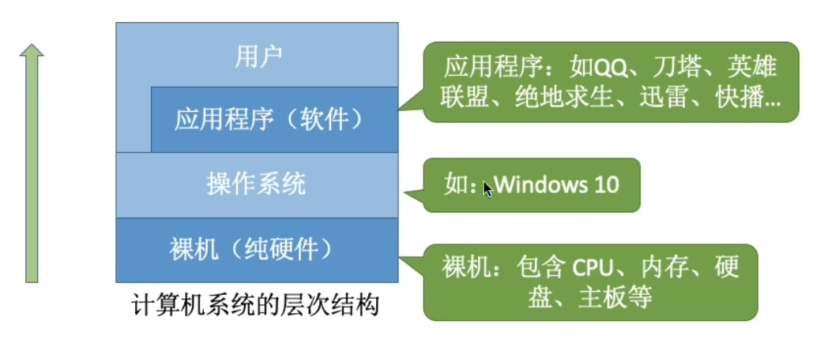
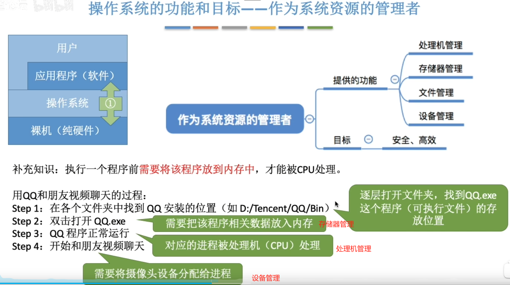
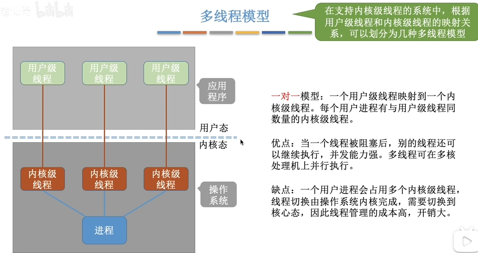

# 操作系统

## 1.1介绍

### 1.1.1操作系统概念

### 1.1.2操作系统特征

并发：宏观上看多事件同时进行，微观上看是各事件被分段交替进行

并行：就是多事件同时进行，每一分每一秒都在干多件事情

单核CPU同一时刻只能执行一个程序

互斥共享：同一时间段只能由一个进程使用资源

同时共享：宏观上看同一时间共同使用资源，微观上是进程交替使用资源，即在极短的时间片段内由一个进程使用，下一个短的时间片段由另一个进程使用。

## 1.2操作系统的分类

### 1.3.1操作系统的运行机制

### 1.3.2中断和异常

内中断信号引发后，操作系统内核立即夺回CPU的使用权（回到内核态），并开始执行中断信号的内核程序（中断处理程序）的指令。

还有用户态使用陷入指令，主动切换回内核态，让操作系统内核提供服务。陷入指令不是内核指令。

外部中断的方式提到两种：

- 一是定时器定时中断，每隔一段固定时间就发送一个时钟中断信号，此时操作系统内核执行处理中断信号的内核程序，处理完后看到应用程序1已经使用过50ms了，把CPU的使用权给应用程序二。相同的过程，内核处理完中断程序后会把CPU使用权给应用程序1，这样就由中断实现了多个程序的并发运行。
- 二是I/O输入输出设备中断，在I/O设备任务完成后固定发送中断信号。
- 外部中断信号的检查是在每条指令执行结束后开始，内中断信号的检查是从执行每条指令时开始。
- **时钟系统中断的主要工作是处理和时间有关的信息及决定是否执行调度程序**，和时间有关的所有信息包括系统时间、进程的时间片、延时、使用CPU的时间、各种定时器。

陷入程序与系统调用相关，主要作用就是用户主动把CPU使用权交给内核让其提供服务，即主动从用户态切换回内核态。

中断信号引发后，内核根据中断向量表中的中断信号类型找到对应的中断程序（中断程序也是内核程序）。

中断保护中断现场要进行压栈处理，即把PC（程序计数器）、PSWR（程序状态字寄存器）保存在栈中，自动保存操作由硬件完成。

### 1.3.3系统调用

这里设计系统调用是为了使用计算机资源，创建新文件要使用存储空间。

所以这里的意思是，由内核安排各阶段使用什么资源，让这些进程互斥共享资源，从而避免任务执行错误。

应用程序在执行陷入程序(访管指令，是非特权指令，在用户态下使用)之前，要先把系统调用要用的参数写入寄存器中，系统调用入口程序回根据寄存器中的参数判断用户需要哪种系统调用服务，此时入口程序执行完就调用所需的系统调用服务程序。在系统调用执行完后，内核将CPU使用权交给应用程序，使其继续执行未执行完的指令。

**CPU在核心态下可以执行除了访管指令外的全部指令。**

## 1.4操作系统体系结构

**操作系统管理内存时，管理的是内存中的数据放在哪里，哪里可以放数据，哪里不能放数据（内存保护），哪里空闲等问题**。而内存数据是什么，怎么读和写，都不是操作系统关心的。

就比如内存可以看作水杯，操作系统关心水杯放哪里，哪些水杯的水能喝，哪些水杯的水不能喝。而水杯中的是水还是饮料，是把水杯拿起来喝还是用吸管插进去喝，那是用户的问题。

包含了内核必要功能和非必要功能的内核为大内核，只包含必要功能的内核为微内核。

这里大内核与微内核的系统调用在CPU状态变换次数有所不同，而CPU状态变换的过程也有时间成本。

## 1.5操作系统引导

计算机主存由RAM和ROM组成，ROM中存储了BIOS(Basic Input/Output System基础输入输出系统)，其中最重要的是包含了ROM引导程序（BOOT），又称作自举程序

这里活动分区为C盘，一般在C盘上安装操作系统

第四步其实就是在windows等操作系统根目录下找到操作系统初始化程序并执行。

## 2.1进程管理

### 2.1.1进程的概念

进程是程序的一次执行过程，程序可以有多次执行过程，也就是可以有多个进程，比如QQ的登陆界面可以打开多个。

这里的PID对于每个进程来说是唯一且不重复的，每创建一个进程就会分配一个新的PID程序辨识号。

这里有一个独特的数据结构叫PCB程序控制块，用于存储进程的各种信息，比如PID、UID、进程使用的CPU时间、进程分配的内存空间等等。

PCB是进程存在的唯一标志，当进程创建时，操作系统会为其创建PCB，当进程结束时，操作系统会回收其PCB

### 2.1.2进程的组成、特征

进程由PCB、程序段、数据段组成，其中PCB是给操作系统用的，程序段和数据段是给进程自己用的。

进程创建的过程中在内存中创建PCB、放入程序段的一系列指令与数据段的变量。

进程的过程反映了进程实体的变化过程，也就是进制执行过程中，进程实体在不断变化，体现在PCB、程序段、数据段的变化。进程实体反映了进程每一时刻的状态。

### 2.1.3进程的状态与转换

这里程序处于就绪态是，具备运行条件包括进程所需的设备资源都已经被分配好

这里阻塞态只能从运行态转换到，也就是进程的程序段执行过程中等待请求分配设备资源时，就会被自动从运行态转换到阻塞态。

当设备资源接触占用被分配给进程后，进程又从阻塞态转换到就绪态，后续等运行态的进程终止或运行时间到后，被调度到CPU中执行，则从就绪态转换到运行态。

进程的组织方式中连接方式其实也就是链表，即分数据域与指针域，指针域存放下一个结点的地址。

### 2.1.4进程控制

这里假如PCB2在状态变换后，但没有完成把PCB2从阻塞队列放到就绪队列时，发生了中断，就会造成操作系统中的队列信息错误，导致无法进程无法顺利执行，所以需要使用原语一气呵成将状态变换和队列变换完成。

原语的实现依靠开中断指令和关中断指令完成。

**创建原语**

这里的作业是指将外存中需要执行的程序挑一个放入内存中执行。

**阻塞原语**

**阻塞原语与唤醒原语**

**切换原语**

进程切换时，要把这个进程的运行环境保存到PCB中（保存一些必要信息），也就是PSW、PC、通用寄存器中的信息。

### 2.1.5进程通信

进程间通信也就是两个进程之间进行数据交互，如从微博分享吃瓜文给微信好友

每个进程对共享空间的访问应该是互斥的，即共享空间同时只能被一个进程访问，否则在进程写入数据时，可能数据会被其他进程写的数据覆盖。

这里的映射到地址空间是指把共享内存区的一片连续空间的地址复制过来吗？还有虚拟地址是什么？页表项和段表项又是啥？同步互斥工具是啥？

进程间消息的结构主要包括消息头和消息体，消息头包含发送进程ID、接收进程ID】消息长度等格式化的信息，消息体则是具体的数据。

操作系统会把进程P发送的消息放置在操作系统内核的地址空间中，进程Q的PCB中的消息队列内。然后操作系统内核根据进程Q的接收原语，在消息队列内寻找进程P发送的消息，再将其复制到进程Q的地址空间。

对比直接通信的点名道姓发送信息，间接通信则是通过系统调用的方式，在操作系统内核地址区申请一片信箱空间A，进程P往信箱中发送消息，进程Q则从信箱中接收消息。

管道其实就是一个内存缓冲区，从数据结构的角度上看，管道是个循环队列。

管道通信有先进先出（FIFO）的特性，也就是进程读写数据只能按照固定顺序读写，这是与共享存储不同的地方。

并且各个进程要互斥的访问管道，也就是管道被写入数据时，同时只能有一个进程写。

管道中的数据一旦被读出，就会彻底消失，一个管道允许有多个写进程，但只能有一个读进程。

#### 2.1.5.2信号

向相关的进程发送信号，通知进程发生了什么事件。

信号类型表引用了csapp大黑书中的内容。

各个进程自定义的信号处理程序只能用于进程自身，不能被其他进程使用。

### 2.1.6线程

#### 2.1.6.1线程的概念与特点

进程中的程序内容也可以划分成多个部分，并发执行，比如QQ可以边语音聊天边文字聊天。

引入了线程以后，线程成为程序执行流的最小单位。

引入线程以后，进程只作为除CPU之外的系统资源的分配单元，线程变为CPU执行单元，也就是调度的基本单位。

也就是切换同一进程的线程，进程环境不用切换（使用的不同资源、数据），不同进程的线程间切换才要切换进程环境。

这里的线程控制块TCB是不是和Freertos中的任务控制块TCB是一个东西呢？

线程基本不拥有系统资源。

#### 2.1.6.2线程的实现方式和多线程模型

Thread是线程的英文，从代码上看，线程其实就是一段代码逻辑，线程调度就是多段代码的执行。

内核级线程会被分配一个核来执行线程，如果每个线程都需要操作系统来管理，比如线程切换由操作系统来切换，需要许多系统开销时间，线程管理成本高。

一对一模型实际上就是内核级线程，也就是用户级线程与内核级线程一一对应。

多对一模型其实就是用户级线程，即一个内核级线程中处理多个用户级线程，但是如果用户级线程其中有一个阻塞，其他的线程也会被阻塞。

多对多模型中，用户级线程就是进程中的一部分指令集合，由内核级线程运行，并且只有用户级线程获得了运行机会才能运行。

并且只有进程中所有内核级线程都阻塞时，这个进程才会阻塞。

#### 2.1.6.3线程的状态和转换

线程的状态和转换与进程的非常相似

堆栈用于保存函数调用信息，即函数调用完成后，函数返回的地址，还有调用过程中所用的局部变量等。

由于堆栈空间比较大，可以只保存堆栈指针，后续通过堆栈指针找到堆栈空间所在位置。

每个TCB就可以表示一个线程，与进程类似。

线程的组织可以通过把每个进程的线程组成一张表，也可以把操作系统所有线程都组织成一张表。

### 2.1.7堆与栈

#### 2.1.7.1堆

堆是一片空闲的内存，用于被malloc、free分配的内存空间，存放回收的数据。

#### 2.1.7.2栈

数据只能从栈顶那一端压入，从栈顶那一端出栈。

函数栈保存函数的返回地址和函数中定义的局部变量

在进入函数后，执行第一句代码前，要把函数的返回地址（函数的下一条指令的地址）保存到栈中。

## 2.2调度

### 2.2.1调度的概念

作业其实就是一个具体的任务，也是一个程序（一串指令集合）

高级调度即作业调度，作业在每次调度时，只会分别调入和调出内存一次。作业在被调入内存时，会建立PCB，被调出时，会撤销对应的PCB。

低级调度也称为进程调度，进程调度频率很高。

中级调度也称为内存调度，当内存不够时，可以将某些进程的数据调出到外存，等内存空闲或进程运行时再调入内存。

暂时调到外存等待的进程状态为挂起状态，被挂起的进程PCB会被组织成挂起队列。

一个进程可能会被多次调出和调入，因此内存调度的频率比作业调度更高。

#### 2.2.2.1进程调度的时机、切换与过程、方式

临界资源，一段时间内只能运行一个进程使用的资源，各进程需要互斥地访问临界资源。

临界区是访问临界资源的那段代码，进程在访问操作系统内核临界区时，操作系统会对内核临界资源上锁，只有在进程退出临界区后，临界资源才能解锁调度给其他进程。因此在访问内核程序临界区时们不能进行进程调度和切换。

普通临界区被访问时也会对临界资源上锁，但是普通临界区的访问不会影响内核的管理工作，因此可以在访问临界区的同时进行进程调度和切换。

根据进程调度是否可以被强行剥夺处理机资源，可将进程调度的方式分为**非抢占式调度和抢占式调度**。

进程的调度和切换是有代价的，进程执行的时间远不如进程调度和切换花费的时间多，并不是调度和切换的越快越好。

#### 2.2.2.2调度器和闲逛进程

### 2.2.3调度的目标（调度算法的评价指标）

**CPU利用率**

甘特图就是把各进程执行阶段与时刻标记出来，最后再计算CPU总时间

**系统吞吐量**

**周转时间**

**带权周转时间**

**等待时间**

对于进程来说，等待时间指进程被创建后等待被服务的时间之和

对于作业来说，等待时间除了进程等待被服务时间之和，还要加上作业在外存等待被调度时间

#### 2.2.5.1调度算法：先来先服务、最短作业优先、最高响应比优先

**先来先服务（FCFS）**

先来先服务也就是等待时间最久的作业或者进程优先被调度。

**短作业/进程优先（SJF/SPF）**

非抢占式的短作业优先调度算法

抢占式的短作业优先调度算法

这里的剩余时间是指剩余完成运行的时间

**高响应比优先算法（HRRN）**

这里进程的等待时间是从进程到达开始算，到当前进程主动放弃CPU所经历的时间，要求服务时间是进程完成运行所需时间。

#### 2.2.5.2调度算法：时间片轮转、优先级、多级反馈队列

**时间片轮转（RR）**

**时间片大小为2**

这里的时间片指的是处理机时间片，也就是CPU上的时间片，而发生在CPU上的调度只能是进程或线程调度。

每次调度一定是等到时间片用完或者进程结束才发生，若进程只需要使用1个单位时间，而时间片有2个单位时间，则进程会在进程运行完后主动放弃处理机，也就是运行1个单位时间后就放弃处理机。

**时间片大小为5**

时间片不能太大，否则进程被响应时间太久，就直接退化成先来先服务调度算法了。

时间片也不能太小，因为进程切换是需要系统开销的，切换的太频繁会导致系统花大量时间在进程切换上，运行进程的时间比例反而减少了。

**优先级调度算法**

非抢占式优先级调度算法

抢占式优先级调度算法

静态优先级是指进程创建后进程优先级就不变，动态优先级是指后续会根据情况动态调整进程的优先级。

**多级反馈队列调度算法**

这里I/O操作阻塞放回原队列是自己设置的吗？

队列中一旦出现更高优先级的进程，当前在处理机运行的进程会被抢占处理机。这里被抢占处理机的进程不会被放到下一级队列中，而是回到原队列的队尾。

#### 2.2.5.3调度算法：多级队列调度算法

也就是把不同类型的进程分配到不同队列，队列之间设置优先级，队列内的进程按照适合队列进程类型的调度算法来调度进程上处理机运行。

### 2.2.6多处理机调度

**公共就绪队列**

**私有就绪队列**

推迁移

这个特定的系统程序就起到了包工头派活的作用

拉迁移

## 2.3同步与互斥

### 2.3.1同步与互斥的基本概念

也就是进程可能执行和被调度的顺序是不清楚的，这就导致进程执行会有多种执行顺序的可能，当要求进程执行顺序按照一定的要求时，进程执行顺序就会被同步。

### 2.3.2进程互斥的实现方法

#### 2.3.2.1进程互斥的软件实现方法

#### 2.3.2.2进程互斥的硬件实现方法

### 2.3.3互斥锁

当available==ture时，当前锁是可用的。此时进程进入临界区时，调用accquire()函数获取锁，从而此时锁不在可用，另一个进程如果也想获取锁，就会被阻塞，直到锁被释放。

### 2.3.4信号量

#### 2.3.4.1信号量机制

这里貌似不用担心进程被阻塞后，放入等待队列中的位置，进程指针在信号量中已经被确定，后面V操作的时候会根据信号量中的进程指针来用wakeup原语唤醒进程。

#### 2.3.4.2用信号量实现进程互斥、同步、前驱关系

前操作之后执行V（s）是指当前确定进程中某些部分的执行顺序后，前面需要执行的代码2要在执行完以后才能释放资源。如果进程2在进程1之前执行，会将自己阻塞，被切换到阻塞队列，直到进程1执行完代码2，再执行V操作释放资源。

后操作之前执行P（s）则是在代码2后续执行的操作（代码4）在执行前要进行P操作，这样当进程2在进程1之前执行时，会将自己阻塞，切换到阻塞态。直到代码2执行完后进行V操作释放资源，此时进程2会被从阻塞队列唤醒，进入到就绪队列，在分配CPU后执行代码4。当进程2在进程1之后执行，则会顺利申请到资源，从而执行代码4.

### 2.3.5生产者-消费者问题

### 2.3.6读者-写者问题

### 2.3.7哲学家进餐问题

### 2.3.8管程

## 2.4死锁

### 2.4.1死锁的概念

五个哲学家每个人之间都有一个筷子，当五个人并发拿起自己左手边的筷子时，资源刚好被分配完，此时如果五个哲学家要并发地拿起自己右手边的筷子吃饭，会发现都给右手边的人占用。此时都在等右手边的人放弃资源，这时进程会相互阻塞，都无法前进，这就是死锁现象。

### 2.4.2死锁的处理策略-预防死锁

### 2.4.3死锁的处理策略-避免死锁

### 2.4.4死锁的处理策略-检测和接触

要补一下图的知识点！！

- 根据优先级，优先级高的可以优先使用所需资源
- 执行时间长的进程就不能使用撤销进程和进程回退，否则付出的时间代价很大，又要重新运行这么多时间。
- 越快完成的进程就可以分配资源给他，让他尽快完成
- 如果进程已经使用了很多资源，那暂时抢占它的资源就能解除很多进程的死锁
- 用户对于交互式进程更加看重，因此系统优先剥夺批处理进程的资源给交互式进程

## 3.1内存管理

### 3.1.1.1内存的基础知识

动态重定位是增加一个重定位寄存器，将装入模块的起始物理地址存入，后面执行指令时CPU访问重定位寄存器，将指令中的地址与重定位寄存器中的值相加得到物理地址。

这里目标模块的编写都是从逻辑地址0开始，编译的过程除了将高级语言转换为机器语言指令还将其进行编址。

### 3.1.1.2内存管理的概念

### 3.1.1.3进程的内存映像

堆区在未使用区、只读代码/数据区、读写数据区内存空间大小已定的情况下，不超出1GB内存空间时，堆区大小可以动态变化（malloc动态分配内存空间）。

宏不会专门被分配内存空间，在预编译阶段，会将代码中的宏定义替换为被定义的数据。这个数据若是1024之类的常量，是指令的一部分，也就是立即数，会被存储在只读代码区。

库函数被存储在共享库的存储映射区，可以被所有用户进程共享使用。

### 3.1.2.1连续分配管理模式

内部碎片就是给进程分配的内存空间中未使用的部分。

动态内存分配在进程装入内存时才分配内存空间，建立分区，从而使得建立的分区大小符合进程需要。

总而言之就是回收的时候，如果有几个相邻的空闲内存分区，就要把它们合并。

### 3.1.2.2动态分区分配算法

、

### 3.1.3.1基本分页存储管理的概念

页、页面是进程逻辑地址空间被按固定大小存储空间分开的一个个分区，页框、页帧是内存空间被按照固定大小存储空间分开的一个个分区。

### 3.1.3.2基本地址变换机构

### 3.1.3.3具有快表的地址变换机构

### 3.1.3.4两级页表

### 3.1.4基本分段存储管理方式

### 3.1.5段页式管理方式

### 3.2.1虚拟内存的基本概念

### 3.2.2请求分页管理方式

### 3.2.4页面置换算法

### 3.2.5+3.23页面分配策略

### 3.2.7内存映射文件

